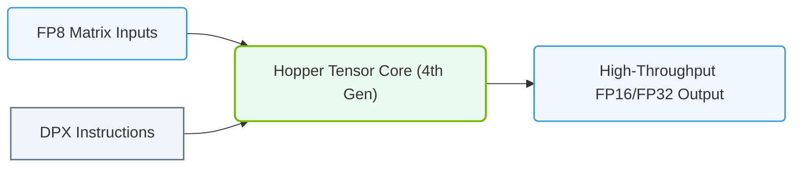

# 10.4d Third-gen Tensor Cores (Hopper H100): FP8, structured sparsity (2:4)

  📦 Nvidia GPU Architecture
  📖 GPU Microarchitecture

## 🧭 Context Introduction

The NVIDIA H100 GPU, built on the Hopper architecture, represents a major leap in AI compute capability. Its third-generation Tensor Cores introduce two breakthrough features: **FP8 (8-bit floating point)** precision and **structured sparsity (2:4)**. These innovations allow engineers to train and deploy larger models faster while using less memory and power. For new engineers, think of this as getting more performance per watt and per dollar — critical for scaling AI workloads in production.

---

## ⚙️ What Are Third-Gen Tensor Cores?

- **Purpose:** Specialized hardware units designed for matrix multiply-accumulate (MMA) operations — the core math behind neural networks.
- **Evolution:** Each generation (Volta, Turing, Ampere, Hopper) added new data types and optimization techniques.
- **Key Advancements in H100:**
  - Native support for **FP8** (E4M3 and E5M2 formats)
  - Hardware-accelerated **structured sparsity** with a 2:4 pattern
  - Up to **6x faster** than the previous A100 generation for certain workloads

---

## 📊 FP8: 8-Bit Floating Point Precision

### What is FP8?

FP8 is a compact numeric format that uses only **8 bits** to represent a floating-point number. It comes in two variants:

| Variant | Bits for Exponent | Bits for Mantissa | Best For |
|---------|------------------|-------------------|----------|
| **E4M3** | 4 | 3 | Forward pass (inference) |
| **E5M2** | 5 | 2 | Backward pass (training) |

### Why FP8 Matters

- **Memory savings:** Half the memory footprint of FP16 (16-bit) and one-quarter of FP32 (32-bit).
- **Throughput boost:** H100 Tensor Cores can process FP8 operations at **double the rate** of FP16.
- **Accuracy retention:** With proper scaling and mixed-precision techniques, FP8 maintains model accuracy for most modern architectures.

### How Engineers Use FP8

- **Training:** Use E5M2 for gradients (wider range) and E4M3 for activations/weights (higher precision).
- **Inference:** Use E4M3 exclusively for maximum throughput.
- **Mixed precision:** Combine FP8 with FP16 or FP32 for critical layers (e.g., attention softmax).

---

## 🕵️ Structured Sparsity (2:4)

### What is Structured Sparsity?

Structured sparsity is a technique where **2 out of every 4 values** in a matrix are forced to zero. This creates a predictable pattern (2:4) that the hardware can exploit.

### How It Works

- **Pattern:** For every group of 4 consecutive elements, exactly 2 are non-zero.
- **Hardware support:** H100 Tensor Cores have dedicated circuits that skip zero values during computation.
- **Throughput gain:** Up to **2x** performance improvement for sparse matrices compared to dense computation.

### Benefits for Engineers

- **Model compression:** Reduce model size by up to 50% without retraining (using pruning).
- **Faster inference:** Sparse models run faster on H100 due to hardware acceleration.
- **Lower memory bandwidth:** Fewer non-zero values mean less data movement.

### How to Enable Structured Sparsity

- **Training-time:** Use techniques like **magnitude pruning** or **regularization** to enforce the 2:4 pattern during training.
- **Post-training:** Apply pruning to a trained model and fine-tune to recover accuracy.
- **Framework support:** NVIDIA's TensorRT and PyTorch have built-in support for structured sparsity.

---

### 📊 Visual Representation: Hopper 4th Gen Tensor Core and DPX Instructions
This diagram maps Hopper's fourth-generation Tensor Core, introducing native FP8 precision support and hardware-accelerated DPX instructions for dynamic programming.

## 🛠️ Practical Comparison: H100 vs. A100

| Feature | A100 (Ampere) | H100 (Hopper) | Improvement |
|---------|---------------|---------------|-------------|
| Tensor Core Generation | 3rd | 4th | — |
| FP8 Support | ❌ No | ✅ Yes (E4M3, E5M2) | New capability |
| Structured Sparsity | ❌ No | ✅ Yes (2:4) | New capability |
| FP16 TFLOPS (dense) | 312 | 1,000 | ~3.2x |
| FP8 TFLOPS (dense) | N/A | 2,000 | — |
| FP8 TFLOPS (sparse) | N/A | 4,000 | — |

---

## 🧪 Real-World Example: FP8 + Sparsity in Action

Imagine you are deploying a large language model (LLM) for inference:

1. **Without optimization:** The model uses FP16 and dense matrices. It requires 40 GB of GPU memory and runs at 100 tokens/second.
2. **With FP8:** Convert weights to FP8 (E4M3). Memory drops to 20 GB. Throughput increases to 180 tokens/second.
3. **With FP8 + sparsity:** Apply 2:4 pruning to the attention layers. Memory drops further to 15 GB. Throughput jumps to 350 tokens/second.

**Result:** You can serve more users on the same hardware, or use smaller, cheaper GPUs.

---

## 🧰 Tools and Frameworks

- **NVIDIA TensorRT:** Optimizes models for H100, including FP8 and sparsity support.
- **PyTorch:** Use `torch.fp8` (experimental) or `torch.sparse` for structured sparsity.
- **NVIDIA NeMo:** Framework for training large models with FP8 and sparsity.
- **NVIDIA CUDA Toolkit:** Provides libraries like `cuBLAS` and `cuSPARSELt` for low-level control.

---

## ✅ Key Takeaways for New Engineers

- **FP8** is a game-changer for memory and throughput — learn to use it in mixed-precision workflows.
- **Structured sparsity (2:4)** gives you a free 2x speedup — apply it to models that can tolerate pruning.
- **H100 Tensor Cores** are not just faster; they enable entirely new optimization strategies.
- **Start small:** Experiment with FP8 on a single layer, then expand to the full model.
- **Monitor accuracy:** Always validate that FP8 and sparsity do not degrade model quality.

---

## 📚 Further Learning

- NVIDIA Hopper Architecture Whitepaper
- NVIDIA TensorRT Developer Guide (FP8 and Sparsity chapters)
- PyTorch Mixed Precision Training Documentation
- "Structured Sparsity for Deep Neural Networks" (NVIDIA Research Blog)