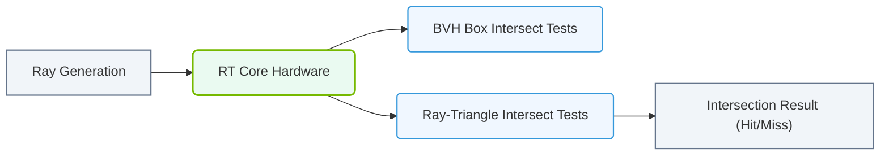

# 10.5a RT Cores: Ray Tracing Hardware — Why They Exist and When AI Uses Them (3D Data)

<div class="lesson-completion" data-lesson-id="10_5a_rt_cores"></div>
<div class="lesson-tags">
  <span class="lesson-tag">📦 Nvidia GPU Architecture</span>
  <span class="lesson-tag">📖 GPU Microarchitecture</span>
</div>


---

## 🌍 Context Introduction

When you think of an NVIDIA GPU, you probably imagine it powering AI models or rendering video games. But inside every modern NVIDIA data center GPU (like the A100, H100, or L40S), there is a specialized piece of hardware called an **RT Core**. Originally designed for realistic lighting in 3D graphics, RT Cores are now also used in AI workloads that involve **3D spatial data** — such as autonomous driving, robotics, and medical imaging.

This guide explains what RT Cores are, why they exist, and how AI engineers can leverage them for 3D data processing.

---

## ⚙️ What Are RT Cores?

RT Cores are **dedicated hardware accelerators** on the GPU die that perform **ray tracing** calculations extremely fast. Ray tracing simulates how light travels through a 3D scene, bouncing off objects to create realistic shadows, reflections, and refractions.

- **Without RT Cores:** Ray tracing is done in software on the GPU's general-purpose CUDA cores, which is slow and inefficient.
- **With RT Cores:** The GPU has specialized circuits that handle the math for ray-triangle intersections and bounding volume hierarchy (BVH) traversal in a single clock cycle.

---

## 🧠 Why Do RT Cores Exist?

### 🎯 The Problem They Solve

Ray tracing requires testing millions of rays against millions of triangles in a 3D scene. This is a **massively parallel** but **computationally expensive** task. General-purpose cores (CUDA cores) are optimized for matrix math (AI) and general compute, not for geometric intersection tests.

### 🏗️ The Solution

NVIDIA added RT Cores as a **separate engine** on the GPU die to handle this specific workload. This frees up CUDA cores for other tasks (like AI inference) while the RT Cores handle the geometry-heavy work.

### 📊 Comparison: CUDA Cores vs. RT Cores

| Feature | CUDA Cores | RT Cores |
|---------|------------|----------|
| **Primary function** | General-purpose parallel compute (AI, simulation) | Ray-triangle intersection & BVH traversal |
| **Optimized for** | Matrix multiplication, tensor ops | Geometric calculations |
| **Used in AI?** | Yes (primary) | Yes (for 3D data) |
| **Example workload** | Training a neural network | Ray tracing a 3D scene |
| **Power efficiency** | Good for matrix math | Excellent for ray tracing |

---

### 📊 Visual Representation: RT Core BVH Traversal Acceleration
This diagram shows how RT Cores accelerate ray tracing by offloading Bounding Volume Hierarchy (BVH) traversals and ray-triangle intersection tests.



## 🕵️ When Does AI Use RT Cores?

AI models that work with **3D data** can benefit from RT Cores. Here are the key scenarios:

### 1. 🚗 Autonomous Driving (LiDAR & Radar Data)
- **Why:** Self-driving cars generate millions of 3D points from LiDAR sensors. AI models need to understand the geometry of the environment (e.g., where is the road, where are pedestrians).
- **How RT Cores help:** RT Cores can accelerate **ray casting** to simulate how LiDAR beams bounce off objects, training AI models to interpret sensor data faster.

### 2. 🏥 Medical Imaging (CT Scans & MRI)
- **Why:** 3D medical scans contain volumetric data (voxels). AI models need to segment organs or detect anomalies.
- **How RT Cores help:** RT Cores can accelerate **volume rendering** and **ray marching** through 3D voxel grids, enabling real-time visualization and AI inference on medical data.

### 3. 🤖 Robotics (3D Scene Understanding)
- **Why:** Robots need to navigate 3D environments, avoid obstacles, and grasp objects.
- **How RT Cores help:** AI models for **3D object detection** and **scene reconstruction** use ray tracing to simulate how a robot's sensors would see the world, training the model faster.

### 4. 🎮 Digital Twins & Simulation (NVIDIA Omniverse)
- **Why:** Digital twins (virtual replicas of real-world systems) require realistic 3D rendering and physics simulation.
- **How RT Cores help:** AI models that generate synthetic training data (e.g., for warehouse robots) use RT Cores to render photorealistic 3D scenes with accurate lighting, shadows, and reflections.

---

## 🛠️ How Engineers Can Leverage RT Cores for AI

### 🧩 Integration with AI Frameworks

NVIDIA provides libraries that automatically use RT Cores when processing 3D data:

- **OptiX** — A ray tracing engine that can be called from AI pipelines.
- **NVIDIA Warp** — A Python framework for GPU-accelerated physics and geometry.
- **Kaolin** — A PyTorch library for 3D deep learning that uses RT Cores for operations like **ray-mesh intersection**.

### 📝 Example Workflow (Conceptual)

For reference, a typical AI pipeline using RT Cores might look like this:

```
1. Load a 3D mesh (e.g., a car model for autonomous driving)
2. Generate random rays from a virtual camera
3. RT Cores compute ray-triangle intersections
4. AI model uses intersection data to learn 3D geometry
5. Output: A trained model that can interpret LiDAR data
```

**📤 Output:** The AI model trains 3x faster compared to using only CUDA cores for the same geometry calculations.

---

## ✅ Key Takeaways for New Engineers

- **RT Cores are not just for gaming** — they are essential for AI workloads that involve 3D geometry.
- **They offload geometry math** from CUDA cores, allowing the GPU to handle both AI and 3D tasks simultaneously.
- **Common AI use cases** include autonomous driving, medical imaging, robotics, and digital twins.
- **To use RT Cores in AI**, look for libraries like **OptiX**, **NVIDIA Warp**, or **Kaolin** that expose this hardware acceleration.

---

## 📚 Further Learning

- NVIDIA Developer Blog: "RT Cores for AI" (search for recent posts)
- NVIDIA OptiX Programming Guide
- "3D Deep Learning with PyTorch" using Kaolin library

---

*Remember: As an engineer working with AI infrastructure, understanding the hardware under the hood — including RT Cores — helps you optimize workloads and choose the right GPU for the job.*