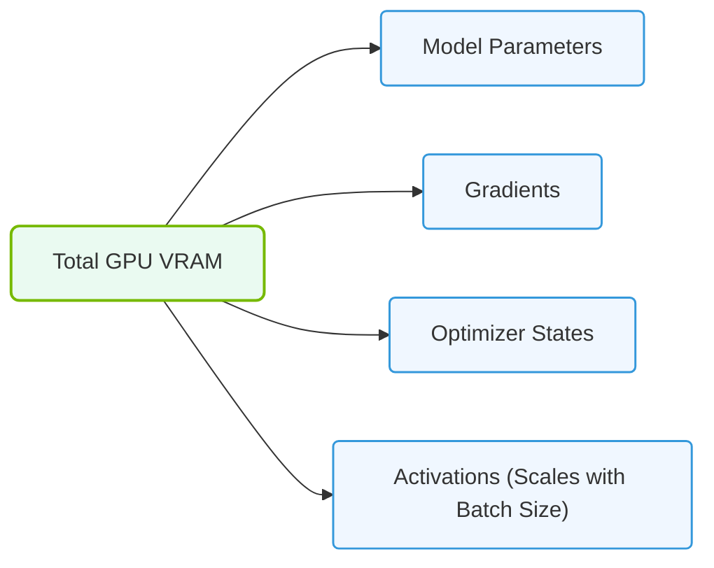

# 11.1a Latency and bandwidth requirements: why system DDR cannot feed GPU cores

  📦 Nvidia GPU Architecture
  📖 GPU Memory Subsystems

---

## 🌐 Context Introduction

When you first look at a modern AI server, you'll notice two distinct types of memory: **system DDR RAM** (the kind your laptop uses) and **GPU VRAM** (the memory soldered onto the GPU board). A natural question arises: *Why can't we just use the system's DDR memory to feed the GPU cores?* The answer lies in two critical performance metrics — **latency** and **bandwidth** — and the fundamental architectural differences between CPU and GPU workloads.

---

## ⚙️ The Core Problem: GPU Cores Are Starving for Data

- A single NVIDIA GPU can contain **thousands of cores** (e.g., 10,752 CUDA cores in an H100).
- Each core needs a constant stream of data to perform calculations.
- If the memory cannot deliver data fast enough, the cores sit idle — a condition called **memory starvation**.
- System DDR memory was designed for CPU workloads, which are **latency-sensitive** but **bandwidth-modest**.
- GPU workloads are **bandwidth-hungry** and can tolerate higher latency if data arrives in massive chunks.

---

## 📊 Bandwidth: The Highway Width Analogy

Think of bandwidth as the number of lanes on a highway. More lanes mean more cars (data) can travel simultaneously.

| Memory Type | Typical Bandwidth | Number of Lanes (Analogy) |
|-------------|------------------|---------------------------|
| DDR5 (System RAM) | ~50–60 GB/s | A 2-lane road |
| GDDR6X (Consumer GPU VRAM) | ~900–1,000 GB/s | A 40-lane highway |
| HBM3 (Enterprise GPU VRAM, e.g., H100) | ~3,000–3,900 GB/s | A 150-lane superhighway |

- **System DDR** provides roughly **50–60 GB/s** of bandwidth.
- An H100 GPU requires **3,000+ GB/s** to keep its cores fed.
- This means system DDR is **50–60x too slow** for modern GPU workloads.

---

## 🕵️ Latency: The Reaction Time Problem

Latency is the time it takes for a single piece of data to travel from memory to the core.

- **System DDR latency**: ~80–100 nanoseconds (ns)
- **GPU VRAM latency**: ~200–400 nanoseconds (ns)

At first glance, DDR looks *faster* in terms of latency. So why is it still a problem?

- **CPU workloads** are latency-bound: a CPU might wait for a single value before proceeding.
- **GPU workloads** are throughput-bound: the GPU launches thousands of threads that all wait together.
- The GPU hides latency by **switching between threads** — while one thread waits for data, another computes.
- But this trick only works if the **bandwidth is high enough** to keep all threads supplied.

---

## 🛠️ Why DDR Fails: The Real-World Math

Let's break down why DDR cannot feed GPU cores using a simple example:

- **GPU cores**: 10,000 cores running at 2 GHz
- **Each core**: needs 4 bytes of data per clock cycle (a typical 32-bit operation)
- **Total bandwidth needed**: 10,000 cores × 2 GHz × 4 bytes = **80,000 GB/s**

Even the fastest HBM3 memory (3,900 GB/s) is not enough for *every core to run at full speed simultaneously*. This is why:

- GPU cores are **not all active at once** — they share memory bandwidth.
- Memory bandwidth is the **single biggest bottleneck** in AI training.
- System DDR at 50 GB/s would only feed **0.06%** of the cores at full speed.

---

### 📊 Visual Representation: GPU VRAM Allocations during Training
This diagram outlines the major layers that allocate VRAM space during model training: model parameters, gradients, optimizer states, and batch activations.

## 📈 The Architecture Difference: Wide vs. Narrow Buses

- **System DDR** uses a **64-bit or 128-bit memory bus** (narrow).
- **GPU VRAM** uses a **wide memory bus**:
  - H100: **5,120-bit bus** with HBM3
  - A100: **5,120-bit bus** with HBM2e
- A wider bus means more data can be transferred in a single clock cycle.
- System DDR's narrow bus is like a single water pipe; GPU VRAM's bus is like a massive irrigation canal.

---

## 🔄 The Memory Hierarchy on a GPU

To understand why system DDR is insufficient, look at the GPU's memory hierarchy:

1. **Register File** (fastest, smallest) — inside each core
2. **Shared Memory / L1 Cache** — on-chip, ~100–200 GB/s per SM
3. **L2 Cache** — on-chip, shared across all cores
4. **VRAM (HBM or GDDR)** — off-chip, but on the GPU package
5. **System DDR** — off the GPU, across the PCIe bus

- Data must travel from **system DDR** through **PCIe** (which adds latency and limits bandwidth to ~64 GB/s for PCIe Gen5).
- Even if system DDR were faster, the **PCIe bottleneck** would throttle it.
- VRAM sits **physically closer** to the GPU cores, reducing travel time.

---

## 🧩 Practical Example: Training a Large Language Model

Consider training a 70-billion parameter LLM:

- **Model weights**: ~140 GB (in FP16)
- **Optimizer states**: ~280 GB
- **Gradients**: ~140 GB
- **Total memory needed**: ~560 GB

If the GPU had to fetch all this from system DDR:

- **Time to load weights once**: 140 GB ÷ 50 GB/s = **2.8 seconds**
- **With HBM3**: 140 GB ÷ 3,900 GB/s = **0.036 seconds** (36 milliseconds)

During training, the GPU reads and writes this data **billions of times**. System DDR would make training **100x slower** or more.

---

## ✅ Summary: Why System DDR Cannot Feed GPU Cores

| Factor | System DDR | GPU VRAM (HBM3) | Impact |
|--------|------------|-----------------|--------|
| Bandwidth | ~50 GB/s | ~3,900 GB/s | DDR is 78x slower |
| Bus width | 64–128 bits | 5,120 bits | DDR moves less data per cycle |
| Physical distance | Across PCIe | On GPU package | DDR has higher effective latency |
| Workload type | Latency-optimized | Throughput-optimized | DDR designed for different use case |
| Core count support | Feeds ~60 cores | Feeds ~10,000+ cores | DDR cannot scale to GPU core counts |

---

## 🔑 Key Takeaway for New Engineers

- **Bandwidth is the king** in GPU computing, not latency.
- System DDR was designed for CPUs that do **one thing at a time, very quickly**.
- GPU VRAM was designed for GPUs that do **thousands of things at once, very broadly**.
- Never try to run AI workloads using system DDR as the primary memory for GPU cores — the performance will be **unusable**.
- Always check the **memory bandwidth** specification of a GPU before planning your AI infrastructure.