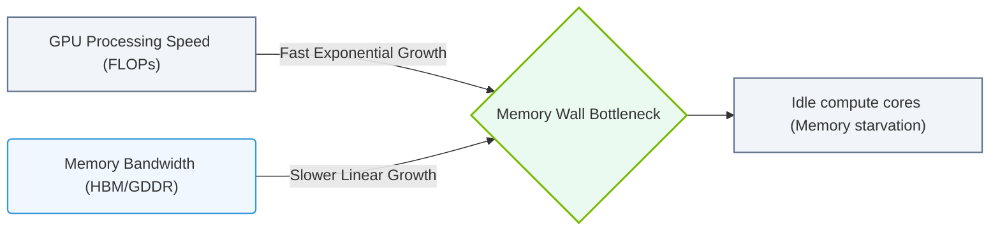

# 11.1b The GPU memory wall: how VRAM capacity determines maximum model size

<div class="lesson-completion" data-lesson-id="11_1b_gpu_memory_wall"></div>
<div class="lesson-tags">
  <span class="lesson-tag">📦 Nvidia GPU Architecture</span>
  <span class="lesson-tag">📖 GPU Memory Subsystems</span>
</div>


Welcome, new engineer! This topic is one of the most practical and limiting factors you'll encounter when working with AI models. Think of VRAM (Video Random Access Memory) as the GPU's personal, ultra-fast desk space. The bigger your model, the more desk space you need. If your model doesn't fit, it simply won't run — or it will run painfully slow. This is the **GPU memory wall**.

---

## 🧠 Context: Why VRAM Matters for AI

When you train or run inference on a large language model (LLM) or a computer vision model, every parameter, every activation, and every gradient must live in VRAM during computation. System RAM (your computer's main memory) is too slow for the GPU to access efficiently. The GPU needs data instantly, and VRAM provides that speed.

- **VRAM is the GPU's dedicated memory.** It is physically attached to the GPU die.
- **System RAM is shared with the CPU.** The GPU can access it, but it's like sending data through a long, slow tunnel.
- **The memory wall** is the hard limit: once your model's memory footprint exceeds VRAM capacity, you hit a wall. The model either fails to load or runs at a crawl.

---

## ⚙️ How Model Size Relates to VRAM

Every AI model has a **memory footprint**. This is not just the file size of the model weights. It includes:

- **Weights:** The learned parameters (e.g., 7 billion parameters for a 7B model).
- **Optimizer states:** Used during training (Adam optimizer stores two additional copies per parameter).
- **Gradients:** Computed during backpropagation.
- **Activations:** Intermediate values stored during forward pass (can be huge for large batch sizes).
- **Batch size:** Larger batches mean more activations in memory.

### 📊 Simple Formula (Approximate)

For a model with **P** parameters, using **FP16** (2 bytes per parameter):

- **Weights only:** `P × 2 bytes`
- **Training (with Adam optimizer):** `P × 2 bytes (weights) + P × 2 bytes (gradients) + P × 4 bytes (optimizer states) = P × 8 bytes`
- **Inference only:** `P × 2 bytes (weights) + activations`

**Example:** A 7B parameter model in FP16 for inference needs roughly `7B × 2 bytes = 14 GB` of VRAM just for weights. Add activations, and you're easily at 16–20 GB.

---

## 🛠️ The Memory Wall in Practice

Here is a simple comparison to illustrate the wall:

| Model Size (Parameters) | Precision | Approx. VRAM for Weights | Typical GPU (VRAM) | Fits? |
|--------------------------|-----------|--------------------------|--------------------|-------|
| 7B                       | FP16      | 14 GB                    | NVIDIA A10 (24 GB) | ✅ Yes |
| 13B                      | FP16      | 26 GB                    | NVIDIA A10 (24 GB) | ❌ No |
| 13B                      | INT8      | 13 GB                    | NVIDIA A10 (24 GB) | ✅ Yes |
| 70B                      | FP16      | 140 GB                   | NVIDIA A100 (80 GB)| ❌ No (needs multiple GPUs) |

**Key takeaway:** You can squeeze larger models into smaller VRAM by using lower precision (INT8, FP8, or even 4-bit quantization), but you lose some accuracy.

---

### 📊 Visual Representation: Compute Speed vs. Memory Bandwidth Scaling (Memory Wall)
This diagram displays the growing performance gap (the Memory Wall) between compute FLOP rates scaling exponentially and slower memory bandwidth growth rates.



## 🕵️ How Engineers Hit the Wall (and What Happens)

When you try to load a model that exceeds VRAM:

- **Error:** You'll see an out-of-memory (OOM) error. The model fails to load.
- **Crash:** The training script or inference server crashes.
- **Swap to system RAM:** Some frameworks (like PyTorch) can offload layers to system RAM, but this is **extremely slow** — think minutes per batch instead of milliseconds.

**Real-world scenario:** You have a single NVIDIA A100 (80 GB VRAM). You want to fine-tune a 70B parameter model in FP16. The model alone needs 140 GB for weights, plus gradients and optimizer states. You hit the wall. Your options:

- Use multiple GPUs (model parallelism).
- Use lower precision (e.g., 4-bit quantization via bitsandbytes).
- Use offloading (but expect 10–100x slower training).

---

## 📈 Strategies to Avoid the Memory Wall

Here are the common techniques engineers use to fit larger models into limited VRAM:

- **Quantization:** Reduce precision from FP32/FP16 to INT8, FP8, or 4-bit. This cuts memory usage by 2x to 4x.
- **Gradient Checkpointing:** Trade compute for memory. Recompute activations during backward pass instead of storing them all. Saves ~50% VRAM but slows training.
- **Model Parallelism:** Split the model across multiple GPUs. Each GPU holds a portion of the layers.
- **Pipeline Parallelism:** Different GPUs process different layers in sequence.
- **Tensor Parallelism:** Split individual layers across GPUs.
- **Offloading:** Move some layers to system RAM or CPU memory. Works for inference but is slow for training.

---

## 🧪 Simple Example: Checking VRAM Usage

When you load a model, you can quickly check how much VRAM it consumes. Here is a Python example using PyTorch:

```python
import torch
import torch.cuda as cuda

# Load a model (example: 7B parameter model)
model = torch.load("my_model.pt", map_location="cuda")

# Check VRAM usage
allocated = cuda.memory_allocated() / (1024**3)  # Convert to GB
reserved = cuda.memory_reserved() / (1024**3)

print(f"VRAM allocated: {allocated:.2f} GB")
print(f"VRAM reserved: {reserved:.2f} GB")
```

📤 **Output:**  
**VRAM allocated: 14.32 GB**  
**VRAM reserved: 16.00 GB**

If you see an OOM error, you've hit the memory wall.

---

## ✅ Final Thoughts

The GPU memory wall is a fundamental constraint in AI infrastructure. As a new engineer, always check:

- **Model size vs. VRAM capacity** before deployment.
- **Precision** (FP16, INT8, etc.) to fit your model.
- **Parallelism strategies** if your model is too large for a single GPU.

Remember: VRAM is finite. The wall is real. But with the right techniques, you can push past it — or at least know exactly where it stands.

---
