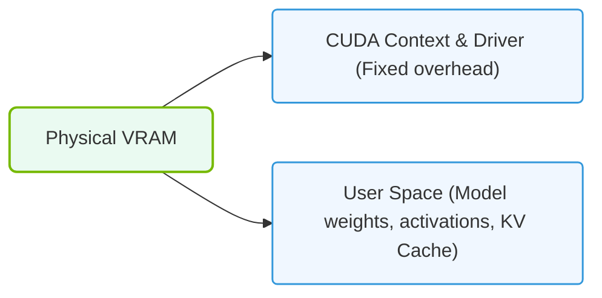

# 11.1c VRAM allocation breakdown: weights, optimizer states, activations, KV cache

  📦 Nvidia GPU Architecture
  📖 GPU Memory Subsystems

When you train or run a large AI model on an NVIDIA GPU, the GPU's VRAM (Video Random Access Memory) is not just storing the model weights. It is juggling multiple types of data simultaneously. Understanding how VRAM is divided among **weights**, **optimizer states**, **activations**, and the **KV cache** is essential for engineers who need to diagnose out-of-memory errors, choose the right GPU, or optimize model performance.

This breakdown explains what each component is, why it consumes VRAM, and how they compete for the same limited memory pool.

---

## ⚙️ The Four Main VRAM Consumers

Every AI workload (training or inference) divides GPU memory into four primary categories. Each serves a distinct purpose:

- **Weights** — The learned parameters of the neural network (e.g., the numbers in a transformer layer).
- **Optimizer States** — Extra data needed only during training to update weights (e.g., momentum, variance).
- **Activations** — Intermediate outputs of each layer, stored temporarily during forward pass for use in backpropagation.
- **KV Cache** — Key-Value cache used during autoregressive inference (e.g., text generation) to avoid recomputing past tokens.

---

## 📊 Comparison Table: VRAM Components at a Glance

| Component | Used During | Persistence | Typical Size (Relative) | Purpose |
|-----------|-------------|-------------|-------------------------|---------|
| **Weights** | Training & Inference | Permanent (loaded once) | 1x (baseline) | Store model parameters |
| **Optimizer States** | Training only | Per training step | 2x–3x of weights | Momentum, variance, gradients |
| **Activations** | Training only (mostly) | Per forward pass | 2x–8x of weights | Intermediate layer outputs |
| **KV Cache** | Inference only | Per generated token | Grows with sequence length | Cached attention keys/values |

> **Key Insight:** During training, VRAM is dominated by **activations** and **optimizer states**. During inference, VRAM is dominated by **weights** and the **KV cache**.

---

## 🕵️ Deep Dive into Each Component

### 🧠 Weights (Model Parameters)

- These are the actual numbers that define the model's behavior.
- For a model like LLaMA-7B (7 billion parameters), stored in **16-bit (FP16)** precision, weights consume approximately **14 GB** of VRAM.
- In **8-bit** quantization, this drops to ~7 GB; in **4-bit**, to ~3.5 GB.
- Weights are loaded once and remain in VRAM for the entire training or inference session.

### 🛠️ Optimizer States (Training Only)

- Optimizers like **Adam** or **AdamW** store additional per-parameter values:
  - **Momentum** (first moment estimate)
  - **Variance** (second moment estimate)
  - **Gradients** (temporary, but stored for the backward pass)
- For the Adam optimizer, this typically adds **2x to 3x** the weight memory.
  - Example: 7B parameter model in FP16 → 14 GB weights → ~28 GB for optimizer states.
- This is why training large models often requires **mixed precision** (FP16) or **gradient checkpointing** to reduce memory.

### 🔄 Activations (Training Only)

- During the forward pass, every layer's output is stored in VRAM so the backward pass can compute gradients.
- Activations are **not** permanent — they are freed after the backward pass for that layer.
- However, for deep networks (e.g., 32-layer transformers), activations can consume **2x to 8x more VRAM than weights**.
- **Gradient checkpointing** is a technique that trades compute for memory: it discards most activations and recomputes them during the backward pass, reducing activation memory by up to 80%.

### 💬 KV Cache (Inference Only)

- During autoregressive text generation (e.g., ChatGPT), the model must attend to all previous tokens.
- The **Key** and **Value** matrices for each attention layer are cached in VRAM to avoid recomputing them for every new token.
- KV cache size grows linearly with **batch size** and **sequence length**.
  - Formula: `2 * batch_size * sequence_length * num_layers * hidden_dim * bytes_per_element`
- For a 7B model generating 2048 tokens with batch size 1, the KV cache can consume **~2–4 GB** of VRAM.
- For long sequences (e.g., 32k tokens), the KV cache can exceed the weight memory.

---

### 📊 Visual Representation: VRAM Allocations: User Space vs. System Overhead
This diagram shows the division of physical VRAM between user-managed parameters (weights, activations) and fixed CUDA runtime overhead.

## 📈 Real-World VRAM Allocation Example

Consider training a **7B parameter model** in FP16 on an NVIDIA A100 (80 GB VRAM):

| Component | Memory (GB) | Notes |
|-----------|-------------|-------|
| Weights | 14 | 7B × 2 bytes |
| Optimizer States | 28 | Adam: 2x weights (momentum + variance) |
| Gradients | 14 | Temporary, but stored during backward pass |
| Activations | 20–40 | Depends on sequence length and batch size |
| **Total** | **76–96** | Often exceeds 80 GB → need gradient checkpointing |

For **inference** on the same model:

| Component | Memory (GB) | Notes |
|-----------|-------------|-------|
| Weights | 14 | FP16 |
| KV Cache | 2–8 | Depends on sequence length |
| Activations | 0 | Not stored during inference |
| **Total** | **16–22** | Easily fits in 80 GB VRAM |

---

## 🛠️ Practical Tips for Engineers

- **Monitor VRAM usage** with **nvidia-smi** or **nvitop** to see which component is consuming memory.
- **Reduce activation memory** by enabling **gradient checkpointing** (e.g., `model.gradient_checkpointing_enable()` in Hugging Face Transformers).
- **Reduce optimizer state memory** by using **8-bit optimizers** (e.g., bitsandbytes library) or **AdamW with FP16**.
- **Reduce KV cache memory** during inference by using **FlashAttention** or **PagedAttention** (vLLM).
- **Quantize weights** to 8-bit or 4-bit to free VRAM for larger batch sizes or longer sequences.

---

## ✅ Summary

- VRAM is shared among **weights**, **optimizer states**, **activations**, and **KV cache**.
- Training is memory-heavy due to **activations** and **optimizer states**.
- Inference is memory-light but the **KV cache** grows with sequence length.
- Understanding this breakdown helps engineers choose the right GPU, batch size, and optimization techniques to avoid out-of-memory errors.

> **Golden Rule:** If you run out of VRAM, first check if you are training (reduce batch size or enable gradient checkpointing) or inferencing (reduce sequence length or use quantization).