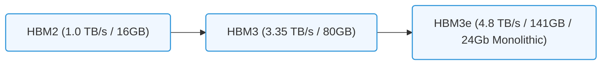

# 11.3b HBM2, HBM2e, HBM3, HBM3e: generational bandwidth and capacity milestones

  📦 Nvidia GPU Architecture
  📖 GPU Memory Subsystems

## 🧠 Context Introduction

High Bandwidth Memory (HBM) is a specialized type of memory designed to sit right next to the GPU die, connected through a wide, fast interface called an interposer. Think of it like a multi-lane highway built directly alongside a factory — data moves in and out of the GPU much faster than traditional memory (like GDDR). For AI workloads, where massive datasets and model parameters need to be shuffled constantly, HBM is the difference between a GPU that waits and a GPU that works.

Over the generations, HBM has evolved from HBM2 to HBM3e, with each step delivering higher bandwidth (more data moved per second) and larger capacity (more data stored per stack). This topic breaks down those milestones so you can understand what each generation means for AI training and inference.

---

## ⚙️ HBM2 — The Foundation

HBM2 was the first widely adopted HBM generation in NVIDIA data center GPUs (e.g., V100). It established the baseline for high-bandwidth memory in AI.

- **Bandwidth per stack**: Up to 256 GB/s per stack (using 2 Gb/s per pin)
- **Capacity per stack**: Up to 8 GB (using 8-Hi stacks of 8 Gb dies)
- **Typical GPU configuration**: 4 stacks (V100) → 32 GB total, ~900 GB/s total bandwidth
- **Key limitation**: Memory capacity was a bottleneck for larger models

---

## 📊 HBM2e — The Capacity Boost

HBM2e (enhanced) arrived with the A100 GPU. It kept the same physical interface but increased the density of memory dies.

- **Bandwidth per stack**: Up to 410 GB/s per stack (using 3.2 Gb/s per pin)
- **Capacity per stack**: Up to 16 GB (using 8-Hi stacks of 16 Gb dies)
- **Typical GPU configuration**: 6 stacks (A100 80GB) → 80 GB total, ~2.0 TB/s total bandwidth
- **Key improvement**: Doubled capacity per stack without changing the physical footprint

---

## 🚀 HBM3 — The Speed Leap

HBM3 was introduced with the H100 GPU. It fundamentally redesigned the memory interface to push bandwidth much higher.

- **Bandwidth per stack**: Up to 819 GB/s per stack (using 6.4 Gb/s per pin)
- **Capacity per stack**: Up to 24 GB (using 12-Hi stacks of 16 Gb dies)
- **Typical GPU configuration**: 6 stacks (H100) → 144 GB total, ~3.35 TB/s total bandwidth
- **Key improvement**: Nearly 2x bandwidth per stack over HBM2e

---

### 📊 Visual Representation: HBM Bandwidth and Capacity Generational Progress
This flowchart tracks the evolution of HBM metrics across HBM2, HBM3, and HBM3e generations.

## 🛠️ HBM3e — The Current Peak

HBM3e (enhanced) is the latest generation, featured in the H200 GPU. It pushes both bandwidth and capacity further.

- **Bandwidth per stack**: Up to 1.2 TB/s per stack (using 9.2 Gb/s per pin)
- **Capacity per stack**: Up to 36 GB (using 12-Hi stacks of 24 Gb dies)
- **Typical GPU configuration**: 6 stacks (H200) → 216 GB total, ~4.8 TB/s total bandwidth
- **Key improvement**: 50% more bandwidth and 50% more capacity than HBM3

---

## 🕵️ Generational Comparison Table

| Feature | HBM2 | HBM2e | HBM3 | HBM3e |
|---|---|---|---|---|
| **Max bandwidth per stack** | 256 GB/s | 410 GB/s | 819 GB/s | 1.2 TB/s |
| **Max capacity per stack** | 8 GB | 16 GB | 24 GB | 36 GB |
| **Data rate per pin** | 2.0 Gb/s | 3.2 Gb/s | 6.4 Gb/s | 9.2 Gb/s |
| **Stack height (dies)** | 8-Hi | 8-Hi | 12-Hi | 12-Hi |
| **Example GPU** | V100 | A100 (80GB) | H100 | H200 |
| **Total GPU memory** | 32 GB | 80 GB | 144 GB | 216 GB |
| **Total GPU bandwidth** | ~900 GB/s | ~2.0 TB/s | ~3.35 TB/s | ~4.8 TB/s |

---

## 💡 Why This Matters for AI

- **Larger models need more capacity**: A 175-billion parameter model like GPT-3 requires roughly 350 GB of memory in FP16. HBM3e's 216 GB per GPU means you need multiple GPUs, but each GPU can hold more of the model.
- **Faster training needs more bandwidth**: Each training step moves billions of parameters between memory and compute units. Higher bandwidth reduces the time spent waiting for data, directly speeding up training.
- **Inference latency drops with bandwidth**: When serving a model, every millisecond counts. Higher bandwidth means the GPU can fetch weights and activations faster, reducing response time.

---

## 🔍 Quick Reference for New Engineers

- **HBM2** → Good for early AI models (ResNet, BERT-base)
- **HBM2e** → Enabled larger models (GPT-2, BERT-large)
- **HBM3** → Unlocked modern LLMs (GPT-3, LLaMA)
- **HBM3e** → Powers today's frontier models (GPT-4, Llama 3)

When you see a GPU spec sheet, look for **memory bandwidth** (TB/s) and **memory capacity** (GB). These two numbers tell you how much data the GPU can hold and how fast it can access it — the two most critical factors for AI performance.
