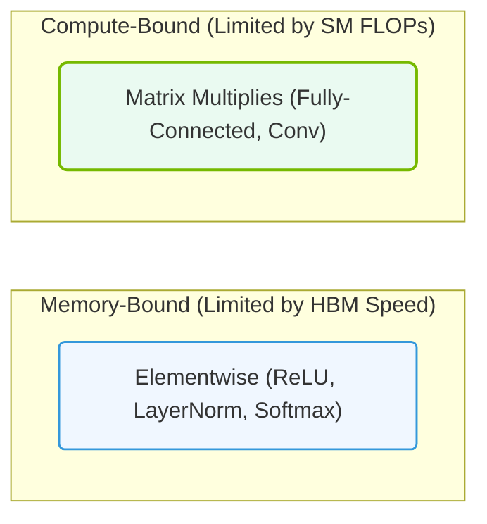

# 11.4b Memory-bound vs. compute-bound operations in deep learning

  📦 Nvidia GPU Architecture
  📖 GPU Memory Subsystems

Welcome, new engineer! In deep learning, your GPU doesn't just compute — it also moves data. Understanding whether your model is **memory-bound** or **compute-bound** is the first step to optimizing performance. This guide explains the difference simply, so you can spot bottlenecks and tune your workloads.

---

## 🧠 Context: Why does this matter?

A GPU has two main jobs:
1. **Compute** — performing math operations (like matrix multiplications).
2. **Memory access** — reading/writing data (like weights, activations, and gradients).

If your GPU spends more time waiting for data to arrive than actually computing, it's **memory-bound**.  
If it spends most of its time crunching numbers, it's **compute-bound**.  
Knowing which one you have tells you where to focus optimization efforts.

---

## ⚙️ What is a compute-bound operation?

A **compute-bound** operation is limited by the GPU's processing speed (FLOPS — Floating Point Operations Per Second).  
The GPU's compute units are fully utilized, and memory bandwidth is not the bottleneck.

**Characteristics:**
- Large matrix multiplications (e.g., dense layers with big batch sizes).
- Convolutions with many filters.
- Operations that require many arithmetic steps per data element.

**Example:**  
Training a large transformer model with a batch size of 128 on a high-end GPU like the NVIDIA A100. The GPU's tensor cores are saturated, and memory bandwidth is sufficient.

**How to identify:**
- GPU compute utilization is near 100% (check with **nvidia-smi** or **Nsight Systems**).
- Memory bandwidth utilization is lower (e.g., 40–60%).
- Increasing batch size improves throughput linearly until memory runs out.

---

## 📊 What is a memory-bound operation?

A **memory-bound** operation is limited by how fast data can be moved to/from GPU memory (VRAM bandwidth).  
The GPU's compute units are idle, waiting for data.

**Characteristics:**
- Small matrix multiplications (e.g., tiny batch sizes or single samples).
- Element-wise operations (e.g., ReLU, dropout, batch normalization).
- Operations with low arithmetic intensity (few math operations per byte of data).

**Example:**  
Running inference on a small model with a batch size of 1. The GPU spends most of its time fetching weights from VRAM rather than computing.

**How to identify:**
- Memory bandwidth utilization is near 100% (check with **nvidia-smi** or **Nsight Systems**).
- GPU compute utilization is low (e.g., 20–40%).
- Increasing batch size does not improve throughput significantly.

---

### 📊 Visual Representation: Performance Limits: Compute-Bound vs. Memory-Bound
This diagram shows the classification of operations (elementwise vs. matrix multiplications) based on their math limits.

## 🛠️ Comparison table: Memory-bound vs. compute-bound

| Feature | Compute-bound | Memory-bound |
|---------|---------------|--------------|
| **Bottleneck** | GPU compute speed (FLOPS) | Memory bandwidth (GB/s) |
| **GPU compute utilization** | High (80–100%) | Low (20–50%) |
| **Memory bandwidth utilization** | Low to moderate | High (80–100%) |
| **Typical operations** | Large matrix multiplies, convolutions | Element-wise ops, small matrices, activations |
| **Batch size effect** | Throughput scales with batch size | Throughput saturates quickly |
| **Optimization strategy** | Increase parallelism, use Tensor Cores | Reduce memory transfers, fuse operations |
| **Example model** | Large ResNet-152, GPT-3 | Small MobileNet, single-sample inference |

---

## 🕵️ How to diagnose which one you have

Use profiling tools to measure utilization. Here's how to check with common tools:

**Using nvidia-smi (quick check):**
- Run: **nvidia-smi** (in terminal)
- Look at the **Volatile GPU-Util** column.  
  - If it's >90% → likely compute-bound.  
  - If it's <50% → likely memory-bound.

**Using Nsight Systems (detailed analysis):**
- Profile your training or inference script.
- Examine the timeline:
  - Long gaps between kernel launches → memory-bound.
  - Kernels running back-to-back at high occupancy → compute-bound.

**Using PyTorch Profiler (for Python users):**
- Enable the profiler and check the **self_cuda_time** vs. **self_cuda_memory** columns.
- High memory time relative to compute time indicates memory-bound.

---

## 🚀 Optimization strategies for each case

### If you are compute-bound:
- Use mixed precision training (FP16 or BF16) to double throughput.
- Enable Tensor Cores (NVIDIA's specialized hardware for matrix math).
- Increase batch size to saturate compute units.
- Use larger model parallelism (e.g., tensor parallelism).

### If you are memory-bound:
- Fuse operations (e.g., combine convolution + batch norm into one kernel).
- Reduce memory footprint (e.g., gradient checkpointing, activation compression).
- Use smaller batch sizes or gradient accumulation.
- Optimize data loading (use **NVIDIA DALI** or **PyTorch DataLoader** with many workers).

---

## ✅ Key takeaway for new engineers

- **Memory-bound** = GPU is waiting for data. Optimize data movement.
- **Compute-bound** = GPU is busy computing. Optimize math efficiency.
- Always profile first — never guess. Use tools like **nvidia-smi**, **Nsight Systems**, or **PyTorch Profiler**.
- The same model can be memory-bound in one scenario (batch size 1) and compute-bound in another (batch size 128).

As you grow in your AI infrastructure journey, you'll learn to spot these bottlenecks by instinct. For now, remember: **move less data, compute more efficiently, and always measure.**
