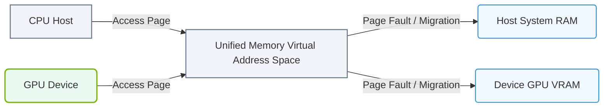

# 11.5c Managed memory and Unified Memory: bridging CPU and GPU address spaces

  📦 Nvidia GPU Architecture
  📖 GPU Memory Subsystems

---

## 🌐 Context Introduction

When you write code for AI workloads, your data often lives in two separate worlds: the **CPU's system memory (RAM)** and the **GPU's device memory (VRAM)**. Traditionally, engineers had to manually move data between these two spaces using functions like `cudaMemcpy`. This is tedious, error-prone, and can slow down development.

**Managed Memory** and **Unified Memory** solve this by creating a single, shared address space that both the CPU and GPU can access. The system automatically migrates data between RAM and VRAM as needed, so you can focus on building your AI model instead of managing memory transfers.

---

## ⚙️ What is Unified Memory?

Unified Memory is a feature of NVIDIA's CUDA platform that provides a **single pointer** to memory that both the CPU and GPU can use. The CUDA driver and hardware handle the data movement behind the scenes.

- **Key idea**: You allocate memory once, and the system automatically pages data between CPU and GPU memory.
- **How it works**: When the GPU needs data that is currently in CPU memory, a **page fault** occurs, and the data is migrated to GPU memory. The reverse happens when the CPU accesses GPU-resident data.
- **Benefit**: Simplifies code — no explicit `cudaMemcpy` calls needed.

---

## 🛠️ Managed Memory: The Software Layer

Managed Memory is the CUDA API that enables Unified Memory. It is the programmer's interface to this unified address space.

- **Allocation**: Use `cudaMallocManaged()` instead of `cudaMalloc()`.
- **Behavior**: The pointer returned can be dereferenced on both the CPU and GPU.
- **Migration**: Data migrates on demand. If the GPU kernel needs data that is on the CPU, the system moves it automatically.
- **Oversubscription**: Managed Memory allows you to allocate more memory than physically available on the GPU, as long as total memory (CPU + GPU) can hold it.

---

## 🕵️ How It Works Under the Hood

- **Page fault mechanism**: When a kernel on the GPU accesses a memory address not currently in GPU VRAM, a page fault is triggered. The CUDA driver then migrates the required page from CPU RAM to GPU VRAM.
- **Hardware support**: Modern NVIDIA GPUs (Pascal architecture and later) have hardware support for page faults, making Unified Memory efficient.
- **Migration granularity**: Data is moved in pages (typically 4 KB or 64 KB), not as entire buffers. This reduces unnecessary data movement.

---

## 📊 Comparison: Traditional vs. Unified Memory

| Feature | Traditional (cudaMalloc + cudaMemcpy) | Unified Memory (cudaMallocManaged) |
|---------|---------------------------------------|-------------------------------------|
| **Memory allocation** | Separate pointers for CPU and GPU | Single pointer for both |
| **Data transfer** | Manual (explicit copy) | Automatic (on-demand migration) |
| **Code complexity** | High — must manage transfers | Low — simpler code |
| **Performance control** | Full control over when data moves | Less control; migration can cause latency |
| **Oversubscription** | Not possible (must fit in VRAM) | Possible (uses CPU RAM as overflow) |
| **Debugging** | Easier to trace data movement | Harder to predict when migration occurs |
| **Best for** | Performance-critical, well-understood data flow | Rapid prototyping, complex data access patterns |

---

### 📊 Visual Representation: CUDA Unified Memory (UM) Page Migration
This diagram displays CUDA Unified Memory, utilizing the Page Migration Engine to automatically shift page frames between System RAM and GPU VRAM over PCIe/NVLink.

## ✅ When to Use Unified Memory

- **Prototyping**: When you want to quickly test an idea without worrying about memory management.
- **Irregular access patterns**: When data access is unpredictable (e.g., graph algorithms, sparse data).
- **Large datasets**: When your data exceeds GPU VRAM but fits in total system memory.
- **Code simplicity**: When you want to reduce the number of lines of code and avoid manual copy errors.

---

## ⚠️ When to Avoid Unified Memory

- **Performance-critical applications**: Manual `cudaMemcpy` gives you precise control over when data moves, avoiding latency from page faults.
- **Streaming workloads**: If you know exactly when data is needed, explicit copies can be overlapped with computation.
- **Real-time systems**: Page fault latency can be unpredictable (milliseconds), which is unacceptable for real-time inference.

---

## 💡 Practical Example (Conceptual)

Imagine you have a large array of data that you want to process on the GPU:

**Traditional approach**:
- Allocate CPU memory with `malloc()`.
- Allocate GPU memory with `cudaMalloc()`.
- Copy data from CPU to GPU with `cudaMemcpy()`.
- Run the GPU kernel.
- Copy results back with `cudaMemcpy()`.

**Unified Memory approach**:
- Allocate memory with `cudaMallocManaged()`.
- Fill data on the CPU.
- Run the GPU kernel — data migrates automatically.
- Read results on the CPU — data migrates back automatically.

The Unified Memory version is shorter and less error-prone.

---

## 🧠 Key Takeaways for New Engineers

- **Unified Memory** is a hardware + software feature that creates a single address space for CPU and GPU.
- **Managed Memory** is the CUDA API (`cudaMallocManaged`) that enables Unified Memory.
- Data migrates automatically via page faults — but this can introduce latency.
- Use Unified Memory for simplicity and prototyping; use manual memory management for peak performance.
- Modern NVIDIA GPUs (Pascal and later) support hardware page faults, making Unified Memory efficient for many workloads.

---

## 📚 Further Learning

- Experiment with `cudaMallocManaged` in small test programs to see how data migrates.
- Profile your code with NVIDIA Nsight to observe page fault behavior.
- Read the CUDA Programming Guide section on Unified Memory for advanced tuning options.