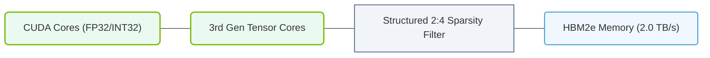

# 12.1b Ampere (A100 — 2020): 3rd-gen Tensor Cores, MIG, NVLink 3.0, 80 GB HBM2e

  📦 Nvidia GPU Architecture
  📖 NVIDIA GPU Generations & Form Factors

---

## 🌐 Context Introduction

The NVIDIA Ampere architecture, launched in 2020 with the A100 GPU, represents a major leap forward in AI and high-performance computing. For engineers new to this field, think of Ampere as the GPU that made large-scale AI training and inference practical for enterprise workloads. It introduced several breakthrough technologies — including third-generation Tensor Cores, Multi-Instance GPU (MIG), and NVLink 3.0 — that are now foundational to modern AI infrastructure. The A100 became the gold standard for cloud data centers, powering everything from natural language processing to scientific simulations.

---

## ⚙️ Key Architectural Innovations

- **Third-Generation Tensor Cores**: These specialized processing units are designed specifically for matrix math operations, which are the backbone of neural networks. The A100's Tensor Cores are twice as fast as the previous generation (Volta) and support new data types like **TF32** (TensorFloat-32) and **BF16** (Brain Floating Point 16), enabling faster training without sacrificing accuracy.

- **Multi-Instance GPU (MIG)**: This feature allows a single A100 GPU to be physically partitioned into up to seven smaller, isolated GPU instances. Each instance has its own dedicated memory, cache, and compute cores. This is critical for engineers managing shared infrastructure, as it enables multiple users or workloads to run simultaneously on one GPU with guaranteed performance isolation.

- **NVLink 3.0**: A high-speed interconnect technology that allows multiple A100 GPUs to communicate directly with each other at up to **600 GB/s** (bidirectional). This is essential for scaling AI models across many GPUs, as it dramatically reduces data transfer bottlenecks compared to traditional PCIe connections.

- **80 GB HBM2e Memory**: The A100 comes with up to 80 GB of high-bandwidth memory (HBM2e), offering **2 TB/s** of memory bandwidth. This massive memory capacity allows engineers to train larger models and process bigger datasets without swapping data to slower system memory.

---

## 📊 Comparison: A100 vs. Previous Generation (V100)

| Feature | V100 (Volta, 2017) | A100 (Ampere, 2020) |
| :--- | :--- | :--- |
| **Tensor Core Generation** | 2nd-gen | 3rd-gen |
| **Peak TFLOPS (FP16)** | 125 TFLOPS | 312 TFLOPS |
| **Memory Capacity** | 32 GB HBM2 | 80 GB HBM2e |
| **Memory Bandwidth** | 900 GB/s | 2 TB/s |
| **NVLink Version** | NVLink 2.0 (300 GB/s) | NVLink 3.0 (600 GB/s) |
| **Multi-Instance GPU (MIG)** | Not supported | Up to 7 instances |
| **New Data Types** | FP16, FP32 | TF32, BF16, FP16, FP32 |

---

### 📊 Visual Representation: Ampere A100 GPU Architecture Layout
This diagram maps the A100 GPU components, displaying 3rd Gen Tensor Cores, structured sparsity support, and HBM2e memory interfaces.

## 🛠️ Practical Use Cases for Engineers

- **Large Language Model Training**: The A100's 80 GB memory and fast Tensor Cores make it ideal for training models like GPT-3 or BERT-large. Engineers can fit entire model weights and optimizer states in GPU memory, reducing the need for complex model parallelism.

- **Multi-Tenant AI Inference**: With MIG, a single A100 can serve multiple inference models simultaneously. For example, you can partition the GPU into three instances: one for a real-time chatbot, one for image classification, and one for batch processing — all with guaranteed performance.

- **Scientific Simulations**: The high memory bandwidth and NVLink 3.0 enable molecular dynamics simulations (e.g., using GROMACS or NAMD) to scale across multiple A100 GPUs with minimal communication overhead.

---

## 🕵️ How These Features Work Together

- **MIG + Tensor Cores**: Each MIG instance gets its own dedicated Tensor Core slice. This means a small AI model running on one instance still benefits from hardware-accelerated matrix math, without interference from other instances.

- **NVLink 3.0 + Large Memory**: When training a model that exceeds 80 GB, engineers can connect multiple A100 GPUs via NVLink. The high-speed interconnect allows the model to be split across GPUs, with near-instant data sharing between them.

- **TF32 + Tensor Cores**: TF32 is a new data type that automatically uses 19-bit precision for training. It runs on Tensor Cores and delivers the same accuracy as FP32 but with **2x the throughput**. Engineers don't need to change their code — it works out of the box with frameworks like PyTorch and TensorFlow.

---

## 💡 Key Takeaway for New Engineers

The A100 is not just a faster GPU — it's a fundamentally more flexible and efficient compute platform. For engineers building AI infrastructure, the most important concepts to understand are:

- **MIG** for resource sharing and isolation
- **NVLink** for multi-GPU scaling
- **Tensor Cores** for accelerated matrix operations
- **80 GB memory** for large model support

These features collectively make the A100 the backbone of modern AI data centers, and understanding them is essential for designing, deploying, and managing AI workloads at scale.

---

## 📚 Further Learning

- NVIDIA's official Ampere architecture whitepaper
- MIG user guide for partitioning and workload management
- NVLink 3.0 topology examples for multi-GPU server configurations
- Tensor Core programming guide for TF32 and BF16 usage