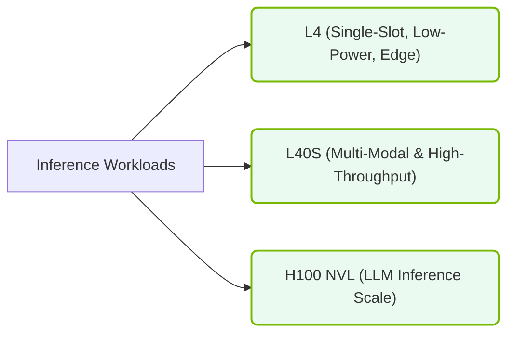

# 12.3a A30, A10, L4: inference-optimized cards for lower TDP deployments

  📦 Nvidia GPU Architecture
  📖 NVIDIA GPU Generations & Form Factors

## 🧭 Context Introduction

When deploying AI models into production, not every workload needs the raw horsepower of a flagship GPU like the H100. Many real-world applications—such as serving a chatbot, running image recognition, or processing video streams—require **inference** (running a trained model to make predictions) rather than training. Inference workloads are often less compute-intensive but demand low latency, high throughput, and energy efficiency.

NVIDIA offers a family of GPUs specifically optimized for inference in **lower TDP (Thermal Design Power)** deployments. These cards are designed to fit into servers with limited power budgets, smaller form factors, or dense multi-GPU configurations. The three key players in this space are the **NVIDIA A30**, **NVIDIA A10**, and **NVIDIA L4**. Each strikes a balance between performance, power consumption, and cost.

This guide will help you understand what makes these cards special, where they shine, and how to choose between them.

---

## ⚙️ What Makes a GPU "Inference-Optimized"?

Inference-optimized GPUs differ from training-focused GPUs in several ways:

- **Lower TDP**: They consume less power (typically 70W to 165W vs. 300W+ for training cards), making them suitable for edge servers, air-cooled racks, or power-constrained environments.
- **Smaller Form Factor**: Many are single-slot or low-profile, allowing dense packing (e.g., 4–8 GPUs per server).
- **Specialized Tensor Cores**: They include Tensor Cores optimized for **INT8** and **FP8** precision, which are common in inference (reducing memory bandwidth and compute requirements without sacrificing accuracy).
- **Hardware Acceleration for Video**: Some cards (like the L4) include dedicated video encode/decode engines for AI-powered video analytics.
- **No NVLink**: These cards typically lack high-speed interconnects (NVLink) because inference workloads rarely require multi-GPU communication.

---

## 📊 Comparison Table: A30 vs. A10 vs. L4

| Feature | **NVIDIA A30** | **NVIDIA A10** | **NVIDIA L4** |
| :--- | :--- | :--- | :--- |
| **Architecture** | Ampere | Ampere | Ada Lovelace |
| **Primary Use** | General inference + small training | Cloud inference, virtual workstations | Edge inference, video AI |
| **TDP** | 165W | 150W | 72W |
| **Form Factor** | Dual-slot, full-height | Single-slot, full-height | Single-slot, low-profile |
| **Memory** | 24 GB HBM2 | 24 GB GDDR6 | 24 GB GDDR6 |
| **Memory Bandwidth** | 933 GB/s | 600 GB/s | 300 GB/s |
| **Tensor Cores (Gen)** | 3rd Gen (Ampere) | 3rd Gen (Ampere) | 4th Gen (Ada) |
| **INT8 Performance** | 330 TOPS | 250 TOPS | 242 TOPS |
| **FP8 Support** | No | No | Yes |
| **Video Encode/Decode** | None | None | 2x NVENC, 2x NVDEC |
| **Best For** | Balanced inference + small training | Cloud inference, VDI | Video AI, edge, low-power inference |

---

### 📊 Visual Representation: Inference GPU Platforms Hierarchy
This diagram displays inference-optimized GPUs (L4, L40S, H100 NVL) and their target workload placements.

## 🕵️ Deep Dive: When to Use Each Card

### 🟢 NVIDIA A30 — The Balanced Workhorse

The A30 is the most versatile card in this group. It uses HBM2 memory (high bandwidth) and supports a wider range of precisions (FP32, TF32, FP16, INT8). It can handle **small-scale training** (fine-tuning) and inference equally well.

- **Ideal for**: Engineers who need one card for both development and production. For example, you might train a small model on the A30, then deploy it on the same card for inference.
- **Power consideration**: At 165W, it still requires active cooling and a standard PCIe slot. It fits in most rack servers.
- **Limitation**: No video encoding—if your workload involves video streams, look elsewhere.

### 🔵 NVIDIA A10 — The Cloud Inference Specialist

The A10 is designed for **high-density cloud deployments**. Its single-slot form factor allows you to pack up to 8 GPUs in a single server. It uses GDDR6 memory (slower than HBM2 but cheaper) and focuses on INT8 inference.

- **Ideal for**: Serving large language models (LLMs) or recommendation systems at scale. Think of it as the "workhorse of inference" for cloud providers.
- **Power consideration**: 150W is manageable, but you'll need good airflow in a dense server.
- **Limitation**: No FP8 support—if you're deploying models that use FP8 quantization (common in newer LLMs), the L4 is a better choice.

### 🟣 NVIDIA L4 — The Energy-Efficient Edge Champion

The L4 is the newest card in this lineup, built on the Ada Lovelace architecture. Its standout feature is **ultra-low power consumption** (72W) combined with dedicated **video encode/decode engines**. It's the go-to card for AI-powered video analytics, such as object detection in security cameras or real-time video transcoding.

- **Ideal for**: Edge servers, micro-datacenters, or any deployment where power and space are at a premium. Also perfect for video AI pipelines.
- **Power consideration**: At 72W, it can be passively cooled in some chassis, or use a simple fan. It can even run on a standard PCIe slot without auxiliary power in some configurations.
- **Limitation**: Lower memory bandwidth (300 GB/s) means it's not ideal for very large models that require frequent memory access.

---

## 🛠️ Practical Deployment Considerations

When choosing between these cards for a lower TDP deployment, consider these factors:

- **Power Budget**: If your server has a total power limit of 500W, you could deploy:
  - 3x L4 (216W total) — great for video AI
  - 2x A10 (300W total) — better for LLM inference
  - 1x A30 (165W total) — balanced for mixed workloads
- **Form Factor**: The L4's low-profile design fits in 1U servers; the A30 requires a 2U or larger chassis.
- **Cooling**: All three cards are air-cooled. Ensure your server has adequate front-to-back airflow.
- **Software Support**: All three are supported by NVIDIA's Triton Inference Server, TensorRT, and CUDA 11.x/12.x. The L4 requires CUDA 12.0+ for full Ada Lovelace features.

---

## 🔍 Quick Decision Guide

**Choose the A30 if:**
- You need to do light training + inference on the same card.
- Your models use FP16 or INT8 precision.
- You have a standard server with dual-slot GPU capacity.

**Choose the A10 if:**
- You're deploying in a cloud or data center with dense GPU packing.
- Your workload is pure inference (no training).
- You need 24 GB of memory but can't afford HBM2 costs.

**Choose the L4 if:**
- Power efficiency is your top priority.
- Your workload involves video streams (AI + encoding).
- You're deploying at the edge or in a space-constrained environment.
- Your models use FP8 quantization.

---

## ✅ Summary

The A30, A10, and L4 represent NVIDIA's commitment to making AI inference accessible in power-constrained environments. They trade raw compute for efficiency, allowing engineers to deploy AI at scale without melting their server room. By understanding the trade-offs in memory type, form factor, and specialized features (like video encoding), you can select the right card for your specific inference workload.

Remember: the best GPU is the one that meets your performance requirements *within your power and budget constraints*. Start with the L4 for edge/video, the A10 for cloud inference, and the A30 for mixed workloads—and you'll rarely go wrong.