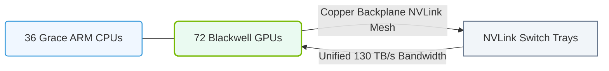

# 12.3f GB200 NVL72: 72 Blackwell GPUs + 36 Grace CPUs in a single liquid-cooled rack

  📦 Nvidia GPU Architecture
  📖 NVIDIA GPU Generations & Form Factors

## 🌐 Context Introduction

The **GB200 NVL72** represents NVIDIA's most ambitious system design for AI training and inference at scale. It combines **72 Blackwell GPUs** with **36 Grace CPUs** into a single, liquid-cooled rack. This is not just a server—it's a complete AI supercomputer in a box, designed to handle the largest language models (LLMs) and generative AI workloads. For new engineers, think of it as a purpose-built, high-density computing cluster that eliminates traditional networking bottlenecks by treating all GPUs as a single, massive accelerator.

---

## ⚙️ What Makes the GB200 NVL72 Unique?

- **72 Blackwell GPUs** — Each GPU is a next-generation NVIDIA architecture optimized for AI/ML workloads, with massive memory bandwidth and tensor core performance.
- **36 Grace CPUs** — These are NVIDIA's own Arm-based CPUs, designed to feed data to the GPUs without traditional x86 bottlenecks.
- **Single Rack Form Factor** — Everything fits in one liquid-cooled rack, drastically reducing physical footprint and power consumption compared to traditional GPU clusters.
- **Liquid Cooling** — The entire system is cooled by liquid, enabling higher power density and quieter operation than air-cooled alternatives.
- **NVLink-C2C Interconnect** — Grace CPUs and Blackwell GPUs communicate over a high-speed, low-latency chip-to-chip link, making the CPU-GPU pair act like a single processor.

---

## 📊 Key Specifications at a Glance

| Component | Specification |
|-----------|---------------|
| **GPUs** | 72 NVIDIA Blackwell GPUs |
| **CPUs** | 36 NVIDIA Grace Arm CPUs |
| **Interconnect** | NVLink-C2C (900 GB/s per CPU-GPU pair) |
| **GPU Memory** | 192 GB HBM3e per GPU (total: 13.8 TB) |
| **CPU Memory** | 480 GB LPDDR5X per CPU (total: 17.28 TB) |
| **Cooling** | Direct liquid cooling (DLC) |
| **Form Factor** | Single rack (approx. 40U) |
| **Power** | ~120 kW (typical) |

---

## 🛠️ How It Works: The Architecture

### 🧠 Grace CPU + Blackwell GPU Pairing

Each **Grace CPU** is paired with **two Blackwell GPUs** via NVLink-C2C. This creates a unified memory space where the CPU and GPU can share data without copying it over PCIe. For engineers, this means:

- **No PCIe bottleneck** — Data moves at 900 GB/s between CPU and GPU.
- **Simpler programming** — Unified memory allows code to treat CPU and GPU memory as one pool.
- **Lower latency** — Ideal for AI inference where every millisecond matters.

### 🔗 NVLink Switch System

All 72 GPUs are connected through NVIDIA's **NVLink Switch** fabric, forming a single GPU domain. This allows:

- **All-to-all GPU communication** — Any GPU can talk to any other GPU at full speed.
- **Linear scaling** — Training large models (like GPT-4 scale) becomes practical without network overhead.
- **Graceful failure handling** — If one GPU fails, the system can redistribute workloads across remaining GPUs.

### 💧 Liquid Cooling Infrastructure

The rack uses **direct-to-chip liquid cooling** with coolant flowing through cold plates attached to each GPU and CPU. Key points for engineers:

- **No fans** — The rack is nearly silent (except for pumps).
- **Higher density** — You can pack more compute per square foot of data center floor.
- **Water temperature** — Typically uses 25-35°C inlet water, reducing chiller energy.

---

### 📊 Visual Representation: GB200 NVL72 Rack-Scale Interconnect
This diagram displays the GB200 NVL72 rack-scale architecture, showing how 36 Grace CPUs and 72 Blackwell GPUs act as a single 1.4 ExaFLOP system via a copper NVLink backplane.

## 🕵️ Why This Matters for AI Workloads

### 🚀 Training Large Language Models (LLMs)

Training a model like Llama 3 70B or GPT-4 requires thousands of GPUs working in parallel. The GB200 NVL72 reduces the need for complex multi-rack networking because:

- All 72 GPUs are in one rack with NVLink switching.
- Communication latency is microseconds, not milliseconds.
- Engineers can treat the rack as a single "virtual GPU" with 13.8 TB of memory.

### 🎯 Inference at Scale

For serving AI models to users, the GB200 NVL72 excels because:

- Grace CPUs handle pre/post-processing (tokenization, decoding).
- Blackwell GPUs run the model with high throughput.
- Liquid cooling allows 24/7 operation without thermal throttling.

---

## 🧩 Comparison: GB200 NVL72 vs. Traditional GPU Servers

| Feature | Traditional 8-GPU Server | GB200 NVL72 (Single Rack) |
|---------|--------------------------|---------------------------|
| **Total GPUs** | 8 | 72 |
| **CPU Type** | x86 (Intel/AMD) | Arm (NVIDIA Grace) |
| **Interconnect** | PCIe Gen5 (128 GB/s) | NVLink-C2C (900 GB/s) |
| **Cooling** | Air (fans) | Liquid (pumps) |
| **Power per Rack** | ~10 kW | ~120 kW |
| **Model Memory Capacity** | ~1.5 TB | ~13.8 TB |
| **Training Time (GPT-3 175B)** | ~3 months | ~2 weeks |

---

## 🔧 Operational Considerations for New Engineers

### 📦 Rack Installation

- **Weight** — A fully loaded GB200 NVL72 rack can weigh over 1,500 kg (3,300 lbs). Ensure floor loading capacity.
- **Power** — Requires 3-phase 480V AC power. Plan for dedicated electrical circuits.
- **Cooling** — Must connect to facility water loop (chilled water or cooling tower). No air cooling option.

### 🌡️ Monitoring and Management

- **NVIDIA Base Command** — Use this software to monitor GPU utilization, temperature, and power.
- **Liquid Cooling Alerts** — Set up alerts for coolant flow rate, inlet/outlet temperature, and pump status.
- **GPU Health** — Monitor for NVLink errors, memory errors, and thermal throttling.

### 🛡️ Redundancy

- **Power Supplies** — The rack uses N+1 redundant power supplies.
- **Cooling Pumps** — Dual pumps with automatic failover.
- **Networking** — Dual 400 Gbps network interfaces per rack for redundancy.

---

## 📚 Summary: Key Takeaways for New Engineers

- The **GB200 NVL72** is a single-rack AI supercomputer with 72 Blackwell GPUs and 36 Grace CPUs.
- It uses **liquid cooling** to manage 120 kW of power in a compact form factor.
- **NVLink-C2C** and **NVLink Switch** eliminate traditional networking bottlenecks.
- Ideal for **training large models** and **high-throughput inference**.
- Requires careful planning for **power, cooling, and floor loading** in the data center.

> 💡 **Pro Tip**: When designing AI infrastructure, think of the GB200 NVL72 as a building block. Multiple racks can be connected via InfiniBand or Ethernet to create even larger clusters for frontier AI workloads.

---

*This guide is part of the NVIDIA-Certified Associate: AI Infrastructure and Operations curriculum. For deeper dives, explore the official NVIDIA documentation on Blackwell architecture and Grace CPU design.*