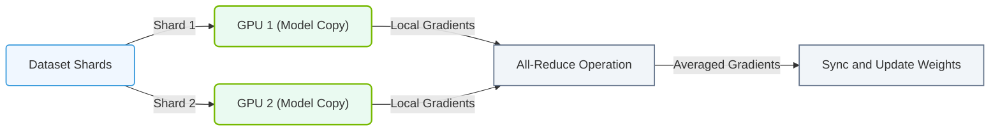

# 13.1a Data Parallelism: splitting batches across GPUs and averaging gradients

  📦 Nvidia GPU Architecture
  📖 Multi-GPU Interconnects

## 📖 Context Introduction

When training large AI models on a single GPU, you are limited by that GPU's memory and compute power. Data Parallelism is the simplest and most common strategy to scale training across multiple GPUs. The core idea is straightforward: **split the training data (batches) across multiple GPUs, let each GPU compute gradients independently, then average those gradients together to update a single shared model.** This allows engineers to train models faster and on larger datasets without needing a single GPU with enormous memory.

---

## ⚙️ How Data Parallelism Works

The process follows a simple loop:

- **Step 1: Split the Batch** — A large mini-batch of data (e.g., 1024 samples) is divided into smaller micro-batches (e.g., 256 samples per GPU across 4 GPUs).
- **Step 2: Distribute to GPUs** — Each GPU receives its own unique subset of the data.
- **Step 3: Forward Pass** — Each GPU runs a forward pass through its local copy of the model.
- **Step 4: Compute Local Gradients** — Each GPU calculates gradients based on its own micro-batch.
- **Step 5: All-Reduce (Average Gradients)** — All GPUs communicate to sum and average their gradients so every GPU ends up with the same averaged gradient.
- **Step 6: Update Model** — Each GPU uses the averaged gradients to update its local model copy (all copies stay identical).

---

## 🛠️ The Key Operation: All-Reduce for Gradient Averaging

The critical communication step is called **All-Reduce**. This is where all GPUs must talk to each other to combine their gradients.

- **What it does:** Takes the gradient vector from each GPU, sums them element-wise, then divides by the number of GPUs.
- **Why it's needed:** Without averaging, each GPU would update its model in a different direction, and the models would diverge.
- **How it happens:** GPUs communicate over high-speed interconnects like **NVLink** or **InfiniBand** (covered in later sections).

**Simple analogy:** Imagine 4 students each solving a different part of a math problem. They then compare answers and take the average to get the final correct answer. The All-Reduce operation is the "comparing answers" step.

---

## 📊 Comparison: Single GPU vs. Data Parallelism

| Feature | Single GPU Training | Data Parallelism (4 GPUs) |
|---|---|---|
| **Batch Size** | 256 samples | 1024 samples (256 per GPU) |
| **Training Time** | Baseline (1x) | ~4x faster (ideal) |
| **Memory per GPU** | Full model + 256 samples | Full model + 256 samples |
| **Communication** | None | Gradients averaged after each step |
| **Model Update** | One update per step | One update per step (averaged) |

---

### 📊 Visual Representation: Data Parallelism (DP) Training Flow
This flowchart maps out Data Parallelism (DP), where identical model copies process separate data shards on distinct GPUs, averaging gradients via All-Reduce.

## 🕵️ Important Considerations for Engineers

- **Batch Size Scaling** — When you increase the total batch size (e.g., from 256 to 1024), you may need to adjust the learning rate. Larger batches provide more stable gradients but can require tuning.
- **Communication Overhead** — The All-Reduce step takes time. For very small models, the communication cost can outweigh the compute benefit. Data parallelism works best when the model is large enough that compute time dominates.
- **Gradient Averaging Frequency** — Gradients are averaged **after every training step**, not after every micro-batch. This keeps all GPUs synchronized.
- **Memory Footprint** — Each GPU must hold a full copy of the model. For very large models (e.g., 70B parameters), this may not fit in a single GPU's memory — that's when model parallelism (covered later) becomes necessary.

---

## 🧩 Practical Workflow Example

Here is a simplified conceptual flow for a training step using data parallelism with 2 GPUs:

**Initial Setup:**
- Total batch size: 64 samples
- GPU 0 receives samples 1–32
- GPU 1 receives samples 33–64
- Both GPUs have identical model weights

**Step Execution:**
1. GPU 0 and GPU 1 each run a forward pass on their 32 samples.
2. Each GPU computes its local loss and gradients.
3. All GPUs perform an All-Reduce to average gradients:
   - GPU 0's gradient vector: **[0.2, -0.1, 0.5]**
   - GPU 1's gradient vector: **[0.4, 0.0, 0.3]**
   - Averaged gradient: **[(0.2+0.4)/2, (-0.1+0.0)/2, (0.5+0.3)/2] = [0.3, -0.05, 0.4]**
4. Both GPUs update their model using the averaged gradient **[0.3, -0.05, 0.4]**.
5. Both GPUs now have identical updated model weights.

---

## ✅ Key Takeaways for New Engineers

- **Data parallelism is the easiest multi-GPU strategy** — you only need to split data and average gradients.
- **The All-Reduce operation is the backbone** — it ensures all GPUs stay synchronized.
- **Communication speed matters** — faster interconnects (NVLink, InfiniBand) make data parallelism more efficient.
- **Watch your total batch size** — doubling GPUs doubles the effective batch size, which may require hyperparameter tuning.
- **Data parallelism does not reduce per-GPU memory for the model** — each GPU still holds the entire model. For huge models, other parallelism strategies are needed.

---

## 🔗 Next Steps

Once you understand data parallelism, explore:
- **13.1b Model Parallelism** — splitting the model itself across GPUs
- **13.1c Pipeline Parallelism** — dividing layers across GPUs for sequential processing
- **13.2 NVLink and NVSwitch** — the hardware that makes All-Reduce fast