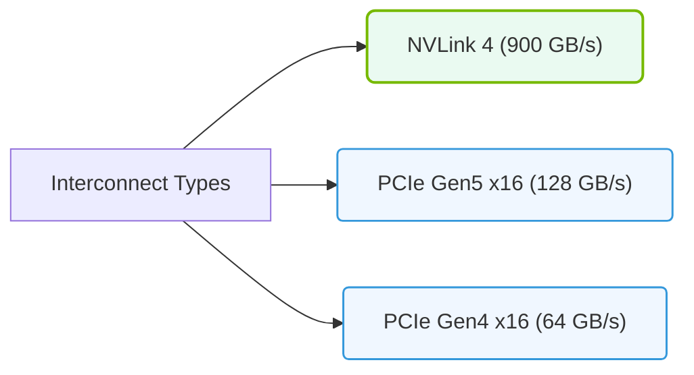

# 13.2d Comparing NVLink bandwidth to PCIe Gen 4 x16 (64 GB/s): a 28x improvement

  📦 Nvidia GPU Architecture
  📖 Multi-GPU Interconnects

---

## 🧭 Context Introduction

When you connect multiple GPUs together to train large AI models, the speed at which they can talk to each other becomes critical. Think of it like a highway system: if the roads are narrow and slow, even the fastest cars (GPUs) will be stuck in traffic. 

Two major technologies handle GPU-to-GPU communication:
- **PCIe Gen 4 x16** — the standard, widely-used connection (like a two-lane road)
- **NVLink** — NVIDIA's specialized, ultra-fast interconnect (like a 28-lane superhighway)

This section explains why the **28x bandwidth improvement** of NVLink over PCIe Gen 4 x16 matters for AI workloads.

---

## ⚙️ What is PCIe Gen 4 x16?

PCIe (Peripheral Component Interconnect Express) is the standard slot used to connect GPUs to a motherboard. The "Gen 4" refers to the generation, and "x16" means it uses 16 lanes for data transfer.

| Feature | Value |
|---------|-------|
| **Total bandwidth** | 64 GB/s (bidirectional) |
| **Direction** | Half-duplex (data flows one way at a time per lane) |
| **Typical use** | General-purpose GPU communication, storage, networking |
| **Latency** | Higher (microseconds) |

**Key limitation:** PCIe was designed for general-purpose I/O, not specifically for GPU-to-GPU communication. It shares bandwidth with other devices (like SSDs and network cards) on the same bus.

---

## 🚀 What is NVLink?

NVLink is NVIDIA's proprietary, high-bandwidth, low-latency interconnect designed exclusively for GPU-to-GPU communication. It creates a direct, high-speed bridge between GPUs, bypassing the CPU and system memory entirely.

| Feature | Value |
|---------|-------|
| **Total bandwidth (NVLink 4.0)** | 1,792 GB/s (bidirectional, per GPU with 18 links) |
| **Direction** | Full-duplex (data flows both ways simultaneously) |
| **Typical use** | AI training, deep learning model parallelism |
| **Latency** | Very low (nanoseconds) |

**Key advantage:** NVLink is purpose-built for the massive data exchanges required during distributed AI training — think gradients, activations, and model parameters flying between GPUs.

---

### 📊 Visual Representation: NVLink vs. PCIe Gen4/Gen5 Bandwidth Comparison
This diagram contrasts the bidirectional bandwidth of NVLink (900 GB/s) against PCIe Gen4 (64 GB/s) and PCIe Gen5 (128 GB/s).

## 📊 The 28x Improvement — Side-by-Side Comparison

Let's put the numbers in perspective:

| Metric | PCIe Gen 4 x16 | NVLink (4.0, 18 links) | Improvement |
|--------|----------------|------------------------|-------------|
| **Bidirectional bandwidth** | 64 GB/s | 1,792 GB/s | **28x** |
| **Direction type** | Half-duplex | Full-duplex | 2x effective throughput |
| **Latency** | ~1-3 µs | ~100-200 ns | 10-15x lower |
| **Shared with other devices?** | Yes (PCIe bus) | No (dedicated GPU links) | No contention |

**Why 28x?**  
- PCIe Gen 4 x16 = 64 GB/s  
- NVLink 4.0 with 18 links = 1,792 GB/s  
- 1,792 ÷ 64 = **28**

---

## 🕵️ Why This Matters for AI Workloads

In AI training, especially with large models (like GPT, BERT, or vision transformers), GPUs must constantly share:
- **Gradients** during backpropagation
- **Activations** between layers
- **Model parameters** when using model parallelism

With PCIe, these exchanges become a bottleneck. With NVLink:
- **Training time drops dramatically** — GPUs spend less time waiting for data
- **Larger models become feasible** — you can split a model across more GPUs without hitting communication walls
- **Scaling efficiency improves** — adding more GPUs actually speeds up training, not just adds overhead

---

## 🛠️ Real-World Analogy

Imagine you're moving a giant library (your AI model) from one building to another:

- **PCIe Gen 4 x16** = A single person carrying one book at a time through a narrow hallway. It works, but it's slow.
- **NVLink** = A fleet of 28 people, each carrying books both ways simultaneously, using a dedicated express tunnel. The job gets done 28x faster.

---

## ✅ Key Takeaway for New Engineers

- **PCIe Gen 4 x16** is fine for single-GPU workloads or simple multi-GPU setups where communication is infrequent.
- **NVLink** is essential for multi-GPU AI training at scale — it removes the communication bottleneck and enables the massive parallelism required for modern deep learning.
- The **28x bandwidth improvement** isn't just a theoretical number; it directly translates to faster training, larger model support, and better GPU utilization.

When designing AI infrastructure, always check whether your GPUs support NVLink and whether your workload will benefit from it. For serious AI training, NVLink is not optional — it's the backbone of multi-GPU performance.