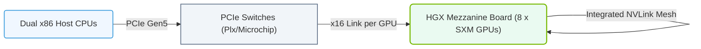

# 13.4a HGX A100/H100: the reference baseboard with 8 SXM GPUs and NVSwitch

  📦 Nvidia GPU Architecture
  📖 Multi-GPU Interconnects

---

## 🌐 Context Introduction

When you start working with AI infrastructure, you will quickly encounter the need to connect multiple GPUs together. A single GPU, no matter how powerful, can only process so much data at once. For large-scale AI models (like GPT or BERT), engineers must use many GPUs working in parallel. The **HGX A100** and **HGX H100** are Nvidia's reference baseboard designs that solve this problem. They provide a standardized way to connect **8 SXM GPUs** using a high-speed switch called **NVSwitch**. Think of the HGX baseboard as the "motherboard" for a cluster of GPUs inside a single server.

---

## ⚙️ What is an HGX Baseboard?

The HGX (HGX stands for "Hopper GPU eXtreme" or "Ampere GPU eXtreme") is a **reference baseboard**—a pre-designed circuit board that holds multiple GPUs and the interconnects between them. It is not a full server; it is the core component that server manufacturers (like Dell, HPE, or Supermicro) integrate into their own systems.

- **Purpose:** To provide a standardized, high-performance platform for multi-GPU computing.
- **Key Components:**
  - **8 SXM GPUs** (SXM = Server eXtension Module, a physical form factor for GPUs)
  - **NVSwitch** (a high-speed switch that connects all GPUs together)
  - **Power delivery** and **cooling** infrastructure

---

## 🧩 The 8 SXM GPUs

The **SXM** form factor is designed specifically for servers. Unlike desktop GPUs (which plug into PCIe slots), SXM GPUs connect directly to the baseboard via a high-density connector. This allows for:

- **Higher bandwidth** (more data lanes)
- **Lower latency** (shorter physical distance)
- **Better power efficiency** (direct power delivery)

Each of the 8 GPUs on the HGX baseboard is identical and can communicate with every other GPU at very high speeds.

---

## 🔗 NVSwitch — The Heart of the Interconnect

The **NVSwitch** is a custom silicon chip that acts as a fully connected switch between all 8 GPUs. It is the key technology that enables **all-to-all GPU communication** without bottlenecks.

| Feature | What It Means for Engineers |
|---------|-----------------------------|
| **Full Bandwidth** | Each GPU can talk to every other GPU at the same time, at full speed. |
| **Low Latency** | Data moves between GPUs in microseconds, not milliseconds. |
| **Scalability** | Multiple HGX baseboards can be connected together using NVLink bridges. |

- **NVLink** is the physical cable/connection that carries data between GPUs and NVSwitch.
- **NVSwitch** is the actual chip that routes the traffic.

---

### 📊 Visual Representation: HGX baseboard architecture
This diagram displays the HGX baseboard layout, showing x86 CPUs interfacing with the x8 SXM GPU baseboard via PCIe switches.

## 🛠️ How It All Fits Together

Here is a simplified view of how the HGX A100/H100 baseboard works inside a server:

1. **8 GPUs** are mounted on the baseboard in SXM slots.
2. **NVSwitch chips** (usually 4 or 6 per baseboard) sit between the GPUs.
3. Each GPU has **NVLink connections** to the NVSwitch.
4. The NVSwitch creates a **fully connected mesh**—any GPU can send data to any other GPU in one hop.
5. The baseboard also includes **power management** and **thermal sensors** to keep everything running safely.

---

## 🕵️ A100 vs H100 — Key Differences

While the architecture is similar, the H100 baseboard offers improvements over the A100:

| Feature | HGX A100 | HGX H100 |
|---------|----------|----------|
| **GPU Architecture** | Ampere | Hopper |
| **NVLink Bandwidth per GPU** | 600 GB/s | 900 GB/s |
| **NVSwitch Generation** | Third-gen NVSwitch | Fourth-gen NVSwitch |
| **Maximum GPUs per NVSwitch Domain** | 8 | 8 (with support for larger clusters) |
| **Memory per GPU** | 40 GB or 80 GB HBM2e | 80 GB HBM3 |
| **Power per GPU** | 400W | 700W |

**For engineers:** The H100 provides faster data movement and more memory, which directly translates to faster training times for large models.

---

## 📊 Why This Matters for AI Workloads

When training a large AI model, data must be split across multiple GPUs. The HGX baseboard ensures that:

- **Gradient updates** (the math that adjusts the model) are shared instantly between all GPUs.
- **Model parallelism** (splitting the model itself across GPUs) works efficiently.
- **Data parallelism** (splitting the training data) does not become bottlenecked by slow interconnects.

Without NVSwitch, engineers would have to rely on slower PCIe connections, which would dramatically increase training time.

---

## 🧠 Real-World Analogy

Imagine you have 8 chefs (GPUs) in a kitchen (the server). Each chef needs to share ingredients (data) with every other chef. Without NVSwitch, they would have to pass ingredients one-by-one through a single door (PCIe). With NVSwitch, there is a **revolving table** in the center of the kitchen—any chef can place ingredients on the table, and any other chef can grab them instantly. The HGX baseboard is the kitchen layout that makes this possible.

---

## ✅ Summary for New Engineers

- **HGX A100/H100** is a reference baseboard that holds **8 SXM GPUs**.
- **NVSwitch** connects all 8 GPUs in a high-speed, fully connected mesh.
- This design is the foundation for **Nvidia DGX systems** and many third-party AI servers.
- The H100 version offers **50% more bandwidth** and **faster memory** than the A100.
- As an engineer, you will see HGX baseboards in data centers where large-scale AI training happens.

**Next step:** When you encounter a server with an HGX baseboard, check the GPU model (A100 or H100) and the NVSwitch generation—this will tell you the maximum performance you can expect for multi-GPU workloads.