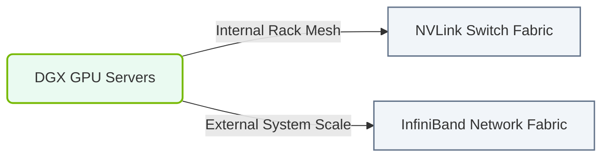

# 13.4e DGX SuperPOD: clustering multiple DGX nodes via InfiniBand for petaflop-scale clusters

  📦 Nvidia GPU Architecture
  📖 Multi-GPU Interconnects

---

## 🧠 Context Introduction

Imagine you've built a single DGX server — a powerful machine with 8 GPUs that can train large AI models. But what if your model is so massive (like GPT-4 or a climate simulation) that it requires thousands of GPUs working together? That's where the **DGX SuperPOD** comes in. It's a blueprint for connecting many DGX nodes into a single, massive supercomputer using a special high-speed network called **InfiniBand**. Think of it as taking multiple high-performance cars and linking them into a single, coordinated racing team.

---

## ⚙️ What is a DGX SuperPOD?

A DGX SuperPOD is a **pre-designed, validated architecture** from NVIDIA that clusters multiple DGX systems (typically DGX A100 or DGX H100) to achieve **petaflop-scale performance** (quadrillions of calculations per second). It's not just stacking servers — it's a carefully engineered system with:

- **Compute nodes**: Multiple DGX systems (e.g., 20, 40, or 140 DGX nodes)
- **High-speed fabric**: InfiniBand networking connecting every GPU to every other GPU
- **Storage**: High-performance parallel file systems (like Lustre or GPUDirect Storage)
- **Management**: Software stack for orchestration, monitoring, and job scheduling

---

## 🛠️ How InfiniBand Makes Clustering Possible

InfiniBand is the secret sauce. Unlike standard Ethernet, InfiniBand offers:

- **Ultra-low latency**: As low as 1 microsecond (vs. 10-100 microseconds for Ethernet)
- **High bandwidth**: 200-400 Gbps per link (NVIDIA Quantum InfiniBand)
- **RDMA (Remote Direct Memory Access)**: GPUs can directly read/write memory on other GPUs without involving the CPU — critical for distributed training
- **GPU Direct**: Data moves directly between GPUs across nodes, bypassing system memory

**How it works in a SuperPOD:**
- Each DGX node has multiple InfiniBand network interface cards (NICs)
- These connect to a **leaf-spine** network topology (like a tree of switches)
- Every GPU can talk to any other GPU in the cluster with minimal delay

---

## 📊 DGX SuperPOD vs. Single DGX Node — A Comparison

| Feature | Single DGX Node | DGX SuperPOD (20 nodes) |
|---------|----------------|------------------------|
| **Total GPUs** | 8 | 160 |
| **Peak Performance** | ~5 petaflops (FP16) | ~100 petaflops (FP16) |
| **Memory** | 640 GB GPU memory | 12.8 TB GPU memory |
| **Network** | Internal NVLink only | NVLink + InfiniBand |
| **Training Time** | Weeks for large models | Days or hours |
| **Use Case** | Small models, prototyping | Large-scale training, LLMs |

---

## 🕵️ Key Components of a DGX SuperPOD

### 1. **Compute Nodes (DGX Systems)**
- Each DGX A100 or H100 has 8 GPUs connected via NVLink (high-speed internal interconnect)
- Each node has 8 InfiniBand NICs (one per GPU) for external communication

### 2. **InfiniBand Network Fabric**
- **Leaf switches**: Connect directly to DGX nodes (typically 8-16 nodes per leaf)
- **Spine switches**: Connect all leaf switches together (non-blocking architecture)
- **Cables**: Active optical cables (AOCs) for long distances, copper for short runs

### 3. **Storage System**
- Parallel file system (e.g., NVIDIA GPUDirect Storage)
- Connected via InfiniBand for high-throughput data loading
- Typically 10-100 PB of usable storage

### 4. **Management and Orchestration**
- **NVIDIA Base Command**: For cluster management and job scheduling
- **Slurm or Kubernetes**: For workload orchestration
- **Monitoring tools**: NVIDIA DCGM (Data Center GPU Manager) for health checks

---

### 📊 Visual Representation: DGX SuperPOD Cluster Topology
This diagram shows the DGX SuperPOD architecture: multiple DGX nodes linked together over dual network fabrics (NVLink fabric internally and InfiniBand fabric externally).

## 🔧 How Engineers Deploy and Operate a SuperPOD

### Step 1: Physical Installation
- Rack all DGX nodes in standard data center racks (typically 20-40 nodes per POD)
- Cable InfiniBand in a **fat-tree** topology (every leaf switch connects to every spine switch)
- Connect storage nodes via InfiniBand

### Step 2: Network Configuration
- Assign IP addresses to all InfiniBand interfaces (using subnet manager)
- Configure routing tables for optimal GPU-to-GPU communication
- Verify connectivity using **ibstatus** and **ibdiagnet** commands

### Step 3: Software Stack Installation
- Install NVIDIA DGX OS (customized Ubuntu)
- Deploy NVIDIA AI Enterprise (containing CUDA, cuDNN, NCCL)
- Configure **NVIDIA NCCL** (NVIDIA Collective Communications Library) to use InfiniBand

### Step 4: Validation and Benchmarking
- Run **NVIDIA HPC-X** benchmarks to test InfiniBand bandwidth and latency
- Execute **NCCL tests** (e.g., allreduce, allgather) to verify GPU-to-GPU performance
- Train a small model (e.g., BERT-Large) to confirm end-to-end functionality

---

## 📈 Real-World Performance Numbers

For a 20-node DGX H100 SuperPOD:
- **InfiniBand bandwidth**: 400 Gbps per link (8 links per node = 3.2 Tbps per node)
- **GPU-to-GPU latency**: ~2 microseconds between any two GPUs in the cluster
- **Training throughput**: Can train a 175B parameter model (like GPT-3) in ~2 weeks (vs. months on a single node)
- **Scalability efficiency**: Typically achieves 90%+ linear scaling (doubling nodes doubles performance)

---

## 🧩 Common Challenges and Solutions

| Challenge | Solution |
|-----------|----------|
| **Cable management complexity** | Use pre-terminated fiber bundles; label every cable |
| **Network congestion** | Use adaptive routing in InfiniBand switches |
| **GPU memory fragmentation** | Use NVIDIA GPUDirect RDMA for efficient memory sharing |
| **Cooling** | Liquid cooling for high-density racks (up to 40 kW per rack) |
| **Firmware updates** | Use NVIDIA's automated update tools (e.g., DGX OS updates) |

---

## ✅ Key Takeaways for New Engineers

1. **DGX SuperPOD is a blueprint, not a product** — it's a reference architecture you can replicate
2. **InfiniBand is the backbone** — without it, GPU-to-GPU communication across nodes would be too slow
3. **Scale matters** — more nodes = more GPUs = faster training, but only if the network is designed correctly
4. **Validation is critical** — always run benchmarks before trusting the cluster for production workloads
5. **Start small** — learn with 2-4 DGX nodes before scaling to 20+ nodes

---

## 📚 Further Learning Resources

- **NVIDIA DGX SuperPOD Reference Architecture** (official documentation)
- **NVIDIA NCCL Documentation** (for understanding GPU communication patterns)
- **InfiniBand Trade Association** (for network fundamentals)
- **NVIDIA Base Command** (for cluster management tutorials)

---

*Remember: A SuperPOD is like a symphony orchestra — each DGX node is a musician, and InfiniBand is the conductor ensuring everyone plays in perfect harmony.*