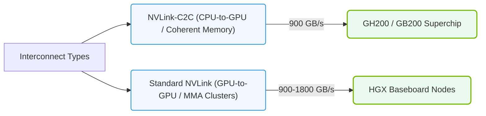

# 13.5a NVLink-C2C vs. standard NVLink: die-to-die vs. node-to-node

  📦 Nvidia GPU Architecture
  📖 Multi-GPU Interconnects

## 🧠 Context Introduction

When building AI systems, engineers often need to connect multiple GPUs together to share data and work on large models. NVIDIA provides two main technologies for this: **standard NVLink** and **NVLink-C2C**. While they share a similar name, they serve very different purposes. Think of standard NVLink as a highway connecting cities (nodes), and NVLink-C2C as a direct bridge connecting two buildings on the same block (dies inside a single package). Understanding this distinction is critical for designing efficient AI infrastructure.

---

## ⚙️ What is Standard NVLink? (Node-to-Node)

Standard NVLink is a high-speed, direct GPU-to-GPU interconnect designed to connect **separate physical GPU nodes** (e.g., multiple GPUs on different PCIe cards or in different servers).

- **Purpose:** Enables multiple GPUs to share memory and work together on large AI models (e.g., training a massive neural network across 8 GPUs).
- **Physical Scope:** Connects GPUs that are physically separate — each GPU is its own chip on its own card.
- **Bandwidth:** Very high (e.g., 900 GB/s per GPU in NVIDIA H100 systems).
- **Topology:** Can form complex networks (e.g., fully connected mesh, NVSwitch-based clusters).
- **Latency:** Low, but higher than NVLink-C2C due to longer physical distances and signal travel through cables or backplanes.

**Key takeaway:** Standard NVLink is for scaling AI workloads **across multiple separate GPU cards** in a server or cluster.

---

## 🔗 What is NVLink-C2C? (Die-to-Die)

NVLink-C2C (Chip-to-Chip) is a **die-to-die** interconnect designed to connect two chips **within the same physical package** or on the same substrate.

- **Purpose:** Connects a GPU to another chip (e.g., a CPU, another GPU, or a custom accelerator) in a tightly integrated, low-latency manner.
- **Physical Scope:** Connects two silicon dies that are physically very close — often on the same interposer or package.
- **Bandwidth:** Extremely high (e.g., up to 900 GB/s per connection in NVIDIA Grace Hopper).
- **Latency:** Ultra-low — measured in nanoseconds, much faster than standard NVLink.
- **Use Case:** Used in NVIDIA Grace Hopper Superchip, where a Grace CPU and Hopper GPU are connected via NVLink-C2C, creating a unified memory space.

**Key takeaway:** NVLink-C2C is for **tightly coupling two chips** in a single module, enabling them to act almost like a single, larger chip.

---

### 📊 Visual Representation: NVLink-C2C vs. Standard NVLink Interconnects
This diagram contrasts NVLink-C2C (connecting CPUs to GPUs on the same package) against standard NVLink (connecting discrete GPUs).

## 📊 Comparison Table: NVLink-C2C vs. Standard NVLink

| Feature | Standard NVLink | NVLink-C2C |
|---------|----------------|------------|
| **Scope** | Node-to-node (separate cards) | Die-to-die (same package) |
| **Physical Distance** | Meters (cables/backplane) | Millimeters (on a substrate) |
| **Latency** | Microseconds | Nanoseconds |
| **Bandwidth** | Very high (e.g., 900 GB/s) | Extremely high (e.g., 900 GB/s) |
| **Power Efficiency** | Good | Excellent (shorter traces) |
| **Typical Use** | Multi-GPU servers, clusters | CPU+GPU superchips, custom accelerators |
| **Example Product** | NVIDIA H100 (8-GPU NVLink) | NVIDIA Grace Hopper Superchip |

---

## 🛠️ When to Use Which?

- **Use Standard NVLink** when you need to scale AI training across **multiple discrete GPUs** in a server or cluster. Example: Training a large language model (LLM) across 8 H100 GPUs in an NVIDIA DGX system.
- **Use NVLink-C2C** when you need **ultra-low latency** and **tight integration** between two chips, such as a CPU and GPU working on the same memory pool. Example: The Grace Hopper Superchip for high-performance computing (HPC) and AI inference.

---

## 🕵️ Real-World Analogy

- **Standard NVLink** = A high-speed train connecting two cities. The cities are separate, but the train allows fast travel between them.
- **NVLink-C2C** = A direct hallway connecting two rooms in the same building. You can walk from one room to the other instantly without going outside.

---

## ✅ Summary for New Engineers

- **Standard NVLink** = Connects **separate GPUs** (node-to-node). Use for scaling across multiple cards.
- **NVLink-C2C** = Connects **two chips in one package** (die-to-die). Use for tight CPU+GPU integration.
- Both are high-speed interconnects, but NVLink-C2C is **faster and more power-efficient** because the chips are physically closer.
- As an engineer, choosing the right interconnect depends on your system architecture: are you building a multi-GPU server (standard NVLink) or a tightly coupled superchip (NVLink-C2C)?

---

*Next time you see "NVLink" in a datasheet, check whether it's standard NVLink or NVLink-C2C — the difference is all about scale and physical proximity.*