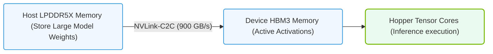

# 13.5c Implications for memory-intensive inference (no PCIe bottleneck)

<div class="lesson-completion" data-lesson-id="13_5c_memory_intensive_inference"></div>
<div class="lesson-tags">
  <span class="lesson-tag">📦 Nvidia GPU Architecture</span>
  <span class="lesson-tag">📖 Multi-GPU Interconnects</span>
</div>


---

## 🧠 Context Introduction

When deploying large AI models for inference—especially those with massive memory footprints like LLMs (Large Language Models) or recommendation systems—the traditional PCIe (Peripheral Component Interconnect Express) bus can become a major bottleneck. NVLink-C2C (Chip-to-Chip) eliminates this limitation by providing a direct, high-bandwidth, low-latency connection between GPUs or between a GPU and a CPU. For new engineers, understanding the implications of this "no PCIe bottleneck" scenario is critical for optimizing memory-intensive inference workloads.

---

## ⚙️ What is the PCIe Bottleneck?

- **PCIe lanes** are shared resources that connect GPUs to the CPU and system memory.
- **Bandwidth limitations**: Even PCIe 5.0 x16 offers only ~32 GB/s per direction—far less than what modern GPUs need for large model weights.
- **Latency overhead**: Data must travel through the CPU and memory controller, adding microseconds of delay.
- **Contention**: Multiple GPUs sharing the same PCIe root complex can cause congestion.

---

## 🚀 How NVLink-C2C Removes the Bottleneck

- **Direct connection**: NVLink-C2C creates a dedicated, point-to-point link between chips (GPU-to-GPU or GPU-to-CPU).
- **Higher bandwidth**: NVLink-C2C offers up to 900 GB/s per direction (depending on implementation), compared to PCIe's ~32 GB/s.
- **Lower latency**: Data transfers happen in nanoseconds instead of microseconds.
- **Cache coherence**: NVLink-C2C supports unified memory access, meaning GPUs can directly read/write each other's memory without CPU intervention.

---

## 📊 Comparison: PCIe vs. NVLink-C2C for Inference

| Feature | PCIe 5.0 x16 | NVLink-C2C |
|---------|--------------|------------|
| **Peak bandwidth (per direction)** | ~32 GB/s | Up to 900 GB/s |
| **Latency** | ~1-3 µs | ~100-200 ns |
| **Cache coherence** | No (requires explicit copies) | Yes (hardware-managed) |
| **CPU involvement** | Required for data movement | Minimal (direct GPU-to-GPU) |
| **Scalability** | Limited by root complex | Scales linearly with links |
| **Power efficiency** | Moderate | Higher (less overhead per byte) |

---

### 📊 Visual Representation: Memory-Intensive Inference in Grace Hopper
This diagram shows how Grace Hopper speeds up inference on massive LLM models by storing larger weights in Grace LPDDR5X and calling them into Hopper HBM3 as needed.



## 🕵️ Implications for Memory-Intensive Inference

### 1. 🧩 Model Parallelism Becomes Efficient

- **Tensor parallelism**: Large model layers can be split across GPUs without waiting for PCIe transfers.
- **Pipeline parallelism**: Intermediate activations flow between GPUs at near-memory speeds.
- **No data copy overhead**: Model weights stay in GPU memory; only activations are shared.

### 2. 💾 Unified Memory Pooling

- **Larger effective memory**: Multiple GPUs appear as one large memory pool (e.g., 8x 80GB GPUs = 640GB).
- **Transparent access**: Any GPU can access any weight or activation without explicit `cudaMemcpy` calls.
- **Reduced engineering complexity**: Engineers write code as if all memory is local.

### 3. ⚡ Real-Time Inference Latency

- **Sub-millisecond response**: For applications like autonomous driving or real-time translation, NVLink-C2C ensures predictable, low latency.
- **No PCIe queuing**: Inference requests don't wait for bus arbitration.
- **Consistent throughput**: Even with multiple concurrent inference streams, performance remains stable.

### 4. 🔄 Dynamic Batching and Model Switching

- **Fast weight swapping**: Models can be loaded/unloaded across GPUs in microseconds.
- **Adaptive batching**: Batches can be dynamically resized without PCIe transfer penalties.
- **Multi-tenant support**: Different models can run on different GPUs and share intermediate results instantly.

---

## 🛠️ Practical Considerations for Engineers

- **Memory alignment**: Ensure model weights are aligned to 256-byte boundaries for optimal NVLink-C2C transfers.
- **Topology awareness**: Use `nvidia-smi topo -m` to verify NVLink-C2C connections between GPUs.
- **Profiling tools**: Use **Nsight Systems** to monitor NVLink-C2C bandwidth utilization and detect any remaining bottlenecks.
- **Avoid CPU fallback**: Design inference pipelines to keep all data movement on the GPU fabric.

**For reference:**
```
nvidia-smi topo -m
```
📤 **Output:** Shows a matrix of GPU connections, where "NV" indicates NVLink-C2C links and "PIX" indicates PCIe.

---

## ✅ Key Takeaways for New Engineers

- **NVLink-C2C eliminates the PCIe bottleneck** for memory-intensive inference, enabling near-native memory access across GPUs.
- **Model parallelism becomes practical** without complex data movement logic.
- **Latency drops by an order of magnitude** compared to PCIe-based systems.
- **Engineers should design for unified memory** and avoid unnecessary CPU involvement.
- **Always profile** to confirm that NVLink-C2C is being utilized effectively—don't assume it's automatic.

---

## 📚 Further Learning

- NVIDIA's official **NVLink-C2C whitepaper**
- **CUDA Programming Guide** – Unified Memory section
- Hands-on labs with **NVIDIA Grace Hopper** systems (which use NVLink-C2C between CPU and GPU)