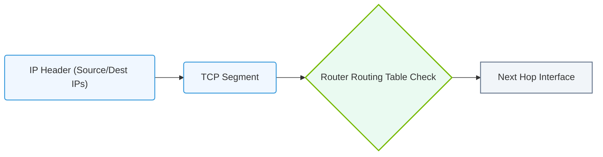

# 14.1c Layer 3 (Network): IP addresses, routing, and routers

  📦 AI Data Center Networking
  📖 Enterprise Networking Baseline

Welcome to Layer 3 of the OSI model — the **Network Layer**. If Layer 2 (Data Link) is about moving frames between devices on the same local network, Layer 3 is about moving packets across *different* networks. This is where the internet truly begins.

For engineers new to AI infrastructure, understanding Layer 3 is critical. AI workloads often involve distributed training across hundreds of GPUs in different racks, clusters, or even data centers. Without proper IP addressing and routing, those massive data transfers would never reach their destination.

---

## 🌐 What is Layer 3?

Layer 3 is responsible for **logical addressing** and **path selection**. It determines the best route for data to travel from a source device to a destination device, even if they are on entirely different networks.

Key responsibilities of Layer 3:
- **Logical addressing** — Assigning IP addresses to devices so they can be uniquely identified across the entire network.
- **Routing** — Choosing the best path for data packets to travel.
- **Packet forwarding** — Moving packets from one router to another toward the final destination.
- **Fragmentation and reassembly** — Breaking large packets into smaller pieces if a network link has a smaller maximum transmission unit (MTU).

---

## 📍 IP Addresses — The Logical Identifiers

An **IP address** is a unique logical identifier assigned to every device on a network. Unlike MAC addresses (Layer 2), IP addresses are hierarchical and can be changed.

### IPv4 vs. IPv6

| Feature | IPv4 | IPv6 |
|---------|------|------|
| Address length | 32 bits | 128 bits |
| Format | Dotted decimal (e.g., `192.168.1.1`) | Hexadecimal colon-separated (e.g., `2001:db8::1`) |
| Number of addresses | ~4.3 billion | 340 undecillion (virtually unlimited) |
| Common in AI data centers | Still widely used internally | Growing adoption for scalability |

### Key IP Address Concepts

- **Network portion** — Identifies the specific network (e.g., `192.168.1.0/24`).
- **Host portion** — Identifies a specific device on that network (e.g., `.10`).
- **Subnet mask** — Defines which part of the IP address is the network and which is the host.
- **Default gateway** — The router IP address that devices use to reach networks outside their own.

> 💡 In AI infrastructure, you'll often see **private IP ranges** like `10.x.x.x` or `172.16.x.x` used for internal cluster communication. These are non-routable on the public internet.

---

## 🛤️ Routing — Finding the Best Path

**Routing** is the process of selecting a path for traffic across one or more networks. A router examines the destination IP address of a packet and decides where to send it next.

### Types of Routing

- **Static routing** — Routes are manually configured by an engineer. Simple but doesn't adapt to network changes.
- **Dynamic routing** — Routers automatically learn and update routes using routing protocols. Essential for large AI clusters.

### Common Dynamic Routing Protocols

- **OSPF (Open Shortest Path First)** — Uses link-state information to find the shortest path. Common in data center fabrics.
- **BGP (Border Gateway Protocol)** — The routing protocol of the internet. Used for connecting different autonomous systems, including inter-data-center links.
- **EIGRP (Enhanced Interior Gateway Routing Protocol)** — Cisco proprietary, but still found in some environments.

### Routing Metrics

Routers use metrics to determine the best path. Common metrics include:
- **Hop count** — Number of routers a packet must pass through.
- **Bandwidth** — Speed of the link.
- **Delay** — Time it takes for a packet to travel.
- **Cost** — An administrative value assigned by the engineer.

---

## 🖥️ Routers — The Traffic Directors

A **router** is a networking device that forwards data packets between computer networks. In an AI data center, routers connect different subnets, racks, and even data centers.

### What Routers Do

- **Examine destination IP** — Look at the packet's destination address.
- **Consult the routing table** — Match the destination to an entry in the table.
- **Forward the packet** — Send it out the correct interface toward the next hop.
- **Handle packet fragmentation** — Split packets if the next link has a smaller MTU.

### Router Components

- **Routing table** — A database of known networks and the best path to reach them.
- **Interfaces** — Physical or virtual ports connecting to different networks.
- **Control plane** — Where routing protocols run and routing tables are built.
- **Data plane** — Where actual packet forwarding happens at high speed.

### Routers vs. Switches (Layer 2 vs. Layer 3)

| Feature | Layer 2 Switch | Layer 3 Router |
|---------|----------------|----------------|
| Uses | MAC addresses | IP addresses |
| Scope | Single broadcast domain | Multiple networks |
| Decision basis | MAC address table | Routing table |
| Common in AI | Top-of-rack switches | Spine switches, border routers |

---

### 📊 Visual Representation: OSI Layer 3 IP Packet Routing
This diagram displays Layer 3 routing logic, wrapping TCP segments in IP headers containing logical source/destination IP addresses.

## 🔄 How Layer 3 Works in an AI Data Center

Imagine an AI training job running across 64 GPUs in 8 different racks. Each rack has its own subnet (e.g., `10.0.1.0/24`, `10.0.2.0/24`, etc.).

1. GPU in rack 1 (IP: `10.0.1.10`) needs to send data to GPU in rack 8 (IP: `10.0.8.20`).
2. The source GPU sends the packet to its **default gateway** (the top-of-rack router).
3. The router checks its routing table and finds a path to `10.0.8.0/24`.
4. The packet is forwarded through the spine network, possibly through multiple routers.
5. The final router in rack 8 delivers the packet to the destination GPU.

> ⚡ This entire process happens in microseconds. For AI workloads, even small delays can add up to significant training time increases.

---

## 🕵️ Common Layer 3 Issues in AI Infrastructure

- **IP address conflicts** — Two devices with the same IP cause connectivity loss.
- **Missing default gateway** — Devices can't reach external networks.
- **Routing loops** — Packets bounce between routers indefinitely.
- **Asymmetric routing** — Traffic takes a different path in each direction, causing firewall or performance issues.
- **MTU mismatches** — Large AI data packets get dropped if routers can't handle them.

---

## 📝 Key Takeaways for New Engineers

- **Layer 3 is about logical addressing and path selection** — It enables communication across different networks.
- **IP addresses are hierarchical** — The network portion identifies the network; the host portion identifies the device.
- **Routers use routing tables** — These tables are built manually (static) or automatically (dynamic protocols).
- **Dynamic routing is essential for AI clusters** — Manual routes don't scale across hundreds of racks.
- **Understand your network topology** — Knowing where subnets, routers, and gateways are located helps you troubleshoot faster.

---

## ✅ Quick Reference — Layer 3 at a Glance

- **Protocol Data Unit (PDU):** Packet
- **Addressing:** IP address (logical, hierarchical)
- **Device:** Router
- **Key function:** Path selection and forwarding between networks
- **Common protocols:** IP, OSPF, BGP, ICMP (ping)

---

> 🧠 *Think of Layer 3 as the postal system of the network. IP addresses are like street addresses (city, street, house number). Routers are like post offices that decide which truck should carry your package to the next city. Without Layer 3, your data would never leave your local neighborhood.*