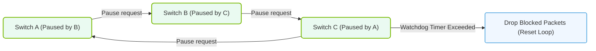

# 16.3e PFC deadlock risks and mitigation strategies

  📦 AI Data Center Networking
  📖 High-Speed Ethernet for AI

## 📘 Context Introduction

In lossless Ethernet fabrics built for AI workloads (like RoCEv2), Priority Flow Control (PFC) is essential to prevent packet drops. However, PFC introduces a unique risk: **deadlock**. A PFC deadlock occurs when multiple switches or endpoints are waiting for each other to release buffer space, causing traffic to stall indefinitely. For new engineers, think of it like a traffic gridlock where no car can move because every intersection is blocked. This section explains why deadlocks happen and how to prevent them.

---

## ⚙️ What is a PFC Deadlock?

A PFC deadlock happens when a **circular dependency** forms in the flow control mechanism. Here’s a simple breakdown:

- **PFC pause frames** are sent by a switch to a sender when its receive buffer is full.
- If Switch A pauses Switch B, and Switch B pauses Switch C, and Switch C pauses Switch A, a **loop** is created.
- No device can send data because each is waiting for the other to resume.
- Traffic on the affected priority class **stops completely** — this is a deadlock.

### 🧩 Key Characteristics of PFC Deadlock

- **Circular waiting**: Each device holds a resource (buffer space) and waits for another.
- **No forward progress**: Packets are not dropped, but they never reach their destination.
- **Affects only lossless priorities**: Typically the RoCEv2 traffic class (e.g., priority 3).
- **Can spread**: A local deadlock can cascade to other switches if not mitigated.

---

## 🕵️ Common Causes of PFC Deadlock

| Cause | Description |
|-------|-------------|
| **Incorrect buffer sizing** | Buffers too small to absorb bursts, causing frequent PFC pauses. |
| **Asymmetric traffic patterns** | AI training has many-to-one or one-to-many flows that create hotspots. |
| **Long physical paths** | High latency between switches increases the time to drain buffers. |
| **Misconfigured PFC thresholds** | PFC triggered too early or too late, creating imbalance. |
| **Congestion spreading** | PFC pauses propagate backward through the network. |

---

### 📊 Visual Representation: PFC Deadlock Cyclic Dependency Loop
This diagram displays how cyclic pause frames create a deadlock loop across switches, and how watchdog timers mitigate it by dropping packets.

## 🛠️ Mitigation Strategies for PFC Deadlock

Engineers can use several techniques to reduce or eliminate PFC deadlock risks. Below are the most effective strategies.

### 1. 🔄 Deadlock Detection and Recovery (DDR)

- **How it works**: Switches monitor for PFC pause frames that persist beyond a timeout threshold.
- **Action**: If a deadlock is detected, the switch temporarily **drops packets** on the affected priority to break the circular wait.
- **Benefit**: Automatic recovery without manual intervention.
- **Trade-off**: Packet drops may occur, but they are rare and far better than a complete stall.

### 2. 📊 Proper Buffer Sizing and Threshold Tuning

- **Set PFC thresholds** to trigger pause frames only when buffers are nearly full (e.g., 80-90%).
- **Use dynamic buffer allocation** (e.g., NVIDIA Spectrum-X shared buffer pools) to absorb bursts.
- **Avoid** setting thresholds too low, which causes premature pauses and increases deadlock risk.

### 3. 🚦 Traffic Shaping and Flow Control

- **Limit the number of flows** per priority class using congestion control algorithms (e.g., DCQCN for RoCEv2).
- **Use ECN (Explicit Congestion Notification)** to signal senders to slow down before PFC triggers.
- **Enable PFC watchdog timers** to automatically clear stalled priorities.

### 4. 🧭 Topology Design

- **Avoid long chains** of switches in the data path — use a **Clos (leaf-spine)** topology instead.
- **Minimize oversubscription** at leaf-to-spine links to reduce congestion points.
- **Use separate VLANs or priority classes** for different traffic types (e.g., storage vs. compute).

### 5. 🔍 Monitoring and Alerting

- **Monitor PFC pause frame counters** on all switch interfaces.
- **Set alerts** for persistent pause frames (e.g., >1 second) which indicate potential deadlock.
- **Use tools like NVIDIA NetQ** or **SNMP** to visualize buffer utilization and PFC activity.

---

## 📊 Comparison: Mitigation Strategies

| Strategy | Complexity | Impact on Performance | Best For |
|----------|------------|-----------------------|----------|
| Deadlock Detection & Recovery (DDR) | Low | Minimal (rare drops) | All deployments |
| Buffer Tuning | Medium | High (if done correctly) | High-burst workloads |
| Traffic Shaping (DCQCN) | High | High (reduces pauses) | RoCEv2 fabrics |
| Topology Design | Medium | High (prevents loops) | New fabric builds |
| Monitoring | Low | None (passive) | Ongoing operations |

---

## ✅ Summary for New Engineers

- **PFC deadlock** is a circular pause condition that stops all traffic on a priority class.
- **Mitigation is essential** because deadlocks can bring AI training to a halt.
- **Start with DDR** — it’s the simplest safety net.
- **Tune buffers and thresholds** carefully to avoid creating the condition in the first place.
- **Monitor PFC counters** regularly to catch issues early.
- **Design your topology** with deadlock prevention in mind (leaf-spine, not daisy chains).

> 💡 **Key takeaway**: PFC deadlock is a silent killer — traffic stops but no packets are dropped. Always enable detection and recovery mechanisms to keep your AI fabric healthy.