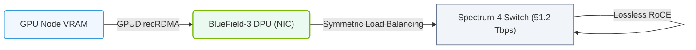

# 16.4a Spectrum-X architecture: Spectrum-4 switch ASIC + BlueField-3 DPU

  📦 AI Data Center Networking
  📖 High-Speed Ethernet for AI

---

## 🌐 Context Introduction

When building an AI data center, the network is the nervous system. Moving massive datasets between GPUs, storage, and compute nodes requires a network that is fast, lossless, and intelligent. Standard Ethernet was never designed for the extreme demands of AI workloads — it can drop packets, introduce latency, and waste bandwidth.

NVIDIA's **Spectrum-X** platform solves this by combining two powerful components: the **Spectrum-4 switch ASIC** (the brain of the network switch) and the **BlueField-3 DPU** (a smart network card that offloads and accelerates networking tasks). Together, they create an Ethernet fabric that is optimized specifically for AI, delivering high throughput, low latency, and zero packet loss.

---

## ⚙️ What is Spectrum-X?

Spectrum-X is not just a switch or a card — it is a **complete Ethernet networking platform** designed for AI workloads. It redefines how data moves in a GPU cluster by making Ethernet behave like a lossless, high-performance fabric.

Key characteristics:
- **Purpose-built for AI** — handles the unique traffic patterns of distributed training and inference.
- **Lossless** — eliminates packet drops that slow down GPU communication.
- **Programmable** — allows engineers to fine-tune the network for specific AI jobs.
- **Scalable** — supports thousands of endpoints (GPUs, storage, servers) in a single fabric.

---

## 🧠 Spectrum-4 Switch ASIC — The Network Brain

The Spectrum-4 is the **world's first 51.2 Tbps switch ASIC** designed for AI. It sits inside the switch hardware and makes all forwarding decisions at wire speed.

| Feature | What It Does for AI |
|---------|---------------------|
| **51.2 Tbps throughput** | Moves 51.2 trillion bits per second — enough to connect hundreds of GPUs simultaneously. |
| **Low latency** | Processes packets in under 100 nanoseconds — critical for GPU synchronization. |
| **Lossless fabric** | Uses advanced buffering and congestion control to prevent packet drops. |
| **Programmable pipeline** | Allows custom packet processing rules for AI traffic patterns. |
| **400GbE ports** | Supports up to 64 ports of 400 Gigabit Ethernet for high-density connections. |

How it works in practice:
- The ASIC examines every packet and decides where to send it instantly.
- It uses **adaptive routing** to avoid congested paths — if one link is busy, it sends traffic through an alternate route.
- It supports **RDMA over Converged Ethernet (RoCEv2)** , which allows GPUs to talk directly to each other without involving the CPU.

---

## 🛠️ BlueField-3 DPU — The Smart Network Card

The BlueField-3 is a **Data Processing Unit** that plugs into a server (like a GPU server) and acts as a smart network interface. It offloads networking, storage, and security tasks from the CPU, freeing it to focus on AI computations.

| Feature | What It Does for AI |
|---------|---------------------|
| **400GbE connectivity** | Connects the server to the Spectrum-X fabric at full speed. |
| **Hardware acceleration** | Processes RDMA, encryption, and virtualization in hardware — not software. |
| **Zero-trust security** | Isolates AI workloads and prevents data leaks between tenants. |
| **Programmable Arm cores** | Runs custom networking applications directly on the DPU. |
| **GPU Direct RDMA** | Allows GPUs to send/receive data directly to/from the network — bypassing the CPU and system memory. |

How it works in practice:
- The BlueField-3 sits between the server's CPU/GPU and the network switch.
- It handles all network protocol processing (TCP/IP, RoCEv2, etc.) so the CPU does not get interrupted.
- For AI training, it enables **GPU-to-GPU communication** over Ethernet with near-zero CPU involvement.

---

## 🔗 How Spectrum-4 + BlueField-3 Work Together

The magic of Spectrum-X is the **tight integration** between the switch ASIC and the DPU. They communicate using a special protocol called **NVIDIA NetQ** and **adaptive congestion control** to keep the fabric lossless.

Here is the flow for a typical AI training job:

1. **GPU sends data** — The GPU on Server A wants to send gradients to Server B.
2. **BlueField-3 processes the data** — It encapsulates the data into RoCEv2 packets and sends them to the Spectrum-4 switch.
3. **Spectrum-4 routes intelligently** — The ASIC examines the packets, checks for congestion, and chooses the best path.
4. **Adaptive routing kicks in** — If the primary path is busy, the switch automatically reroutes traffic through an alternate link.
5. **BlueField-3 receives the data** — Server B's DPU receives the packets, processes them, and delivers the data directly to the GPU.
6. **Zero packet loss** — Throughout the journey, the fabric ensures no packets are dropped, so the training job does not stall.

---

### 📊 Visual Representation: Spectrum-X High-Performance Ethernet Platform
This diagram displays the Spectrum-X platform, linking Spectrum switches and BlueField DPUs to provide lossless network paths for AI workloads.

## 📊 Comparison: Standard Ethernet vs. Spectrum-X

| Aspect | Standard Ethernet | Spectrum-X (Spectrum-4 + BlueField-3) |
|--------|------------------|----------------------------------------|
| **Packet loss** | Common due to congestion | Zero — lossless fabric |
| **Latency** | Microseconds to milliseconds | Sub-microsecond (under 100ns) |
| **CPU involvement** | High — CPU handles networking | Minimal — DPU offloads everything |
| **GPU communication** | Through CPU and system memory | Direct GPU-to-GPU via RDMA |
| **Congestion handling** | TCP backoff (slows down) | Adaptive routing (reroutes instantly) |
| **Security** | Software-based firewalls | Hardware-isolated, zero-trust |
| **Scalability** | Limited by CPU overhead | Scales to thousands of GPUs |

---

## 🕵️ Why This Matters for AI Workloads

AI training is **communication-bound** — GPUs spend a lot of time waiting for data from other GPUs. If the network drops a single packet, the entire training job can pause for milliseconds while the data is retransmitted. Over thousands of GPUs, this adds up to hours of wasted time.

Spectrum-X solves this by:
- **Eliminating packet drops** — No retransmissions, no stalls.
- **Reducing latency** — GPUs get data faster, so they spend more time computing.
- **Offloading the CPU** — The CPU can focus on launching AI jobs instead of managing network traffic.
- **Enabling GPU Direct RDMA** — Data moves directly between GPUs over the network, bypassing the server's memory bus.

---

## 🧩 Real-World Example: Training a Large Language Model

Imagine you are training a GPT-like model across 256 GPUs in 32 servers (8 GPUs per server).

- **Without Spectrum-X**: Each time a GPU sends gradients, the CPU must process the network packet, copy data to system memory, then send it to the switch. If a packet drops, the entire training step waits for retransmission. Training time: **weeks**.
- **With Spectrum-X**: Each GPU sends gradients directly through the BlueField-3 DPU to the Spectrum-4 switch. The switch routes packets losslessly using adaptive routing. The CPU never touches the data. Training time: **days**.

---

## ✅ Key Takeaways for New Engineers

- **Spectrum-X is a platform**, not a single product — it combines a switch ASIC and a DPU.
- **Spectrum-4** is the switch ASIC that provides 51.2 Tbps of lossless throughput.
- **BlueField-3** is the DPU that offloads networking from the CPU and enables GPU Direct RDMA.
- Together, they create an **Ethernet fabric that behaves like InfiniBand** — low latency, high throughput, and zero packet loss.
- This architecture is **essential for scaling AI workloads** to thousands of GPUs without network bottlenecks.
- As an engineer, you will configure these components using tools like **NVIDIA NetQ** for monitoring and **Mellanox OFED** for driver management.

---

## 📚 Further Learning Path

- Explore **RoCEv2** — the protocol that enables RDMA over Ethernet.
- Understand **adaptive routing** — how Spectrum-4 avoids congestion.
- Learn about **NVIDIA NetQ** — the telemetry and troubleshooting tool for Spectrum-X fabrics.
- Practice configuring **BlueField-3 DPUs** using the **MLNX_OFED** driver stack.