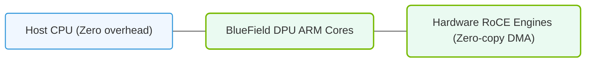

# 16.4c RoCE Acceleration in BlueField: hardware offload of transport processing

  📦 AI Data Center Networking
  📖 High-Speed Ethernet for AI

---

## 🔍 Context Introduction

In modern AI data centers, moving massive amounts of data between GPUs quickly is critical. Traditional networking relies on the CPU to handle transport processing (like packet headers, acknowledgments, and retransmissions). This creates a bottleneck — the CPU gets overloaded, and network latency increases. NVIDIA BlueField Data Processing Units (DPUs) solve this by offloading RoCE (RDMA over Converged Ethernet) transport processing directly to hardware. This means the CPU is freed up to focus on compute tasks, while the BlueField handles all the networking heavy lifting at line rate.

---

## ⚙️ What is RoCE Acceleration?

RoCE Acceleration in BlueField refers to moving the entire RDMA transport layer — including packet segmentation, reordering, acknowledgment generation, and congestion management — from software (CPU) to dedicated hardware logic on the BlueField DPU.

**Key benefits:**
- **Zero CPU overhead** for transport processing — the CPU never touches network packets
- **Line-rate performance** at 100GbE, 200GbE, or 400GbE without CPU intervention
- **Deterministic low latency** — hardware processes packets in nanoseconds, not microseconds
- **Scalability** — as more GPUs are added, the CPU is not burdened with additional network processing

---

## 🛠️ How Hardware Offload Works

The BlueField DPU contains specialized hardware engines that handle the following transport tasks:

- **Packet parsing and classification** — identifies RoCEv2 packets instantly
- **Header generation** — creates Ethernet, IP, UDP, and BTH (Base Transport Header) headers without CPU involvement
- **Sequence number management** — tracks packet ordering and detects missing packets
- **ACK/NAK generation** — automatically sends acknowledgments or negative acknowledgments
- **Retransmission logic** — resends lost packets without CPU intervention
- **Congestion control** — implements DCQCN (Data Center Quantized Congestion Notification) in hardware

---

### 📊 Visual Representation: BlueField DPU RoCE Offload Engine
This diagram displays how BlueField DPUs offload network protocol overhead from host CPUs, running security and storage tasks on ARM cores.

## 📊 Comparison: CPU-Based vs. BlueField Hardware Offload

| Feature | CPU-Based RoCE | BlueField Hardware Offload |
|---------|---------------|---------------------------|
| **Transport processing location** | CPU cores | BlueField hardware engines |
| **Latency per packet** | 5–20 microseconds | < 1 microsecond |
| **CPU utilization** | 30–60% for 100GbE | < 1% for 100GbE |
| **Scalability** | Limited by CPU cores | Scales with number of BlueField DPUs |
| **Determinism** | Variable due to CPU scheduling | Deterministic, hardware-timed |
| **Power efficiency** | Higher power per Gbps | Lower power per Gbps |

---

## 🕵️ Real-World Impact for AI Workloads

For AI training and inference, RoCE acceleration in BlueField provides:

- **Faster collective operations** — AllReduce, AllGather, and ReduceScatter complete sooner because network latency is minimized
- **Higher GPU utilization** — GPUs spend less time waiting for data, more time computing
- **Larger cluster scalability** — thousands of GPUs can communicate without overwhelming CPU resources
- **Predictable performance** — no CPU scheduling jitter affects network throughput

---

## 🧩 How Engineers Benefit

As an engineer working with AI infrastructure, you will see:

- **Simplified tuning** — no need to optimize CPU affinity or interrupt handling for networking
- **Consistent performance** — network behavior is predictable regardless of other workloads on the host CPU
- **Easier debugging** — hardware offload reduces software complexity, making issues easier to isolate
- **Future-proofing** — BlueField handles higher speeds (200GbE, 400GbE) without requiring CPU upgrades

---

## ✅ Summary

RoCE Acceleration in BlueField is a fundamental shift in how AI data centers handle networking. By moving transport processing from the CPU to dedicated hardware, NVIDIA eliminates the CPU as a bottleneck, reduces latency, and enables massive GPU clusters to communicate efficiently. For engineers, this means simpler deployment, predictable performance, and the ability to scale AI workloads without worrying about network overhead.

**Key takeaway:** BlueField hardware offload makes the network invisible to the CPU — it just works at line rate, every time.