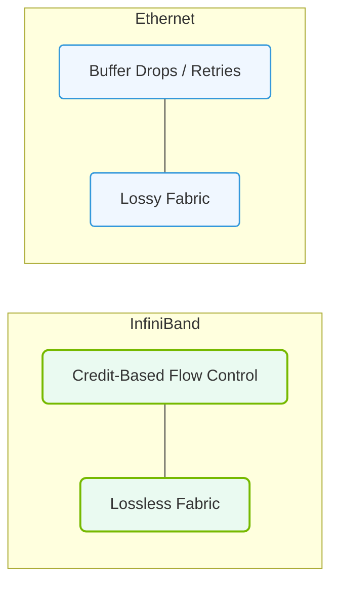

# 17.1a InfiniBand vs Ethernet: channel-based vs packet-switched, lossless by design

  📦 AI Data Center Networking
  📖 InfiniBand Architecture

When building an AI cluster, the network that connects hundreds or thousands of GPUs is just as important as the GPUs themselves. Two main networking technologies compete for this role: **InfiniBand** and **Ethernet**. While both move data, they do so in fundamentally different ways. This topic explains the core philosophical difference: **channel-based vs. packet-switched** and what "lossless by design" really means.

---

## 🌐 Context: Why Networking Matters for AI

AI training, especially large language models (LLMs), requires moving massive amounts of data between GPUs constantly. If the network drops a single packet, the entire training job can stall or fail. Traditional Ethernet was designed for general-purpose internet traffic (web pages, emails), where a lost packet is simply retransmitted. InfiniBand was designed from the ground up for high-performance computing (HPC) and AI, where **every packet must arrive, in order, without delay**.

---

## ⚙️ Core Difference: Channel-Based vs. Packet-Switched

### 📦 Packet-Switched (Ethernet)
- **How it works:** Data is broken into small packets. Each packet contains a source and destination address. Routers and switches look at each packet's address and decide where to send it next.
- **Key characteristic:** Packets from the same message can take different paths to the destination. They may arrive out of order.
- **Analogy:** Think of a postal system. Each letter (packet) has an address. Letters from the same package can travel different routes and arrive at different times. The recipient must reassemble them in the correct order.

### 🔗 Channel-Based (InfiniBand)
- **How it works:** Before data is sent, a dedicated logical path (a "channel") is established between the source and destination. All data for that communication flows through this single, pre-determined path.
- **Key characteristic:** Packets arrive in order, with guaranteed bandwidth and no routing decisions needed for each individual packet.
- **Analogy:** Think of a private railway line between two cities. Once the track is set, trains (data) travel the same route every time, arriving in the exact order they were sent.

### 📊 Comparison Table

| Feature | InfiniBand (Channel-Based) | Ethernet (Packet-Switched) |
| :--- | :--- | :--- |
| **Path Selection** | Single, pre-established channel per connection | Each packet independently routed |
| **Packet Order** | Guaranteed in-order delivery | Packets may arrive out of order |
| **Routing Decision** | Made once at connection setup | Made for every single packet |
| **Latency** | Very low and predictable | Variable, depends on network congestion |
| **Overhead** | Lower per-packet overhead | Higher per-packet overhead (headers, routing) |
| **Best For** | AI training, HPC, low-latency clusters | General-purpose networks, internet, cloud |

---

## 🛡️ Lossless by Design: The Critical Advantage

### ❌ The Problem with Packet Loss
In a standard Ethernet network, if a switch is overloaded, it simply **drops packets**. The sender eventually notices the missing data and retransmits it. For a web page, this is a minor delay. For AI training, a single dropped packet can cause a **global synchronization stall** — all GPUs wait for the missing data, wasting millions of dollars in compute time.

### ✅ How InfiniBand Achieves Losslessness
InfiniBand uses a mechanism called **credit-based flow control**. Here's how it works:

- **Before sending:** The sender asks the receiver, "How much buffer space do you have?"
- **The receiver replies:** "I have room for 10 packets."
- **The sender sends:** Exactly 10 packets, then stops and waits for more "credits."
- **The receiver processes:** As it empties its buffer, it sends more credits back to the sender.

**Result:** Data is **never** sent unless the receiver has guaranteed space for it. This eliminates packet loss entirely at the hardware level.

### 🕵️ Why Ethernet Isn't Lossless by Default
Standard Ethernet uses a "send first, ask later" approach. If a switch buffer fills up, it drops packets. Modern Ethernet (RoCEv2 — RDMA over Converged Ethernet) can be configured to be lossless, but it requires:
- Complex configuration (Priority Flow Control, ECN)
- Careful tuning to avoid head-of-line blocking
- Additional hardware support

InfiniBand achieves losslessness **out of the box** with no extra configuration.

---

### 📊 Visual Representation: InfiniBand vs. Ethernet Network Architecture
This diagram contrasts Native InfiniBand (lossless, credit-based) with traditional Ethernet (lossy, collision/buffer drops).

## 🛠️ Practical Implications for AI Clusters

### For InfiniBand (Channel-Based, Lossless)
- **Predictable performance:** Engineers can calculate exactly how long a training job will take because latency is consistent.
- **Simpler debugging:** No packet reordering or retransmission issues to troubleshoot.
- **Higher GPU utilization:** GPUs spend more time computing and less time waiting for data.

### For Ethernet (Packet-Switched, Best-Effort)
- **Flexibility:** Easier to integrate with existing data center networks and the internet.
- **Lower cost per port:** Ethernet switches are generally cheaper than InfiniBand switches.
- **More complex tuning:** Engineers must configure lossless mechanisms (PFC, ECN) to approach InfiniBand's reliability.

### 🧠 Key Takeaway for New Engineers
If you are building a dedicated AI training cluster where performance is the top priority, **InfiniBand is the gold standard**. If you need a network that also handles storage, internet traffic, and general workloads, **Ethernet with lossless extensions** is a more flexible (but more complex) choice.

---

## ✅ Summary Checklist

- [ ] InfiniBand uses **channel-based** communication — a single path per connection.
- [ ] Ethernet uses **packet-switched** communication — each packet routed independently.
- [ ] InfiniBand is **lossless by design** using credit-based flow control.
- [ ] Ethernet is **lossy by default** but can be made lossless with additional configuration.
- [ ] For AI training, **predictable low latency** (InfiniBand) is often more important than flexibility (Ethernet).

---

## 📚 Further Exploration

- **InfiniBand Trade Association:** Official specifications and whitepapers.
- **RoCEv2 (RDMA over Converged Ethernet):** How Ethernet attempts to match InfiniBand's performance.
- **NVIDIA Quantum InfiniBand:** The current generation of InfiniBand switches used in NVIDIA DGX systems.

> *"In AI networking, the fastest network is the one that never has to retransmit a single packet."*