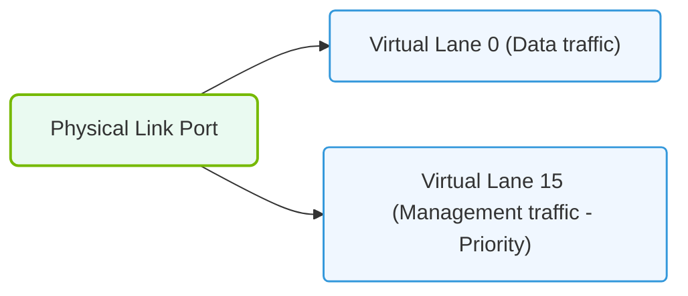

# 17.1d Virtual Lanes (VLs): providing QoS and deadlock avoidance in InfiniBand

  📦 AI Data Center Networking
  📖 InfiniBand Architecture

## 🌐 Context Introduction

In an AI cluster, data moves at incredible speeds — but not all data is equally important. Some traffic, like GPU-to-GPU synchronization, needs to arrive instantly. Other traffic, like checkpoint saves or monitoring data, can tolerate a small delay. InfiniBand solves this challenge using **Virtual Lanes (VLs)**. Think of VLs as separate "express lanes" on a highway: each lane has its own rules, priority, and traffic flow, allowing critical data to bypass slower traffic entirely.

---

## ⚙️ What Are Virtual Lanes?

A Virtual Lane is a **logical data path** within a single physical InfiniBand link. A single physical cable can carry up to **15 VLs** (VL0 through VL14), plus one management lane (VL15). Each VL operates independently, with its own:
- **Buffer space** on the switch or adapter
- **Flow control** (credit-based)
- **Scheduling priority**

**Key insight:** VLs are not separate cables — they are virtual channels sharing the same wire, but behaving as if they were separate connections.

---

## 🎯 Two Core Purposes of Virtual Lanes

### 1️⃣ Quality of Service (QoS)

VLs allow you to **prioritize traffic**. You can assign different traffic types to different VLs, then configure the switch to service higher-priority VLs more frequently.

**Common QoS assignment example:**

- **VL0** — Default traffic (low priority)
- **VL1** — Storage traffic (medium priority)
- **VL2** — GPU collective communication (high priority, e.g., NCCL)
- **VL3** — Management and control traffic (critical)

**How it works:** The switch uses a **weighted round-robin** or **strict priority** scheduler. A high-priority VL (e.g., VL2) might get 80% of the bandwidth, while lower-priority VLs share the remaining 20%.

---

### 2️⃣ Deadlock Avoidance

Deadlocks occur when packets wait for each other in a circular chain — no packet can move, and the network freezes. This is a serious problem in AI training loops.

**How VLs prevent deadlocks:** By assigning **different VLs to different traffic directions or routing paths**, you break the circular dependency. For example:

- **VL0** for northbound traffic (GPU → switch)
- **VL1** for southbound traffic (switch → GPU)
- **VL2** for east-west traffic (GPU ↔ GPU)

Because each VL has its own buffer space, a packet stuck in VL0 cannot block a packet in VL1. The circular wait is broken.

---

## 📊 Comparison: Without VLs vs. With VLs

| Feature | Without Virtual Lanes | With Virtual Lanes |
|---------|----------------------|-------------------|
| Traffic priority | All traffic treated equally | High-priority traffic gets preferential service |
| Deadlock risk | High — one stuck packet can block everything | Low — separate buffers prevent circular waits |
| Bandwidth sharing | Single queue, first-come-first-served | Multiple queues with configurable weights |
| Management overhead | Minimal | Requires VL mapping and configuration |
| Scalability | Poor for mixed workloads | Excellent for AI training + storage + management |

---

### 📊 Visual Representation: InfiniBand Virtual Lanes (VL) Buffering
This diagram displays how physical links are partitioned into virtual lanes to isolate different traffic classes.

## 🛠️ How VLs Are Configured in Practice

Engineers configure VLs at two levels:

### Switch Level
- **Partition the physical link** into logical VLs
- **Assign Service Levels (SL)** to VLs — SL is a label on each packet that tells the switch which VL to use
- **Set arbitration tables** — these define how much bandwidth each VL gets and in what order

### Host/Adapter Level
- **Map application traffic** to specific Service Levels
- **Configure buffer credits** per VL to prevent packet loss

**Example mapping (conceptual):**

- **SL = 0** → **VL0** (default, best-effort)
- **SL = 2** → **VL2** (high-priority GPU traffic)
- **SL = 15** → **VL15** (management, always highest priority)

---

## 🕵️ Real-World Scenario: AI Training Cluster

Imagine a 64-GPU cluster running a distributed training job:

1. **GPU communication** (NCCL all-reduce) → mapped to **VL2** (high priority)
2. **Storage writes** (checkpoint saving) → mapped to **VL1** (medium priority)
3. **Monitoring pings** (SSH, metrics) → mapped to **VL0** (low priority)
4. **Management commands** (SLURM, fabric manager) → mapped to **VL15** (critical)

**Result:** Even if the storage traffic is heavy, the GPU synchronization traffic on VL2 is never delayed. The training job maintains high performance because critical packets always have a dedicated "fast lane."

---

## ✅ Key Takeaways for New Engineers

- **VLs are not physical lanes** — they are logical separations within one physical cable
- **QoS is achieved** by giving high-priority VLs more bandwidth and faster service
- **Deadlock avoidance** works because each VL has independent buffers — no circular waits
- **Service Levels (SL)** are the labels; **Virtual Lanes (VL)** are the actual paths
- **VL15** is reserved for management traffic and always has the highest priority
- **Proper VL planning** is essential for AI clusters running mixed workloads (training + storage + monitoring)

---

## 📚 Further Learning Path

1. Understand **Service Levels (SL)** and how they map to VLs
2. Learn about **SL-to-VL mapping tables** on InfiniBand switches
3. Explore **arbitration tables** — how switches decide which VL to service next
4. Practice with **ibdiagnet** or **ibstatus** to inspect VL configuration on a live cluster

> **Remember:** In an AI data center, Virtual Lanes are your tool for making sure the most important data always gets through — even when the network is under heavy load.