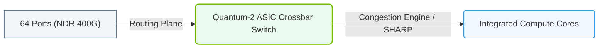

# 17.2b InfiniBand switches: Quantum (HDR) and Quantum-2 (NDR) switch chips

  📦 AI Data Center Networking
  📖 InfiniBand Architecture

---

## 🌐 Context Introduction

In an AI data center, the network is the nervous system connecting thousands of GPUs. When training large language models or running complex simulations, data must move between compute nodes at incredible speeds with almost zero delay. InfiniBand switches are the backbone of this high-performance fabric. This section introduces the two most prominent switch chip families from NVIDIA: **Quantum (HDR)** and **Quantum-2 (NDR)**. Think of these as the traffic controllers for your AI superhighway — they decide how fast and efficiently data packets travel between servers.

---

## ⚙️ What Is an InfiniBand Switch Chip?

An InfiniBand switch chip is the silicon brain inside a physical switch box. It handles packet forwarding, routing, and congestion management. The chip determines the maximum data rate, port count, and overall performance of the switch. NVIDIA's Quantum and Quantum-2 chips are purpose-built for AI workloads, offering ultra-low latency and high throughput.

- **Quantum (HDR)** — The previous generation, still widely deployed.
- **Quantum-2 (NDR)** — The current generation, offering double the bandwidth per port.

---

## 📊 Key Specifications Comparison

| Feature | Quantum (HDR) | Quantum-2 (NDR) |
|---------|---------------|-----------------|
| **Data Rate per Port** | 200 Gbps (HDR) | 400 Gbps (NDR) |
| **Switch Chip Port Count** | 32 ports (HDR) | 64 ports (NDR) |
| **Aggregate Bandwidth** | 6.4 Tbps | 25.6 Tbps |
| **Latency** | Sub-100 nanoseconds | Sub-100 nanoseconds (improved) |
| **Supported Cable Types** | Copper, Active Optical Cables (AOC) | Copper, AOC, and longer-reach optics |
| **Power Efficiency** | Good | Better (more data per watt) |
| **Key Feature** | First to support HDR (200G) | First to support NDR (400G) with in-network computing |

---

## 🕵️ Quantum (HDR) — The Proven Workhorse

Quantum HDR switches were the gold standard for early AI clusters. They provide 200 Gbps per port and are still used in many production environments.

**Key characteristics:**
- **32 ports** of HDR (200 Gbps) per chip, enabling dense 64-port switches using two chips.
- **Adaptive routing** — automatically selects the best path to avoid congestion.
- **Congestion control** — prevents one slow flow from blocking others (important for all-reduce operations).
- **Reliability** — proven in thousands of deployments worldwide.

**Typical use case:** A mid-sized AI cluster with 128 to 512 GPUs, where 200 Gbps per link is sufficient.

---

### 📊 Visual Representation: NVIDIA Quantum-2 NDR Switch ASIC
This diagram displays the Quantum-2 Switch layout, routing NDR link speeds through a non-blocking crossbar routing plane.

## 🚀 Quantum-2 (NDR) — The Next-Generation Powerhouse

Quantum-2 NDR switches double the bandwidth to 400 Gbps per port. This is the current standard for building large-scale AI supercomputers.

**Key characteristics:**
- **64 ports** of NDR (400 Gbps) per chip, enabling 64-port switches in a single chip.
- **In-network computing** — the switch can perform simple computations (like reductions) while data passes through, reducing GPU load.
- **Sharp v2** — an enhanced version of Scalable Hierarchical Aggregation and Reduction Protocol, which speeds up collective operations like all-reduce.
- **Higher radix** — fewer switch hops needed to connect all GPUs, reducing latency.

**Typical use case:** Large-scale AI clusters with 1,000+ GPUs, where 400 Gbps per link is essential to keep GPUs fed with data.

---

## 🛠️ How These Chips Are Used in Practice

Engineers building an AI cluster will choose between Quantum and Quantum-2 based on budget, performance requirements, and future scalability.

**Decision factors:**
- **Bandwidth needs** — If your GPUs can saturate 200 Gbps, HDR is fine. If they need more, go NDR.
- **Cluster size** — For clusters under 512 GPUs, HDR is cost-effective. For larger clusters, NDR reduces complexity.
- **Cable infrastructure** — NDR requires higher-quality cables and optics, which can increase cost.
- **Future-proofing** — NDR is the current standard; HDR is mature but being phased out.

**Example deployment scenario:**
- A cluster with 256 NVIDIA A100 GPUs might use Quantum HDR switches with 200 Gbps links.
- A cluster with 1,024 NVIDIA H100 GPUs would typically use Quantum-2 NDR switches with 400 Gbps links.

---

## 🔍 Real-World Analogy

Think of a switch chip like a highway interchange:
- **Quantum HDR** is a 4-lane highway — fast, reliable, and good for moderate traffic.
- **Quantum-2 NDR** is an 8-lane superhighway — twice the capacity, with smart traffic lights that can merge lanes automatically (in-network computing).

---

## ✅ Summary

| Aspect | Quantum (HDR) | Quantum-2 (NDR) |
|--------|---------------|-----------------|
| Speed | 200 Gbps per port | 400 Gbps per port |
| Ports per chip | 32 | 64 |
| Best for | Small to medium clusters | Large to massive clusters |
| Key innovation | Adaptive routing, congestion control | In-network computing, Sharp v2 |
| Status | Mature, still in use | Current generation, recommended for new builds |

**Bottom line:** For new AI infrastructure projects, Quantum-2 (NDR) is the recommended choice. Quantum (HDR) remains relevant for upgrades or budget-constrained deployments. Understanding the difference helps engineers design networks that match the compute power of their GPUs.

---

## 📚 Further Learning

- Explore NVIDIA's documentation on **Mellanox Quantum-2** for detailed chip specifications.
- Study **InfiniBand routing algorithms** (e.g., DOR, adaptive routing) to understand how these chips handle traffic.
- Look into **Sharp v2** for in-network computing — a key differentiator of Quantum-2.

---

*This guide is part of the NVIDIA-Certified Associate: AI Infrastructure and Operations curriculum. Focus on understanding the bandwidth and port count differences — these are the most critical numbers for designing AI clusters.*