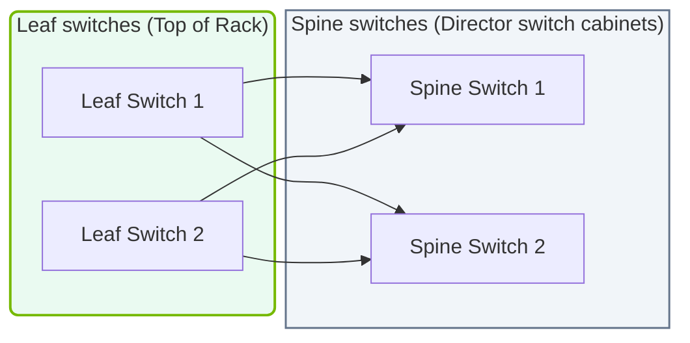

# 17.2c Multi-tier IB fabrics: edge switches, leaf switches, spine switches

  📦 AI Data Center Networking
  📖 InfiniBand Architecture

---

## 🌐 Context Introduction

In an AI data center, thousands of GPUs need to talk to each other simultaneously. A single switch cannot handle this traffic. Instead, engineers build **multi-tier InfiniBand (IB) fabrics** — a structured network topology that scales from a few servers to tens of thousands. This section explains the three main switch roles in such a fabric: **edge switches**, **leaf switches**, and **spine switches**.

Think of it like a highway system:
- **Edge switches** are the on-ramps connecting individual cars (servers/GPUs).
- **Leaf switches** are the local intersections connecting neighborhoods.
- **Spine switches** are the major highways that connect different cities (entire clusters).

---

## ⚙️ Why Multi-Tier Fabrics?

- **Scalability** — A single switch has limited ports. Multi-tier designs allow thousands of nodes.
- **Non-blocking performance** — Every GPU can talk to any other GPU at full speed without congestion.
- **Fault tolerance** — If one switch fails, traffic reroutes through other paths.
- **Low latency** — InfiniBand switches have extremely low switching latency (typically under 100 nanoseconds).

---

## 🛠️ The Three Switch Tiers

### 1. Edge Switches (also called "Top-of-Rack" or ToR switches)

- **Location:** At the top of each server rack.
- **Purpose:** Connect individual servers (compute nodes) to the fabric.
- **Ports:** Typically 36 or 40 ports of 200Gbps or 400Gbps InfiniBand.
- **Role:** The first hop for every GPU-to-GPU communication.

**Key characteristics:**
- Each server connects directly to an edge switch.
- Edge switches are the most numerous in the fabric.
- They handle traffic from local servers and forward it upward to leaf switches.

---

### 2. Leaf Switches (also called "Aggregation" switches)

- **Location:** In a separate row of racks (aggregation layer).
- **Purpose:** Connect multiple edge switches together.
- **Ports:** Typically 64 or 128 ports of 400Gbps or 800Gbps InfiniBand.
- **Role:** The middle layer that aggregates traffic from many edge switches.

**Key characteristics:**
- Each leaf switch connects to many edge switches (not directly to servers).
- Leaf switches provide the first level of aggregation.
- They forward traffic either to other leaf switches (via spine) or to storage/management networks.

---

### 3. Spine Switches (also called "Core" switches)

- **Location:** In dedicated core racks.
- **Purpose:** Connect all leaf switches together into a single, flat fabric.
- **Ports:** Very high port counts (e.g., 128 ports of 800Gbps).
- **Role:** The backbone of the entire AI cluster.

**Key characteristics:**
- Every leaf switch connects to every spine switch (full mesh).
- Spine switches never connect directly to servers or edge switches.
- They provide the highest bandwidth and lowest latency for cross-cluster communication.

---

## 📊 Comparison Table: Edge vs. Leaf vs. Spine

| Feature | Edge Switch | Leaf Switch | Spine Switch |
|---------|-------------|-------------|--------------|
| **Connects to** | Servers (GPUs) | Edge switches | Leaf switches |
| **Typical port speed** | 200Gbps – 400Gbps | 400Gbps – 800Gbps | 800Gbps+ |
| **Number in fabric** | Many (one per rack) | Moderate (10–50) | Few (4–16) |
| **Latency contribution** | Lowest (first hop) | Low | Very low (core) |
| **Failure impact** | Affects one rack | Affects many racks | Affects entire cluster |
| **Redundancy** | Dual-homed servers | Full mesh to spine | Full mesh to leaf |

---

### 📊 Visual Representation: Multi-Tier InfiniBand Spine-Leaf Fabric
This diagram displays a 2-tier InfiniBand network topology, showing Leaf switch links routing to a central NVSwitch spine fabric.

## 🕵️ How Traffic Flows Through the Tiers

Imagine GPU-A in Rack 1 wants to send data to GPU-B in Rack 50:

1. **GPU-A → Edge Switch (Rack 1):** Data leaves the server at full speed.
2. **Edge Switch → Leaf Switch:** The edge switch forwards the packet to any connected leaf switch.
3. **Leaf Switch → Spine Switch:** The leaf switch forwards to a spine switch (using a load-balancing algorithm).
4. **Spine Switch → Leaf Switch (Rack 50):** The spine switch forwards to the leaf switch serving Rack 50.
5. **Leaf Switch → Edge Switch (Rack 50):** The leaf switch forwards to the correct edge switch.
6. **Edge Switch → GPU-B:** The edge switch delivers the data to the target GPU.

**Total hops:** 5 switches (edge → leaf → spine → leaf → edge).  
**Total latency:** Typically under 1 microsecond for the entire path.

---

## 🏗️ Common Fabric Topologies

### Fat-Tree Topology (most common for AI)
- Uses identical switches at all tiers.
- Provides full bisection bandwidth (every node can talk to every other node at full speed).
- Example: 3-tier fat-tree with 36-port switches can support over 1,000 GPUs.

### Dragonfly+ Topology (for extreme scale)
- Groups leaf switches into "groups" connected by spine switches.
- Reduces the number of spine ports needed.
- Used in the largest NVIDIA DGX SuperPOD configurations.

### 2-Tier vs. 3-Tier
- **2-Tier:** Edge + Spine (for small clusters under 500 GPUs).
- **3-Tier:** Edge + Leaf + Spine (for clusters of 500 to 10,000+ GPUs).

---

## 🔧 Practical Considerations for Engineers

**When designing a multi-tier IB fabric, consider:**

- **Port count:** How many servers per rack? How many racks total?
- **Bandwidth per GPU:** Each GPU needs at least 200Gbps (NVIDIA H100) or 400Gbps (NVIDIA B200).
- **Oversubscription ratio:** Ideally 1:1 (non-blocking) for AI training.
- **Cable types:** Active optical cables (AOC) for long distances, passive copper for short runs.
- **Power and cooling:** Each switch consumes 500W–2,000W. Plan accordingly.

**Common mistakes to avoid:**
- Using too few spine switches (creates bottlenecks).
- Mixing different switch speeds in the same tier.
- Forgetting to account for management network connections.
- Underestimating cable management complexity.

---

## ✅ Summary

- **Edge switches** connect servers to the fabric (one per rack).
- **Leaf switches** aggregate multiple edge switches.
- **Spine switches** connect all leaf switches into a single high-speed fabric.
- Multi-tier designs enable **scalability**, **performance**, and **fault tolerance**.
- The most common topology for AI clusters is the **fat-tree** with 3 tiers.

> **Key takeaway:** A well-designed multi-tier IB fabric ensures that every GPU in the cluster can communicate with every other GPU at full speed, with minimal latency — which is essential for training large AI models.