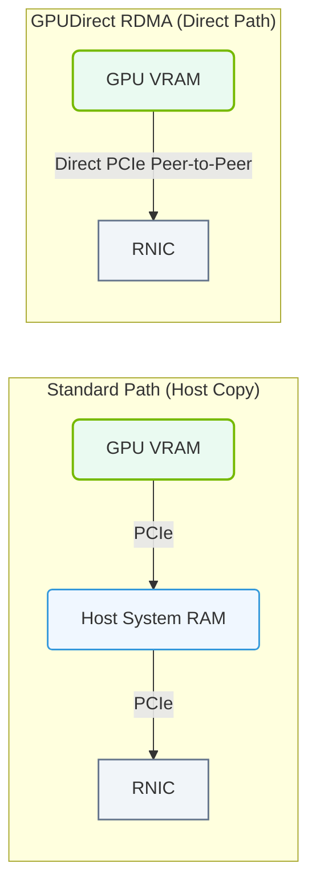

# 17.4d GPUDirect RDMA: transferring data directly between GPU VRAM and network HCA

  📦 AI Data Center Networking
  📖 InfiniBand Architecture

## 🧠 Context Introduction

In large-scale AI training, data must constantly move between GPUs across multiple servers. Traditionally, data from a GPU's memory (VRAM) would travel through the CPU's system memory (RAM) before reaching the network card — a slow, inefficient path. **GPUDirect RDMA** (Remote Direct Memory Access) changes this entirely. It allows a network adapter (Host Channel Adapter, or HCA) to read from or write directly to GPU VRAM, bypassing the CPU and system memory entirely. This dramatically reduces latency and frees the CPU for other critical tasks.

---

## ⚙️ How It Works — The Direct Path

Without GPUDirect RDMA, data takes a long detour:
- GPU VRAM → CPU RAM → Network HCA → Network → Destination

With GPUDirect RDMA, the path is direct:
- GPU VRAM → Network HCA → Network → Destination (and vice versa)

The key enabler is **PCIe peer-to-peer (P2P) transfers**. The HCA and GPU are both connected to the same PCIe bus. GPUDirect RDMA allows the HCA to directly access the GPU's memory space over PCIe, without involving the CPU as a middleman.

---

## 📊 Key Benefits

| Benefit | Description |
|---------|-------------|
| 🚀 **Lower Latency** | Eliminates the CPU and system memory hop, reducing data transfer time significantly |
| 🔄 **Higher Bandwidth** | Frees up CPU memory bandwidth for other operations |
| 💾 **Reduced CPU Overhead** | CPU is not involved in copying data, allowing it to focus on computation |
| 📈 **Scalability** | Enables efficient multi-GPU, multi-node training at scale |
| 🔌 **Direct Path** | Data moves GPU → HCA → Network without intermediate buffering |

---

### 📊 Visual Representation: NVIDIA GPUDirect RDMA Data Path
This diagram displays GPUDirect RDMA, bypass host RAM to copy data directly from GPU VRAM to the network adapter over the PCIe bus.

## 🛠️ How Engineers Enable GPUDirect RDMA

To use GPUDirect RDMA in an AI cluster, engineers must ensure several components are properly configured:

- **Hardware Support**: Both the GPU (NVIDIA Tesla/Quadro/RTX series) and the HCA (e.g., Mellanox ConnectX series) must support GPUDirect RDMA.
- **Driver Installation**: The NVIDIA driver and the Mellanox (or other HCA) driver must be installed and compatible.
- **CUDA Toolkit**: The CUDA toolkit (version 10.0 or later) must be installed, as it includes the necessary libraries (e.g., `libcuda`, `libnvidia-ml`).
- **GPU Direct RDMA Kernel Module**: The `nvidia-peermem` kernel module must be loaded. This module enables the HCA to map GPU memory for RDMA operations.
- **InfiniBand Fabric**: The network must be configured with RDMA over InfiniBand (or RoCE) enabled.

---

## 🕵️ Verification Steps

Engineers can verify GPUDirect RDMA is working by checking system logs and running diagnostic tools.

**Check if the `nvidia-peermem` module is loaded:**
- Run: **lsmod | grep nvidia_peermem**
- Expected output: **nvidia_peermem** (showing the module is loaded)

**Check GPU and HCA are on the same PCIe switch (for best performance):**
- Run: **lspci -tv** (to view the PCIe tree)
- Look for both the GPU and HCA under the same PCIe bridge

**Use the `ib_write_bw` benchmark to test RDMA bandwidth:**
- On server A: **ib_write_bw -d mlx5_0 --use_cuda=0**
- On server B: **ib_write_bw -d mlx5_0 --use_cuda=0 <server_A_IP>**
- Expected output: Bandwidth numbers (e.g., **200 Gbps**) showing direct GPU-to-GPU transfer

---

## 🔍 Common Pitfalls & Troubleshooting

- **❌ Module Not Loaded**: If `nvidia-peermem` is missing, GPUDirect RDMA will not work. Load it with **modprobe nvidia-peermem**.
- **❌ PCIe Topology Issues**: If GPU and HCA are on different PCIe root complexes, performance may degrade. Use **nvidia-smi topo -m** to check topology.
- **❌ Driver Version Mismatch**: NVIDIA driver and Mellanox driver must be compatible. Check NVIDIA's compatibility matrix.
- **❌ CUDA Toolkit Version**: Older CUDA versions may lack GPUDirect RDMA support. Use CUDA 10.0+.

---

## ✅ Summary

GPUDirect RDMA is a foundational technology for high-performance AI clusters. By allowing network HCAs to read/write directly to GPU VRAM, it eliminates unnecessary data copies through system memory, reducing latency and freeing CPU resources. For engineers building or operating AI infrastructure, ensuring GPUDirect RDMA is correctly configured is essential for achieving the multi-node performance required by large-scale training workloads.