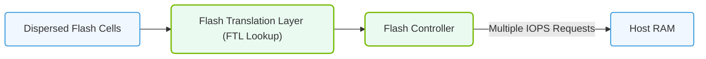

# 19.1b Random IOPS (I/O per second): checkpoint and metadata access patterns

<div class="lesson-completion" data-lesson-id="19_1b_random_iops"></div>
<div class="lesson-tags">
  <span class="lesson-tag">📦 AI Data Center Networking</span>
  <span class="lesson-tag">📖 Enterprise Storage Architectures for AI</span>
</div>


---

## 🌱 Context Introduction

When engineers first start working with AI infrastructure, they often focus on **throughput** — how much data can be moved per second. But in AI workloads, not all data access is sequential. Two critical scenarios where **random I/O operations per second (IOPS)** matter are **checkpointing** and **metadata access**. Understanding these patterns helps you design storage systems that don't become bottlenecks during training or inference.

---

## ⚙️ What Are Random IOPS?

**Random IOPS** measures how many small, non-sequential read or write operations a storage system can handle per second. Unlike sequential IOPS (streaming large files), random IOPS involves accessing data scattered across different locations on disk or flash.

**Key characteristics:**
- Small block sizes (typically 4KB to 64KB)
- Unpredictable access patterns
- High latency sensitivity
- Critical for metadata-heavy operations

---

## 📊 Two Key Access Patterns in AI

### 🧠 Checkpoint Access Pattern

Checkpointing saves the state of a model during training so you can resume if a job fails. This creates a **burst of random writes** followed by **random reads** during recovery.

**What happens:**
- Every few hours (or minutes), all GPUs write their model weights and optimizer states to storage
- Each GPU writes to a different file or location
- Files are small (hundreds of MB to a few GB)
- During recovery, many files are read back simultaneously

**Why random IOPS matters:**
- Thousands of GPUs writing small files at once creates a massive random write storm
- If storage can't handle the random IOPS, checkpointing slows down training

### 🗂️ Metadata Access Pattern

Metadata operations include listing directories, checking file existence, updating timestamps, and managing file locks. These are **tiny, random operations** that happen constantly.

**What happens:**
- Training scripts check if data files exist
- Logging systems create new log files
- Data loaders enumerate directory contents
- File systems update access times

**Why random IOPS matters:**
- Metadata operations are often the hidden bottleneck
- A slow metadata path can make training appear "stuck" even if data transfer is fast

---

## 🛠️ Comparison Table: Checkpoint vs. Metadata Access

| Feature | Checkpoint Access | Metadata Access |
|---------|------------------|-----------------|
| **I/O Size** | 4KB – 64MB (mixed) | 512 bytes – 4KB |
| **Frequency** | Periodic bursts (minutes to hours) | Continuous (every second) |
| **Read vs. Write** | Mostly writes, some reads | Mostly reads, some writes |
| **Impact on Training** | Delays training if slow | Can cause stalls or errors |
| **Storage Sensitivity** | Flash latency matters most | File system design matters most |
| **Typical IOPS Requirement** | 10K – 100K+ per GPU cluster | 1K – 10K per node |

---


### 📊 Visual Representation: Random IOPS SSD Address Translation
This diagram displays random IOPS, showing how dispersed flash cells require address translation lookups (FTL) before reading.




## 🕵️ How to Measure Random IOPS

Engineers should use benchmarking tools to test their storage system's random IOPS capability. Here's a common approach:

**For reference:**
```
fio --name=random-write --ioengine=libaio --rw=randwrite \
    --bs=4k --size=1G --numjobs=8 --iodepth=32 \
    --runtime=60 --time_based --direct=1
```

📤 **Output:** Look for the line showing **IOPS=** followed by a number (e.g., IOPS=45,000). This tells you how many 4KB random writes your storage can handle per second.

**For metadata testing:**
- Use tools like **mdtest** or **filebench** to simulate metadata operations
- Measure operations per second (ops/s) for create, stat, and delete operations

---

## 🧩 Why This Matters for AI Operations

| Scenario | Random IOPS Impact |
|----------|-------------------|
| **Training a large model (100B+ parameters)** | Checkpointing can take 10+ minutes if random IOPS is low |
| **Multi-node training with frequent saves** | Storage becomes the bottleneck, not compute |
| **Data preprocessing pipelines** | Metadata lookups slow down data loading |
| **Inference serving with model versioning** | Frequent file stat operations degrade response time |

---

## ✅ Key Takeaways for New Engineers

1. **Don't ignore random IOPS** — throughput alone doesn't tell the full story
2. **Checkpointing creates write storms** — plan for burst random write capacity
3. **Metadata is the silent killer** — a fast file system with low metadata latency is critical
4. **Test with real workloads** — synthetic benchmarks help, but actual training patterns reveal true performance
5. **Consider NVMe flash** — for high random IOPS, flash storage significantly outperforms HDDs
6. **Monitor both IOPS and latency** — high IOPS with high latency is still bad

---

## 📚 Further Learning

- Review your storage vendor's **random IOPS specifications** (not just sequential throughput)
- Experiment with **fio** to understand your current system's random I/O limits
- Learn about **parallel file systems** (Lustre, GPFS, WekaFS) that optimize for random access patterns
- Understand the difference between **IOPS** and **bandwidth** — they serve different purposes

---

*Remember: In AI infrastructure, random IOPS is often the hidden variable that separates a smoothly running cluster from one plagued by mysterious slowdowns.*