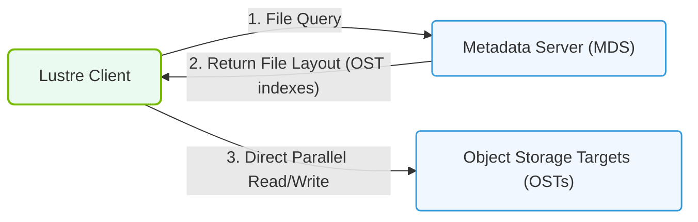

# 20.2a Lustre: the dominant open-source parallel file system for HPC and AI

  📦 AI Data Center Networking
  📖 Parallel File Systems

---

## 🌐 Context Introduction

When training large AI models or running high-performance computing (HPC) simulations, data needs to be read and written by hundreds or thousands of compute nodes simultaneously. Traditional file systems (like NTFS or ext4) were designed for a single computer and cannot handle this scale. **Lustre** is the dominant open-source parallel file system designed specifically for this challenge. It allows many servers to act as one giant, fast storage pool that thousands of GPUs and CPUs can access at the same time.

---

## ⚙️ What Makes Lustre a "Parallel" File System?

Unlike a standard file system where one server handles all requests, Lustre splits data across multiple storage servers. This means:

- **Multiple clients** (compute nodes) can read/write different parts of a file simultaneously.
- **No single bottleneck** — storage performance scales linearly as you add more servers.
- **Metadata operations** (like listing files or checking permissions) are handled by dedicated servers, separate from the data.

---

## 🧱 Core Components of a Lustre File System

Lustre has three main building blocks that work together:

| Component | Full Name | Role in the System |
|-----------|-----------|---------------------|
| **MGS** | Management Server | Keeps the configuration and tells all other components how to connect. |
| **MDS** | Metadata Server(s) | Stores file names, directories, permissions, and where data blocks live. |
| **OSS** | Object Storage Server(s) | Stores the actual file data in chunks called "objects." |

- **Clients** (compute nodes running AI training or HPC jobs) connect to the MDS to find files, then talk directly to OSS servers to read/write data.
- For high availability, you can run **failover pairs** (active/passive) for MDS and OSS.

---

## 🛠️ How Data Flows in Lustre

1. A client wants to open a file called **model_weights.bin**.
2. The client asks the **MDS** for the file's layout information (which OSS servers hold the data).
3. The MDS returns a list of **OSTs** (Object Storage Targets) where the file's chunks are stored.
4. The client then reads/writes directly to those OSS servers — no more MDS involvement for the actual data transfer.

This separation of metadata from data is what makes Lustre fast and scalable.

---

### 📊 Visual Representation: Lustre Parallel Filesystem Layout
This diagram displays Lustre architecture, separating metadata servers (MDS) from parallel object storage targets (OST).

## 📊 Why Lustre Dominates AI and HPC Storage

| Feature | Benefit for AI Workloads |
|---------|--------------------------|
| **Parallel I/O** | Thousands of GPUs can read training data at full speed. |
| **Scalability** | Add more OSS servers to increase capacity and throughput linearly. |
| **POSIX compliance** | Works with standard Linux tools (cp, ls, rsync) without special software. |
| **Open source** | No licensing costs; large community and vendor support. |
| **High availability** | Failover MDS and OSS prevent single points of failure. |

---

## 🕵️ Common Lustre Terms You Will Encounter

- **OST (Object Storage Target):** A storage device managed by an OSS. Each file is striped across multiple OSTs.
- **Stripe count:** How many OSTs a single file is spread across. Higher stripe count = more parallel access.
- **Lustre client:** Any server or node that mounts the Lustre file system.
- **Lustre network (LNet):** The custom networking layer that handles communication between clients and servers (often uses InfiniBand or high-speed Ethernet).

---

## 🔍 Real-World Example: AI Training on Lustre

Imagine you are training a large language model on a cluster with 256 GPUs:

1. Your training script reads a dataset stored on Lustre.
2. Each GPU gets its own chunk of data by reading from different OSTs simultaneously.
3. Checkpoints (model saves) are written back to Lustre by all GPUs at once — no waiting for a single storage server.
4. The MDS handles file metadata quickly, so listing the checkpoint directory with 10,000 files takes milliseconds.

---

## ✅ Key Takeaways for New Engineers

- **Lustre is not a single server** — it is a distributed system of metadata servers and object storage servers.
- **Performance comes from parallelism** — more OSS servers = faster reads and writes.
- **Metadata and data are separate** — this design avoids bottlenecks.
- **Lustre is the industry standard** for large-scale AI and HPC clusters because it is proven, open source, and highly scalable.

---

## 📚 Next Steps to Learn More

- Practice mounting a Lustre file system on a Linux client using the **mount.lustre** command.
- Experiment with the **lfs** command-line tool to check file striping and OST usage.
- Read about **LNet routing** if your cluster spans multiple network switches.

> 💡 **Remember:** Lustre is designed for "big, fast, and shared." If your AI workload needs to move petabytes of data to thousands of GPUs, Lustre is likely the right choice.