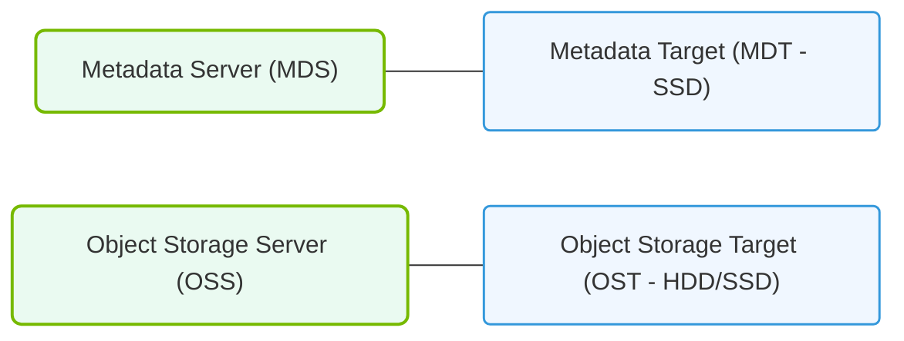

# 20.2b Lustre components: MDS (Metadata Servers), MDTs, OSS (Object Storage Servers), OSTs

  📦 AI Data Center Networking
  📖 Parallel File Systems

## 📘 Context Introduction

When training large AI models, your storage system must handle two very different types of work: managing file names and directories (metadata), and storing the actual file data. Lustre, a high-performance parallel file system, separates these jobs across specialized components. This design allows AI clusters to scale to thousands of clients without bottlenecking on a single server.

Think of Lustre like a massive library:
- **MDS/MDT** = The librarian who knows where every book *should* be (metadata)
- **OSS/OST** = The actual bookshelves storing the books (data)

---

## ⚙️ MDS — Metadata Servers

The **Metadata Server (MDS)** is the brain of the Lustre file system. It manages the namespace — all file names, directory structures, permissions, and timestamps.

**Key points:**
- Handles file open, close, create, delete, and rename operations
- Does **not** store file data — only metadata
- Typically deployed in an **active/passive** pair for high availability
- If the MDS goes down, clients cannot access the file system structure (but existing data on OSTs remains intact)

**How it works in AI workflows:**
- When a training job starts, the MDS quickly resolves file paths so data can be read
- For large datasets with millions of small files, the MDS can become a bottleneck — this is why MDTs exist

---

## 📂 MDT — Metadata Targets

An **Metadata Target (MDT)** is the actual storage device (usually an SSD or NVMe drive) attached to the MDS where metadata is stored.

**Key points:**
- Each MDS manages one or more MDTs
- Lustre supports **DNE (Distributed Namespace)** — allowing multiple MDTs to scale metadata performance
- With DNE, different directories can live on different MDTs, spreading the metadata workload

**Why this matters for AI:**
- Training datasets often have thousands of files in one directory
- Without DNE, a single MDT would handle all metadata requests for that directory
- With DNE, you can split directories across MDTs, reducing contention

---

## 🛠️ OSS — Object Storage Servers

The **Object Storage Server (OSS)** is the component that manages the actual file data. It serves as the interface between clients and the physical storage.

**Key points:**
- Handles read and write requests for file data
- Each OSS manages multiple OSTs
- OSS servers are typically deployed in pairs for redundancy
- Data is striped across OSTs for parallel performance

**How it works in AI workflows:**
- When a training job reads a large file, the OSS streams data directly to compute nodes
- Multiple OSS servers can serve data simultaneously, achieving high aggregate throughput (hundreds of GB/s)

---

### 📊 Visual Representation: Lustre Server Component Bindings
This diagram details the hardware binds of MDS to Metadata Targets (MDT) and OSS to Object Storage Targets (OST).

## 💾 OST — Object Storage Targets

An **Object Storage Target (OST)** is the physical storage device (HDD, SSD, or NVMe) attached to an OSS where file data is actually stored.

**Key points:**
- Each file in Lustre is broken into "objects" and distributed across multiple OSTs
- The number of OSTs a file is striped across is called the **stripe count**
- More OSTs = higher parallel read/write performance for large files

**Stripe configuration example:**
- **Stripe count = 1**: File stored on one OST (good for small files)
- **Stripe count = 8**: File spread across 8 OSTs (good for large AI training datasets)

---

## 📊 Comparison Table: MDS/MDT vs OSS/OST

| Feature | MDS / MDT | OSS / OST |
|---------|-----------|-----------|
| **What it manages** | File names, directories, permissions | Actual file data (bytes) |
| **Performance bottleneck** | Metadata operations (open/close) | Data throughput (read/write) |
| **Typical storage media** | Fast NVMe or SSD | HDD, SSD, or NVMe |
| **Scaling approach** | Add more MDTs (DNE) | Add more OSS/OST pairs |
| **Impact on AI training** | Slows down file discovery | Slows down data loading |
| **Redundancy** | Active/passive pair | Active/active with failover |

---

## 🕵️ How They Work Together — A Simple Example

Imagine you have an AI training dataset called **dataset.bin** (100 GB file).

1. **Client requests file open** → Goes to **MDS** which looks up the file metadata on the **MDT**
2. **MDS responds** with the list of OSTs where the file's objects are stored
3. **Client reads data directly** from the **OSS** servers hosting those **OSTs**
4. **Data flows in parallel** from multiple OSTs to the client at high speed

This separation means:
- The MDS handles thousands of file opens per second
- The OSS/OSTs handle gigabytes per second of data transfer
- Neither component blocks the other

---

## ✅ Key Takeaways for New Engineers

- **MDS/MDT** = File catalog (fast, small storage)
- **OSS/OST** = File content (large, scalable storage)
- **Always monitor both**: A slow MDS can stall training just as badly as slow OSTs
- **Stripe count matters**: For AI workloads with large files (GB+), use stripe counts of 4–16 OSTs
- **DNE is your friend**: If you have millions of files, distribute directories across multiple MDTs

---

## 📝 Quick Reference

| Component | Full Name | Role |
|-----------|-----------|------|
| MDS | Metadata Server | Manages file system namespace |
| MDT | Metadata Target | Stores metadata on disk |
| OSS | Object Storage Server | Manages data I/O |
| OST | Object Storage Target | Stores file data on disk |

**Remember:** In AI infrastructure, metadata operations (MDS/MDT) are often the hidden bottleneck. Always check metadata performance when diagnosing slow training starts.