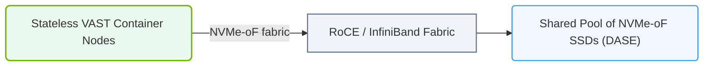

# 20.2f VAST Data: disaggregated NFS+S3 architecture for massive unstructured AI datasets

<div class="lesson-completion" data-lesson-id="20_2f_vast_data_architecture"></div>
<div class="lesson-tags">
  <span class="lesson-tag">📦 AI Data Center Networking</span>
  <span class="lesson-tag">📖 Parallel File Systems</span>
</div>


---

## 🌐 Context Introduction

When working with massive unstructured AI datasets—like billions of images, hours of video, or genomic sequences—traditional storage architectures often struggle. They either run out of capacity, become too slow, or require complex manual management. VAST Data offers a modern approach by **disaggregating** (separating) compute and storage, while supporting both **NFS** (a standard file protocol) and **S3** (an object storage protocol) on the same platform. This means engineers can store and access AI data without worrying about protocol mismatches or performance bottlenecks.

---

## ⚙️ What Is Disaggregated NFS+S3 Architecture?

In a traditional setup, storage is tightly coupled to a single server or protocol. VAST Data breaks this coupling. The key idea:

- **Disaggregation**: Storage hardware (flash drives, NVMe) is separate from the servers that process data. This allows scaling storage and compute independently.
- **Unified Protocol Support**: The same storage pool can be accessed via **NFS** (for file-based workloads like training scripts) and **S3** (for object-based workloads like data lakes or backups).
- **Massive Scale**: Designed to handle petabytes of unstructured data (images, videos, logs) without performance degradation.

---

## 🛠️ How It Works for AI Workloads

VAST Data uses a **shared-nothing architecture** with a global namespace. Here’s the simplified flow:

1. **Data Ingestion**: Engineers write data (e.g., training images) to the VAST cluster using NFS or S3.
2. **Global Namespace**: All data appears as a single file system, regardless of where it physically resides.
3. **Parallel Access**: Multiple GPU servers can read/write the same dataset simultaneously without locking conflicts.
4. **Protocol Translation**: VAST internally converts NFS and S3 requests into a common format, so engineers don’t need separate storage silos.

---


### 📊 Visual Representation: VAST Data DASE (Disaggregated Shared Everything)
This diagram displays VAST Data's DASE architecture, showing stateless containers accessing a shared pool of NVMe-oF flash storage over NVLink/RoCE fabrics.




## 📊 Comparison: VAST Data vs. Traditional Storage

| Feature | Traditional Storage | VAST Data (Disaggregated NFS+S3) |
|---------|---------------------|-----------------------------------|
| **Protocol Support** | Typically one protocol (NFS or S3) | Both NFS and S3 on the same system |
| **Scaling** | Scale-up (add more drives to one server) | Scale-out (add more storage nodes independently) |
| **Performance** | Bottlenecks at the server level | Parallel access from many clients |
| **Data Management** | Manual tiering (move data between fast/slow storage) | Automatic tiering within the same namespace |
| **AI Use Case Fit** | Good for small datasets | Excellent for petabytes of unstructured data |

---

## 🕵️ Key Benefits for AI Engineers

- **No Protocol Lock-In**: Use NFS for legacy tools and S3 for cloud-native applications—both on the same data.
- **Simplified Data Pipelines**: One storage pool for training, validation, and inference data.
- **High Throughput**: Multiple GPUs can stream data simultaneously without waiting.
- **Reduced Complexity**: No need to manage separate file servers and object storage clusters.

---

## 🧩 Example Workflow: Training an Image Classification Model

1. **Ingest Data**: Upload 10 million images via S3 using a simple script.
   - For reference:
     ```
     aws s3 cp ./images/ s3://vast-data-bucket/training/ --recursive
     ```
   - 📤 Output: All images are now in the VAST global namespace.

2. **Mount NFS on GPU Server**: Access the same data as a file system.
   - For reference:
     ```
     mount -t nfs vast-cluster-ip:/training /mnt/training
     ```
   - 📤 Output: The `/mnt/training` directory now contains all images.

3. **Run Training**: The AI framework reads files from `/mnt/training` as if they were local.
   - For reference:
     ```
     python train.py --data-dir /mnt/training
     ```
   - 📤 Output: Training starts with no storage bottlenecks.

4. **Store Results**: Save model checkpoints back to the same namespace via NFS or S3.

---

## ✅ Summary

VAST Data’s disaggregated NFS+S3 architecture is designed for engineers who need to manage **massive, unstructured AI datasets** without the headaches of traditional storage. By separating compute from storage and supporting both file and object protocols on a single platform, it simplifies data pipelines, improves performance, and scales effortlessly. For new engineers, think of it as a **unified, high-speed data lake** that speaks both NFS and S3 fluently.