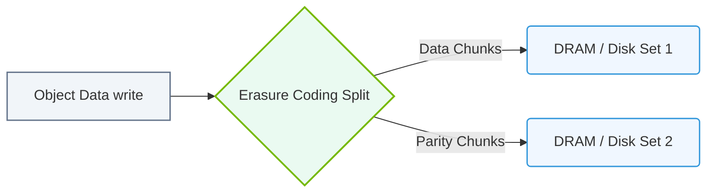

# 20.3b MinIO: S3-compatible object storage deployable on-premises

  📦 AI Data Center Networking
  📖 Parallel File Systems

## 🌐 Context Introduction

In AI workflows, you often need to store massive datasets — from training images to model checkpoints — that can reach petabytes in size. Traditional file systems struggle with this scale. Object storage, like Amazon S3, solves this by storing data as objects (files with metadata) in a flat namespace, making it highly scalable and durable. However, many AI teams need to keep data on-premises for security, latency, or cost reasons. **MinIO** is an open-source, S3-compatible object storage server that you can deploy directly in your own data center. It gives you the same API and functionality as AWS S3, but with full control over your hardware and data.

---

## ⚙️ What is MinIO?

MinIO is a high-performance, Kubernetes-native object storage system. It is designed for AI and big data workloads, offering:

- **S3 API compatibility** — Works with any tool that speaks S3 (e.g., PyTorch, TensorFlow, Spark).
- **On-premises deployment** — Run on bare metal, VMs, or Kubernetes.
- **Erasure coding** — Protects data against drive failures without RAID.
- **High throughput** — Optimized for reading/writing large files (e.g., multi-GB model weights).

---

## 📊 Key Features for AI Engineers

| Feature | What It Means for You |
|---------|-----------------------|
| **S3 API** | Use the same `boto3` or `awscli` commands you already know. No new SDK to learn. |
| **Erasure Coding** | Data is split into data and parity shards. Lose up to half your drives and still recover data. |
| **Bucket Versioning** | Keep multiple versions of datasets or models. Roll back if a training run corrupts data. |
| **Encryption** | Encrypt data at rest and in transit (TLS). Meet compliance requirements. |
| **Bucket Notifications** | Trigger actions (e.g., start a training job) when new data arrives. |
| **Kubernetes Native** | Deploy via Helm chart or Operator. Scales with your cluster. |

---

## 🛠️ How MinIO Works (Simplified)

1. **Data is stored as objects** — Each file (e.g., `training_data_001.parquet`) becomes an object in a bucket.
2. **Buckets are like folders** — You create buckets to organize datasets (e.g., `dataset-images`, `model-checkpoints`).
3. **Erasure coding protects data** — When you write a 1 GB file, MinIO splits it into 8 data shards and 4 parity shards across 12 drives. If any 4 drives fail, the file is still readable.
4. **Clients connect via S3 API** — Your AI training script uses the S3 endpoint (e.g., `http://minio-cluster:9000`) to upload/download objects.

---

## 🕵️ Common Use Cases in AI Infrastructure

- **Storing training datasets** — Large image, video, or text corpora.
- **Model artifact repository** — Save trained model weights, configs, and logs.
- **Checkpoint storage** — Save intermediate model states during long training runs.
- **Data lake for preprocessing** — Store raw and processed data for ETL pipelines.
- **Backup for parallel file systems** — Offload cold data from expensive Lustre/GPFS storage.

---

### 📊 Visual Representation: MinIO Multi-Disk Erasure Coding Protection
This diagram shows how MinIO divides object data into data and parity blocks, distributing them across disks for high redundancy.

## 🔧 Deployment Options (No Commands — Just Concepts)

- **Single-node (standalone)** — One server, one drive. Good for testing or small teams.
- **Distributed mode** — Multiple servers, each with multiple drives. Scales to petabytes.
- **Kubernetes (Operator)** — MinIO Operator manages the cluster lifecycle. Best for cloud-native AI platforms.
- **TLS and DNS** — Always enable TLS (HTTPS) for security. Use a load balancer or service mesh for high availability.

---

## 📈 Performance Considerations

- **Use NVMe or SSD drives** — HDDs bottleneck AI workloads. MinIO performs best with fast local storage.
- **Network matters** — For multi-node clusters, use 25 GbE or faster networking. MinIO can saturate 100 GbE links.
- **Small files are inefficient** — Object storage is optimized for large objects (MBs to GBs). For millions of tiny files, consider batching them into archives (e.g., TFRecord, tar).
- **Client-side tuning** — Use multipart uploads for files > 5 GB. Set `max_concurrent_requests` in your S3 client.

---

## 🔐 Security Best Practices

- **Enable TLS** — Encrypt all traffic between clients and MinIO.
- **Use IAM-like policies** — MinIO supports S3-style bucket policies and identity management.
- **Rotate access keys** — Treat MinIO access/secret keys like passwords.
- **Audit logging** — Enable bucket access logs to monitor who reads/writes data.
- **Network isolation** — Place MinIO on a private subnet; expose only through a reverse proxy or VPN.

---

## 🧩 Integration with AI Tools

- **PyTorch** — Use `torchdata` or `s3fs` to stream data directly from MinIO.
- **TensorFlow** — Use `tf.io.gfile` with S3 endpoint.
- **MLflow** — Store experiment artifacts and models in MinIO buckets.
- **Apache Spark** — Read/write DataFrames to MinIO using S3 connector.
- **Kubernetes** — Use MinIO as a CSI (Container Storage Interface) driver for persistent volumes.

---

## ✅ Summary

MinIO gives you the power of AWS S3 — scalability, durability, and a universal API — but runs on your own hardware. For AI engineers, this means:

- No egress costs when moving petabytes of data.
- Low latency because storage is local to your compute cluster.
- Full control over encryption, access, and data lifecycle.
- Seamless integration with existing AI frameworks and tools.

Start small with a single-node test, then scale to a distributed cluster as your datasets grow. MinIO is a foundational piece of any on-premises AI infrastructure.