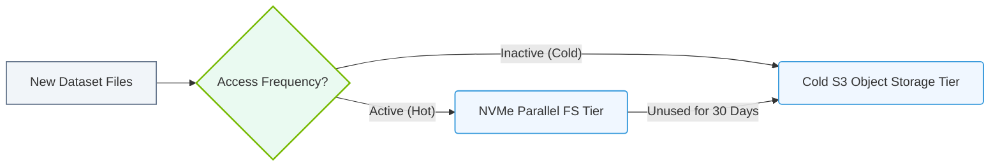

# 20.3c Tiered storage policies: moving cold datasets from NVMe to object storage automatically

  📦 AI Data Center Networking
  📖 Parallel File Systems

---

## 🧠 Context Introduction

In AI infrastructure, datasets go through a lifecycle. Fresh, actively-used training data lives on fast NVMe storage for speed. But once a dataset is no longer needed for active training (it becomes "cold"), keeping it on expensive NVMe drives wastes money. Tiered storage policies solve this by automatically moving cold datasets from high-speed NVMe to cheaper object storage — without engineers having to manually shuffle files around.

Think of it like a smart closet: winter coats (hot data) stay near the door, while summer clothes (cold data) get moved to the attic automatically when the season changes.

---

## ⚙️ What Is a Tiered Storage Policy?

A **tiered storage policy** is a set of rules that automatically migrates data between different storage tiers based on age, access frequency, or other criteria.

- **NVMe tier** — Ultra-fast, expensive storage for active training data
- **Object storage tier** — Slower but much cheaper, ideal for cold/archived datasets
- **Policy engine** — Monitors data usage and triggers moves automatically

The goal: **keep hot data fast, cold data cheap, and never waste engineer time on manual moves.**

---

## 📊 Hot vs. Cold Datasets — When Does Data Go Cold?

| Data State | Typical Access Pattern | Storage Tier | Cost per GB |
|------------|----------------------|--------------|-------------|
| 🔥 **Hot** | Accessed daily for active training | NVMe | High |
| 🌡️ **Warm** | Accessed weekly for validation | NVMe or SSD | Medium |
| ❄️ **Cold** | Accessed monthly or less | Object Storage | Low |

**Signs a dataset is turning cold:**
- No read/write activity for 7+ days
- Model training has moved to a newer dataset
- Dataset is only kept for compliance or reproducibility

---

## 🛠️ How Automatic Tiering Works (Step-by-Step)

1. **Policy Definition** — An engineer defines a rule: "Move any dataset not accessed in 30 days from NVMe to object storage."
2. **Monitoring** — The storage system tracks last-access timestamps for every dataset.
3. **Trigger** — When a dataset hits the 30-day threshold, the policy fires.
4. **Migration** — The system copies the dataset from NVMe to object storage.
5. **Verification** — Checksum ensures data integrity after the move.
6. **Cleanup** — Original NVMe copy is deleted (or kept as a cache pointer).

**Key point:** The move happens in the background — no downtime, no manual scripts.

---

## 🕵️ Common Policy Rules You'll Configure

- **Age-based** — Move files older than X days
- **Access-based** — Move files not read/written in X days
- **Size-based** — Move large cold files first (more savings)
- **Tag-based** — Move datasets labeled "archive" or "completed"

**Example policy logic (plain English):**
> "If a dataset in the NVMe tier has zero reads for 14 consecutive days, and its total size exceeds 100 GB, migrate it to object storage. Keep a metadata pointer on NVMe for fast recall."

---

### 📊 Visual Representation: Tiered Storage Lifecycle Policy
This flowchart maps out a tiered storage policy: shifting hot active training datasets to fast NVMe SSDs and cold files to object storage.

## 📦 What Happens When Cold Data Is Needed Again?

Tiered storage isn't a one-way trip. Most systems support **recall** or **promotion**:

- When a user or job requests a cold dataset, the system automatically pulls it back from object storage to NVMe.
- This recall may take seconds to minutes (object storage is slower), so plan for latency.
- Some systems keep a small "stub" file on NVMe that triggers the recall on access.

**Best practice:** Set a recall timeout — if the dataset isn't accessed again within 24 hours, move it back to object storage automatically.

---

## 🧩 Integration with AI Workflows

Tiered storage policies work seamlessly with:

- **MLflow or Kubeflow** — Datasets are tracked; policies apply based on experiment status
- **Slurm or Kubernetes** — Jobs can request datasets; the storage tiering layer handles location transparently
- **Data catalogs** — Metadata remains visible even after data moves to object storage

**Result:** Engineers see a unified namespace — they don't need to know where the data physically lives.

---

## ✅ Benefits at a Glance

- 💰 **Cost savings** — NVMe costs 5–10x more per GB than object storage
- ⏱️ **Automation** — No manual cron jobs or scripts to maintain
- 🔒 **Data integrity** — Automatic checksums and retries during migration
- 📈 **Scalability** — Policies work across petabytes without manual intervention
- 🧠 **Transparent** — Applications see the same file paths regardless of tier

---

## ⚠️ Common Pitfalls to Avoid

- **Too aggressive** — Moving data too early causes frequent recalls, wasting bandwidth
- **No recall testing** — Always test that cold data can be retrieved within acceptable time
- **Ignoring metadata** — If the object storage doesn't preserve file permissions or timestamps, your pipeline may break
- **One-size-fits-all** — Different datasets (checkpoints, logs, raw data) need different policies

---

## 🧪 Quick Self-Check for New Engineers

- Can you explain why keeping cold data on NVMe is wasteful?
- What three factors would you use to define a "cold" dataset?
- How would you verify that a tiered migration completed successfully?

---

## 📚 Summary

Tiered storage policies are a **set-it-and-forget-it** approach to managing AI dataset lifecycles. By automatically moving cold datasets from expensive NVMe to cheap object storage, you save money, reduce manual work, and keep your AI infrastructure running efficiently. The key is choosing the right triggers (age, access, or tags) and testing recall performance before deploying at scale.

**Remember:** The best policy is one that balances cost savings with the speed your AI workloads actually need.