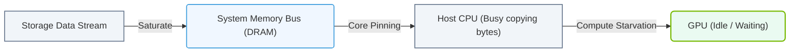

# 21.1b The CPU copy bottleneck: memory bandwidth consumed by unnecessary staging

<div class="lesson-completion" data-lesson-id="21_1b_cpu_copy_bottleneck"></div>
<div class="lesson-tags">
  <span class="lesson-tag">📦 AI Data Center Networking</span>
  <span class="lesson-tag">📖 Accelerating the Storage Pipeline</span>
</div>


---

## 🧠 Context Introduction

In traditional AI infrastructure, when data moves from storage to a GPU for training, it takes a detour through the CPU's main memory (RAM). This detour is called **staging**. While it sounds harmless, each copy of data that passes through the CPU consumes precious memory bandwidth. For new engineers, think of it like this: if you're moving heavy boxes (data) from a warehouse (storage) to a truck (GPU), stopping at a middle table (CPU RAM) to rearrange them every time wastes energy and time. This bottleneck is known as the **CPU copy bottleneck**.

---

## ⚙️ What Is the CPU Copy Bottleneck?

The CPU copy bottleneck occurs when data must be copied from storage to CPU RAM, and then *again* from CPU RAM to GPU memory. This double copy consumes memory bandwidth that could otherwise be used for computation.

- **Unnecessary staging** means data is temporarily held in CPU RAM even though the GPU is the final destination.
- The CPU's memory bus becomes a traffic jam, slowing down the entire pipeline.
- This is especially painful in AI workloads where terabytes of data move constantly.

---

## 📊 How Unnecessary Staging Wastes Memory Bandwidth

| Step | Action | Bandwidth Impact |
|------|--------|------------------|
| 1️⃣ | Storage → CPU RAM | Consumes CPU memory bandwidth |
| 2️⃣ | CPU RAM → GPU Memory | Consumes CPU memory bandwidth again |
| 3️⃣ | GPU processes data | GPU waits for data to arrive |

- **Result:** The CPU memory bus is used twice for the same data, doubling the bandwidth tax.
- **Real-world effect:** GPU utilization drops because it idles waiting for data to finish staging.

---

## 🕵️ Identifying the Bottleneck in Your System

New engineers can spot this bottleneck by monitoring system metrics:

- **High CPU memory bandwidth usage** (check with tools like `nvidia-smi` or `perf`).
- **Low GPU utilization** despite high data throughput from storage.
- **Long data loading times** before training begins.

**Example observation:**
- If your GPU is at 30% utilization but your CPU memory bandwidth is at 90%, you likely have a staging bottleneck.

---


### 📊 Visual Representation: CPU and System Memory Bandwidth Bottleneck
This flowchart demonstrates how standard storage paths create bottlenecks by locking CPU cores to perform memmove operations, starving GPU compute.




## 🛠️ How to Mitigate the CPU Copy Bottleneck

Here are practical steps engineers can take:

- **Use GPUDirect Storage (GDS):** This technology allows data to flow directly from storage to GPU memory, bypassing CPU RAM entirely.
- **Reduce unnecessary copies:** Avoid copying data to CPU RAM unless the CPU needs to process it.
- **Pin memory buffers:** Use pinned (page-locked) memory to speed up transfers between CPU and GPU.
- **Batch data transfers:** Combine small transfers into larger ones to reduce overhead.

**For reference:**
```bash
# Example: Check if GPUDirect Storage is enabled
nvidia-smi gds -s
```
📤 Output: **GPUDirect Storage is enabled: Yes**

---

## 🧩 Comparison: With vs. Without Staging Bottleneck

| Aspect | Traditional Path (With Bottleneck) | Optimized Path (Without Bottleneck) |
|--------|-----------------------------------|-------------------------------------|
| Data flow | Storage → CPU RAM → GPU | Storage → GPU (direct) |
| CPU memory bandwidth usage | High (double copy) | Low (no staging) |
| GPU idle time | High (waits for data) | Low (data arrives faster) |
| Training throughput | Limited by CPU memory speed | Limited by storage speed |

---

## ✅ Key Takeaways for New Engineers

- **Every copy is a tax** — avoid unnecessary staging to save memory bandwidth.
- **The CPU memory bus is a shared resource** — don't let data staging starve compute tasks.
- **GPUDirect Storage is your friend** — it eliminates the CPU copy bottleneck for storage-to-GPU transfers.
- **Monitor your system** — high CPU memory bandwidth + low GPU utilization = staging problem.

---

## 📚 Further Learning

- Explore **GPUDirect Storage** documentation from NVIDIA.
- Practice using **nvidia-smi** to monitor memory bandwidth and GPU utilization.
- Experiment with **pinned memory** in CUDA programs to see the performance difference.

---

*Remember: In AI infrastructure, moving data efficiently is just as important as processing it. Avoid the staging trap, and your GPUs will thank you.*