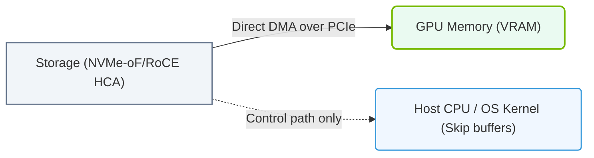

# 21.2a GDS architecture: DMA engine reads from NVMe directly into GPU BAR memory

  📦 AI Data Center Networking
  📖 Accelerating the Storage Pipeline

---

## 🧠 Context Introduction

In traditional AI data pipelines, data must travel from storage (NVMe SSD) to CPU memory, then be copied to GPU memory before processing. This creates a bottleneck — the data takes multiple hops, wasting time and CPU resources.

**GPUDirect Storage (GDS)** changes this by allowing the **DMA engine** to read data directly from NVMe storage into **GPU BAR (Base Address Register) memory** — bypassing the CPU and system RAM entirely. This dramatically reduces latency and improves throughput for AI workloads.

---

## ⚙️ How the DMA Engine Works in GDS

The key component is the **DMA (Direct Memory Access) engine** built into modern NVMe controllers and NVIDIA GPUs. Here's the flow:

- **Step 1:** The application requests data from a file stored on an NVMe SSD.
- **Step 2:** Instead of routing through CPU memory, the NVMe controller's DMA engine is programmed to write data directly into the **GPU's BAR memory** (a region of GPU-accessible memory mapped into the PCIe address space).
- **Step 3:** The GPU can immediately access this data without any CPU intervention or extra memory copies.

> 🧩 **GPU BAR memory** is a small, high-speed window into the GPU's memory that is visible to PCIe devices like NVMe controllers. It acts as a direct bridge between storage and the GPU.

---

## 🛠️ Key Architectural Components

| Component | Role in GDS |
|-----------|-------------|
| **NVMe SSD** | Stores data; has built-in DMA engine capable of initiating transfers |
| **DMA Engine** | Reads data from NVMe and writes directly to GPU BAR memory |
| **GPU BAR Memory** | A PCIe-mapped region of GPU memory that NVMe can write to directly |
| **CUDA Driver** | Manages the mapping between GPU memory and PCIe address space |
| **GDS Library** | Provides APIs (e.g., `cudaMemcpy` with special flags) to enable direct transfers |

---

## 📊 Comparison: Traditional vs. GDS Data Path

| Aspect | Traditional Path | GDS Path |
|--------|------------------|----------|
| **Data flow** | NVMe → CPU RAM → GPU RAM | NVMe → GPU BAR (direct) |
| **CPU involvement** | Required for every copy | Minimal — only for setup |
| **Latency** | Higher (multiple hops) | Lower (single hop) |
| **Throughput** | Limited by CPU memory bandwidth | Maximized by PCIe bandwidth |
| **Memory usage** | CPU RAM used as intermediate buffer | No CPU RAM needed for buffer |

---

### 📊 Visual Representation: GPUDirect Storage (GDS) Direct Data Path
This diagram displays GPUDirect Storage, bypassing the host CPU and system RAM to copy data directly from storage interfaces to GPU VRAM.

## 🕵️ Why This Matters for AI Workloads

- **Training speed:** Large datasets (e.g., ImageNet, medical images) can be loaded directly into GPU memory, reducing I/O wait times.
- **Inference pipelines:** Real-time applications benefit from lower latency when fetching model inputs from storage.
- **Resource efficiency:** CPU cores are freed from data copying tasks, allowing them to handle other operations.

---

## 🔄 Practical Example: How an Engineer Would Use GDS

When writing a CUDA application, engineers use the **GDS API** to enable direct transfers. The process looks like this:

1. **Open the file** on the NVMe drive using standard file I/O.
2. **Register the GPU memory** with the GDS library (this exposes the GPU BAR region to the NVMe controller).
3. **Issue a read request** — the DMA engine handles the transfer directly.
4. **Process data on GPU** — no additional copy needed.

> ✅ The result: Data moves from disk to GPU in a single PCIe transaction, not multiple memory copies.

---

## ⚠️ Important Considerations for Engineers

- **BAR size matters:** GPU BAR memory is limited (typically 256MB–1GB). For large transfers, GDS uses a "bounce buffer" approach — data is streamed through BAR in chunks.
- **NVMe must support GDS:** Not all NVMe drives have the required DMA engine capabilities. Check for **NVMe 1.3+** and **GDS-compatible firmware**.
- **PCIe topology:** For best performance, the NVMe drive and GPU should be on the same PCIe root complex (avoid crossing PCIe switches if possible).
- **CPU still needed for control:** While data bypasses CPU memory, the CPU still orchestrates the transfer (e.g., setting up DMA descriptors).

---

## 📈 Performance Impact (Typical Gains)

- **Latency reduction:** 30–50% lower data access latency compared to traditional path.
- **Throughput increase:** Up to 2x improvement for large sequential reads.
- **CPU utilization:** Drops from ~30% (for data copying) to near 0% during transfers.

---

## 🔍 Summary

The GDS architecture with DMA engine direct-to-GPU-BAR reads is a fundamental optimization for AI infrastructure. By eliminating unnecessary memory hops, it allows engineers to build faster, more efficient data pipelines — critical for training large models and running real-time inference at scale.

> 💡 **Key takeaway:** GDS turns the NVMe drive into a peer device on the PCIe bus that can talk directly to the GPU, just like two GPUs can communicate via NVLink. This is the storage equivalent of "zero-copy" networking.