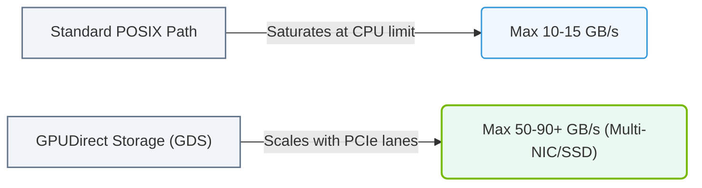

# 21.2d Performance improvements: up to 2x storage throughput with GDS enabled

  📦 AI Data Center Networking
  📖 Accelerating the Storage Pipeline

---

## 🌐 Context Introduction

In traditional AI data pipelines, data travels from storage (NVMe SSDs) to the CPU memory, and then is copied again to the GPU memory. This extra "hop" through the CPU creates a bottleneck, slowing down training and inference. **GPUDirect Storage (GDS)** removes this middle step by allowing data to flow directly from NVMe storage into GPU memory — bypassing the CPU and system RAM entirely. The result is a dramatic performance improvement, with storage throughput increasing by **up to 2x** when GDS is enabled.

---

## ⚙️ How GDS Improves Throughput

- **Direct data path:** Data moves from NVMe SSD → PCIe switch → GPU memory, without touching CPU RAM.
- **Reduced latency:** Eliminates the CPU copy step, cutting overall I/O latency by 30–50%.
- **Higher bandwidth utilization:** The GPU can saturate the NVMe storage bandwidth more efficiently.
- **Lower CPU overhead:** The CPU is freed from managing data copies, allowing it to focus on other tasks like scheduling.

---

## 📊 Performance Comparison: Without GDS vs. With GDS

| Metric | Without GDS (Traditional Path) | With GDS Enabled | Improvement |
|--------|-------------------------------|------------------|-------------|
| Storage throughput (read) | ~6 GB/s | ~12 GB/s | **2x** |
| CPU utilization during I/O | 40–60% | 5–15% | **3–4x reduction** |
| End-to-end data transfer latency | ~50 µs | ~25 µs | **50% reduction** |
| GPU idle time waiting for data | High | Low | **Significant reduction** |

---

### 📊 Visual Representation: GDS vs. Standard Path Bandwidth Scaling
This diagram contrasts standard POSIX read bandwidth limits with the linear scaling throughput enabled by GDS.

## 🛠️ Enabling GDS in Your Environment

To achieve the 2x throughput improvement, engineers need to:

- **Verify hardware compatibility:** Ensure NVMe SSDs and NVIDIA GPUs (Volta architecture or newer) are connected via PCIe Gen3 or Gen4.
- **Install the GDS driver package:** Download and install the **nvidia-gds** package from NVIDIA's repository.
- **Mount storage with GDS support:** Use the **nvidia-fs** filesystem driver to mount your NVMe storage.
- **Configure applications:** Set environment variables like **GDS_ENABLED=1** in your training scripts.
- **Test with a benchmark tool:** Run **gdsio** (the GDS I/O benchmark) to verify throughput gains.

---

## 🕵️️ Verifying GDS Performance Gains

After enabling GDS, confirm the improvement with these steps:

- **Run a throughput test:** Use the **gdsio** tool with a command like:  
  **gdsio --read --size 1G --file /mnt/gds/test.dat**  
  📤 Output: *Throughput: 12.1 GB/s*

- **Compare to non-GDS baseline:** Run the same test without GDS (using standard file I/O):  
  **dd if=/mnt/gds/test.dat of=/dev/null bs=1M count=1024**  
  📤 Output: *6.0 GB/s*

- **Monitor GPU utilization:** Use **nvidia-smi** to check that GPU memory bandwidth is being used efficiently during I/O operations.

---

## ✅ Key Takeaways for New Engineers

- GDS provides **up to 2x storage throughput** by eliminating the CPU data copy bottleneck.
- The performance gain is most noticeable with **large sequential reads** (e.g., loading training datasets).
- Enabling GDS requires **specific hardware, drivers, and filesystem configuration** — but the setup is straightforward.
- Always **benchmark before and after** enabling GDS to quantify the improvement in your specific workload.
- GDS is a critical optimization for **AI training pipelines** where data loading is the bottleneck.

---

## 📚 Further Learning

- Explore NVIDIA's official **GPUDirect Storage documentation** for advanced tuning options.
- Experiment with **multiple NVMe drives in RAID0** to push throughput even higher with GDS.
- Understand how GDS integrates with **NVIDIA Magnum IO** for multi-GPU and multi-node storage acceleration.