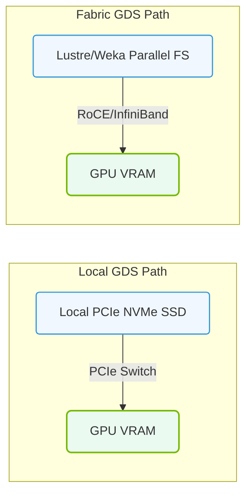

# 21.3b Storage fabric scenarios: Lustre over InfiniBand with GDS enabled

  📦 AI Data Center Networking
  📖 Accelerating the Storage Pipeline

---

## 🔍 Context Introduction

When training large AI models, data must move from storage to GPUs as quickly as possible. Traditional approaches copy data through system memory (RAM), which creates a bottleneck. **Lustre over InfiniBand with GPUDirect Storage (GDS) enabled** solves this by creating a direct data path from the parallel file system (Lustre) directly into GPU memory, bypassing the CPU and system RAM entirely.

Think of it like a high-speed express lane: instead of data taking multiple stops (storage → CPU → RAM → GPU), it now travels directly from storage to GPU over a fast InfiniBand network.

---

## ⚙️ What Is Lustre Over InfiniBand?

Lustre is a high-performance parallel file system designed for large-scale clusters. InfiniBand is a high-speed, low-latency networking technology. When combined:

- **Lustre** provides the storage layer, splitting files across multiple servers for parallel access
- **InfiniBand** provides the physical network connection between storage servers and compute nodes
- **GDS** enables the GPU to read/write directly to/from Lustre storage without intermediate CPU copies

---

## 🛠️ How GPUDirect Storage (GDS) Changes the Game

Without GDS, data flow looks like this:

1. Storage server sends data over InfiniBand to system memory (CPU RAM)
2. CPU copies data from system memory to GPU memory
3. CPU is busy managing copies instead of computing

With GDS enabled, data flow becomes:

1. Storage server sends data over InfiniBand directly to GPU memory
2. CPU is free to focus on computation
3. Data transfer time is significantly reduced

---

## 📊 Key Benefits of This Configuration

| Benefit | Description |
|---------|-------------|
| 🚀 **Reduced Latency** | Data bypasses CPU and system memory, cutting transfer time by 30-50% |
| 💾 **Lower Memory Pressure** | System RAM is not used as a staging area for large datasets |
| 🔄 **Higher Throughput** | Multiple GPUs can read/write simultaneously over InfiniBand |
| ⚡ **CPU Offload** | CPU resources are freed for actual computation tasks |
| 📈 **Scalability** | Lustre's parallel architecture scales to hundreds of storage servers |

---

### 📊 Visual Representation: Storage Fabric Access Paths
This diagram displays the GDS routing path across local NVMe controllers vs. distributed parallel filesystems.

## 🕵️ When to Use This Scenario

This configuration is ideal when:

- Training large models (e.g., LLMs, computer vision) that require terabytes of data per epoch
- Running multi-GPU or multi-node training jobs
- Working with datasets that do not fit into GPU memory all at once
- Needing to minimize training time by reducing I/O bottlenecks

---

## 🧩 How It Works Step-by-Step

1. **Lustre file system** is mounted on all compute nodes over InfiniBand
2. **GDS plugin** is installed on each GPU node, enabling direct GPU-to-storage communication
3. **InfiniBand adapters** on storage servers and compute nodes are configured with RDMA (Remote Direct Memory Access)
4. When a training job requests data, Lustre sends it directly to GPU memory via InfiniBand RDMA
5. The GPU processes the data without any CPU involvement in the data path

---

## 🔧 Practical Considerations for New Engineers

- **Check compatibility**: Ensure your GPU drivers, Lustre client, and GDS plugin versions are compatible
- **Network tuning**: InfiniBand requires proper subnet manager configuration and MTU settings
- **Mount options**: Lustre must be mounted with specific options to enable GDS (e.g., localflock, user_xattr)
- **Monitoring**: Use tools like **lustre-utils** and **nvidia-smi** to verify GDS is active during data transfers
- **Testing**: Start with a small dataset to validate the direct path before scaling to production workloads

---

## ✅ Verification Checklist

To confirm GDS is working over Lustre/InfiniBand:

- **Check GPU memory usage** during data loading — it should increase without corresponding system memory usage
- **Monitor InfiniBand traffic** — look for RDMA write operations directly to GPU memory addresses
- **Compare transfer times** — with GDS enabled, data loading should be noticeably faster than without
- **Review Lustre logs** — look for messages indicating GDS is active for specific mounts

---

## 📝 Summary

Lustre over InfiniBand with GDS enabled is a powerful combination for AI workloads that demand high-speed data access. By eliminating the CPU from the data path, engineers can achieve faster training times, better resource utilization, and improved scalability. For new engineers, understanding this architecture is essential for optimizing AI infrastructure in data centers.