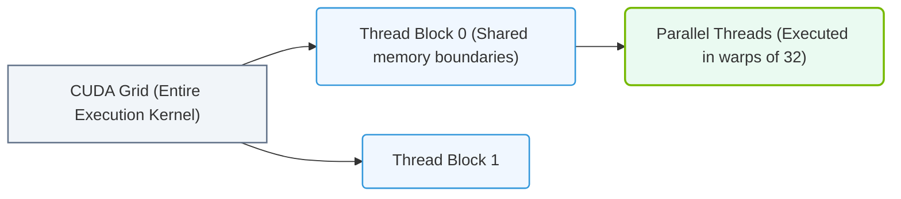

# 22.2a CUDA programming model: grids, blocks, and threads mapped to GPU hardware

<div class="lesson-completion" data-lesson-id="22_2a_cuda_programming_model"></div>
<div class="lesson-tags">
  <span class="lesson-tag">📦 Nvidia Software Stack</span>
  <span class="lesson-tag">📖 Base Drivers, CUDA, and Core Libraries</span>
</div>


---

## 🧭 Context Introduction

When you write a program that runs on an NVIDIA GPU, you are not simply running code on a single processor. Instead, you are launching thousands of lightweight execution units called **threads** that work together in a structured hierarchy. Understanding this hierarchy — **grids**, **blocks**, and **threads** — is essential for any engineer working with AI workloads, because it directly determines how efficiently your code uses the GPU's hardware resources.

Think of it like organizing a large team: threads are individual workers, blocks are teams, and a grid is the entire project. The CUDA programming model gives you control over this organization, and the GPU hardware maps these logical structures onto its physical cores.

---

## ⚙️ The Three-Level Hierarchy

CUDA organizes parallel work into three logical levels. Each level maps to a specific hardware component inside the GPU.

- **Thread** — The smallest unit of execution. Each thread runs the same kernel function but operates on different data (e.g., different pixels in an image).
- **Block** — A group of threads that can cooperate. Threads within the same block can share data through **shared memory** and synchronize with each other.
- **Grid** — A collection of blocks. A grid represents the entire kernel launch. Blocks in a grid are independent — they cannot communicate directly with each other.

---

## 🛠️ Mapping Logical Hierarchy to GPU Hardware

The GPU hardware consists of **Streaming Multiprocessors (SMs)** and **CUDA cores**. Here is how the logical model maps to physical components:

| Logical Concept | Hardware Mapping | Key Detail |
|----------------|------------------|------------|
| **Thread** | Executes on a single CUDA core | Each core handles one thread at a time |
| **Block** | Assigned to one Streaming Multiprocessor (SM) | All threads in a block run on the same SM |
| **Grid** | Distributed across all available SMs | Blocks are scheduled to SMs dynamically |

- **Warp** — A hardware-level group of 32 threads within a block. The SM executes instructions one warp at a time. If threads in a warp diverge (take different code paths), performance drops.

---

## 🕵️ Why This Matters for AI Engineers

When you launch a CUDA kernel (e.g., for matrix multiplication or neural network inference), you specify:

- **Grid dimensions** — How many blocks to launch.
- **Block dimensions** — How many threads per block.

The GPU's scheduler automatically distributes blocks to SMs. If you choose block sizes that are too small, you underutilize the SM. If you choose block sizes that are too large, you may exceed hardware limits (e.g., shared memory or register count).

**Practical guidelines for AI workloads:**

- Use block sizes that are multiples of 32 (the warp size). Common choices: 128, 256, or 512 threads per block.
- Ensure the total number of blocks is large enough to keep all SMs busy (typically thousands of blocks).
- For simple element-wise operations, use one thread per data element.

---


### 📊 Visual Representation: CUDA Thread Block Grid Hierarchy
This diagram displays the CUDA execution hierarchy, showing how threads are grouped into thread blocks, which compile into the execution grid.




## 📊 Visualizing the Hierarchy

Imagine you want to add two large vectors of 1 million elements each.

- You launch a **grid** of blocks.
- Each **block** contains 256 **threads**.
- Each thread computes one element of the result.

The GPU hardware then:

1. Assigns each block to an SM.
2. The SM splits the block's 256 threads into 8 warps (256 ÷ 32 = 8).
3. Each warp executes instructions in lockstep on the SM's CUDA cores.

---

## 🔍 Key Takeaways for New Engineers

- **Threads are lightweight** — Switching between threads costs almost nothing on a GPU, unlike CPU threads.
- **Blocks are independent** — Do not assume blocks execute in any particular order. They can run sequentially or in parallel depending on available SMs.
- **Warp divergence hurts performance** — Try to keep all threads in a warp executing the same instruction path.
- **Resource limits are real** — Each SM has a fixed amount of shared memory, registers, and maximum threads. Exceeding these limits prevents a block from running.

---

## 🧪 Simple Example (Conceptual)

For reference, a typical CUDA kernel launch in Python using Numba or CuPy might look like this:

```python
# Define block and grid dimensions
threads_per_block = 256
blocks_per_grid = (total_elements + threads_per_block - 1) // threads_per_block

# Launch kernel
my_kernel[blocks_per_grid, threads_per_block](input_data, output_data)
```

📤 **Output:** The GPU executes the kernel with the specified number of blocks and threads, distributing work across SMs automatically.

---

## ✅ Summary

The CUDA programming model gives you a simple, scalable way to express parallelism. By understanding how **grids**, **blocks**, and **threads** map to **SMs**, **warps**, and **CUDA cores**, you can write efficient GPU code for AI workloads. Start with block sizes that are multiples of 32, keep your blocks independent, and let the hardware scheduler do the rest.