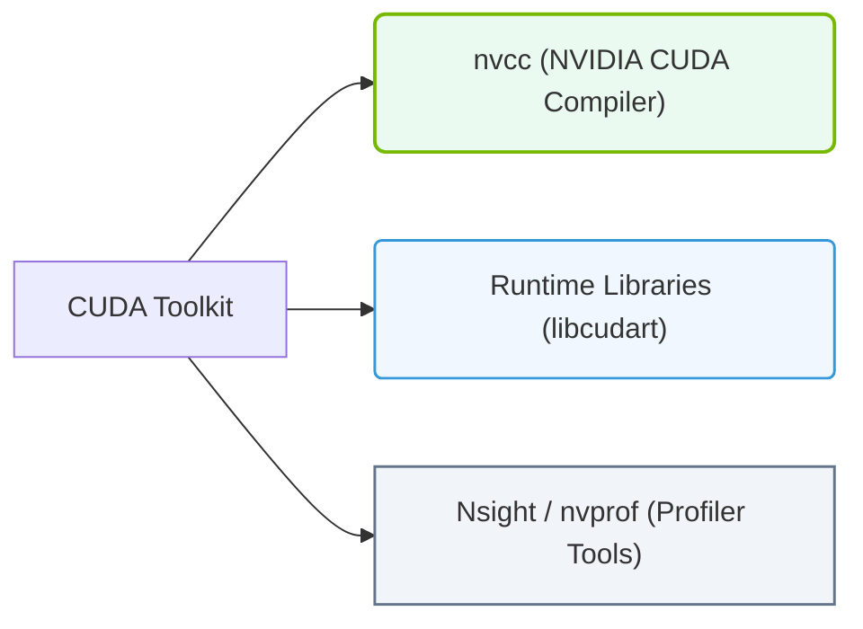

# 22.2b CUDA Toolkit components: nvcc compiler, runtime libraries, and development headers

  📦 Nvidia Software Stack
  📖 Base Drivers, CUDA, and Core Libraries

---

## 🧠 Context: What Is the CUDA Toolkit?

Imagine you want to write a program that runs on an NVIDIA GPU. The GPU doesn't understand your Python or C++ code directly — it speaks its own language. The **CUDA Toolkit** is the translator and toolset that bridges this gap. It provides everything you need to write, compile, and run code on NVIDIA GPUs.

For a new engineer, think of the CUDA Toolkit as a **developer's workshop** containing:
- A **compiler** (nvcc) to turn your code into GPU instructions
- **Libraries** that provide ready-made GPU functions
- **Headers** that tell your code how to talk to the GPU

---

## ⚙️ The Three Core Components

The CUDA Toolkit contains many pieces, but three are essential for every engineer to understand:

### 1. 🛠️ nvcc Compiler — The Code Translator

**nvcc** (NVIDIA CUDA Compiler) is the special compiler that takes your mixed code (CPU code + GPU code) and produces executable programs.

**What it does:**
- Separates your CPU code (C/C++) from your GPU code (CUDA C/C++)
- Compiles CPU code with a standard compiler (like gcc)
- Compiles GPU code into instructions the GPU can execute
- Links everything together into one final program

**Key point for engineers:** You don't run nvcc manually for every project — build systems like CMake or Makefiles handle it. But understanding nvcc helps you debug build errors.

**Example of what nvcc processes (conceptually):**
- A file named **my_program.cu** contains both CPU and GPU code
- nvcc reads this file and produces an executable called **my_program**
- The executable contains both CPU instructions and GPU kernels

---

### 2. 📚 Runtime Libraries — The GPU Helpers

Runtime libraries are pre-built collections of GPU functions that your program can call. They save you from writing low-level GPU code from scratch.

**Key runtime libraries include:**

| Library Name | Purpose | When You Use It |
|-------------|---------|-----------------|
| **cudart** (CUDA Runtime) | Core GPU management — memory allocation, kernel launches, device queries | Every CUDA program needs this |
| **cublas** | Linear algebra on GPU (matrix multiply, etc.) | Machine learning, scientific computing |
| **cufft** | Fast Fourier Transforms | Signal processing, audio analysis |
| **curand** | Random number generation on GPU | Simulations, Monte Carlo methods |
| **cusolver** | Dense and sparse linear system solvers | Engineering simulations |

**How they work in practice:**
- Your program includes a header file (e.g., **cublas_v2.h**)
- At compile time, you link against the library (e.g., **-lcublas**)
- At runtime, the library functions run directly on the GPU

---

### 3. 📄 Development Headers — The Instruction Manuals

Headers are files (ending in **.h** or **.cuh**) that declare what functions and types are available in the CUDA Toolkit. They tell your C/C++ code how to call GPU functions correctly.

**What headers contain:**
- Function declarations (what the function does and what parameters it needs)
- Data type definitions (special GPU types like **float4**, **dim3**)
- Macro definitions (shorthand for common GPU operations)
- Constants (like **cudaSuccess** for error checking)

**Common headers you'll encounter:**

| Header File | What It Provides |
|-------------|------------------|
| **cuda_runtime.h** | Core CUDA functions (memory, device management) |
| **cuda.h** | Lower-level CUDA driver API |
| **device_launch_parameters.h** | Built-in variables like **threadIdx**, **blockIdx** |
| **cublas_v2.h** | CUBLAS library functions |
| **cufft.h** | CUFFT library functions |

---

## 🕵️ How These Components Work Together

Here's a simplified flow when you build a CUDA program:

1. **You write code** in a **.cu** file that includes headers like **cuda_runtime.h**
2. **nvcc compiles** your code — it sees the headers, understands the GPU functions you want to call
3. **nvcc links** your program against runtime libraries (like **cudart**)
4. **Your program runs** — the CPU part executes, and when it reaches GPU code, it calls the runtime library
5. **Runtime library** communicates with the NVIDIA driver, which talks to the GPU hardware

---

### 📊 Visual Representation: CUDA Toolkit Software Components
This diagram maps the components of the CUDA Toolkit, organizing compilers (nvcc), runtime libraries, and profiling tools.

## 📊 Quick Comparison Table

| Component | Analogy | What It Does | File Extension |
|-----------|---------|--------------|----------------|
| **nvcc** | Chef's knife | Cuts (compiles) your code into GPU instructions | Executable tool (no extension) |
| **Runtime Libraries** | Pre-made sauces | Ready-to-use GPU functions | **.so** (Linux) or **.dll** (Windows) |
| **Development Headers** | Recipe cards | Tells your code how to use the libraries | **.h** or **.cuh** |

---

## 🎯 Practical Takeaway for New Engineers

When you install the CUDA Toolkit, you get all three components automatically. Here's what you need to remember:

- **nvcc** is the compiler — you'll see it in build scripts and Makefiles
- **Runtime libraries** are what make your GPU code actually work — you link against them
- **Headers** are what you **#include** in your source code

**Common mistake to avoid:** Forgetting to link against the right runtime library. If you use CUBLAS functions but forget **-lcublas** in your build command, you'll get linker errors about undefined references.

**How to check if everything is installed correctly (conceptually):**
- Look for the **nvcc** executable in your system PATH
- Check that header files exist in the CUDA include directory (typically **/usr/local/cuda/include**)
- Verify library files exist in the CUDA lib directory (typically **/usr/local/cuda/lib64**)

---

## 🔍 Next Steps

As you grow in your role, you'll learn to:
- Write simple CUDA kernels that use these components
- Debug build issues by understanding what nvcc expects
- Choose the right runtime library for your task
- Read header files to understand available GPU functions

For now, remember this simple rule: **nvcc compiles, libraries execute, headers declare.** Everything else builds on this foundation.