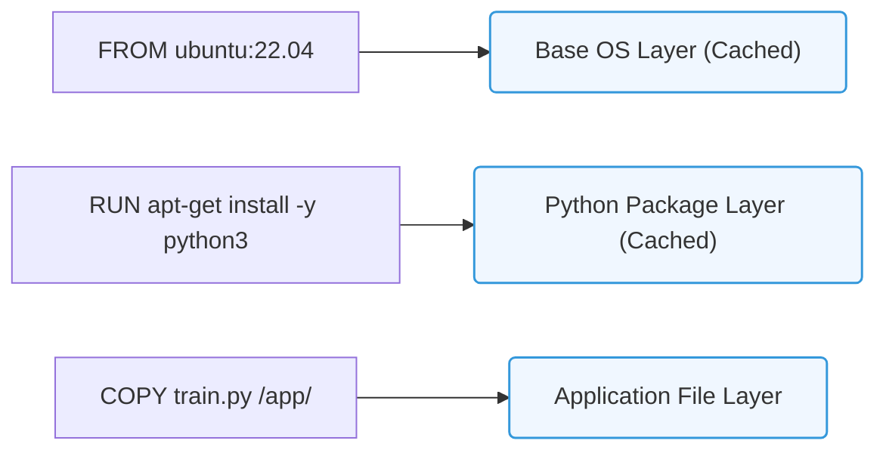

# 23.3b Dockerfile anatomy: FROM, RUN, COPY, ENV, EXPOSE, ENTRYPOINT, CMD

<div class="lesson-completion" data-lesson-id="23_3b_dockerfile_anatomy"></div>
<div class="lesson-tags">
  <span class="lesson-tag">📦 Nvidia Software Stack</span>
  <span class="lesson-tag">📖 Containerization Fundamentals</span>
</div>


---

## 📖 Context Introduction

A Dockerfile is the blueprint for building a container image. For engineers new to AI infrastructure, think of it as a recipe that tells Docker exactly how to assemble your AI application environment — from the base operating system to the final command that runs your model. Each instruction in a Dockerfile adds a layer to the image, making it reproducible and portable across different systems.

---

## ⚙️ The Seven Core Instructions

### 1. **FROM** — The Foundation Layer

- **Purpose**: Specifies the base image your container will start from.
- **Why it matters**: For AI workloads, you typically start from an NVIDIA CUDA-enabled image (e.g., **nvidia/cuda:12.2.0-runtime-ubuntu22.04**) to get GPU support.
- **Key point**: Every Dockerfile must begin with a **FROM** instruction — it's the only mandatory command.

### 2. **RUN** — Building the Environment

- **Purpose**: Executes commands during the image build process.
- **Common uses**: Installing Python packages, system libraries, or AI frameworks like PyTorch or TensorFlow.
- **Best practice**: Combine related **RUN** commands into one to reduce image layers and size.

### 3. **COPY** — Bringing Your Code In

- **Purpose**: Copies files from your local machine into the container image.
- **AI scenario**: Copy your trained model files, inference scripts, and configuration files.
- **Important**: Use **COPY** instead of **ADD** for local files — it's more predictable and secure.

### 4. **ENV** — Setting Environment Variables

- **Purpose**: Defines environment variables that persist in the container.
- **AI use cases**: Setting **PYTHONUNBUFFERED=1** for real-time logs, or **CUDA_VISIBLE_DEVICES=0** to control GPU access.
- **Note**: These variables are available to all subsequent instructions and running containers.

### 5. **EXPOSE** — Opening Ports

- **Purpose**: Documents which ports the container will listen on at runtime.
- **AI context**: Common for model serving APIs (e.g., port **8000** for FastAPI or **8501** for Streamlit).
- **Important**: This is documentation only — actual port mapping happens when you run the container with **-p** flag.

### 6. **ENTRYPOINT** — The Main Executable

- **Purpose**: Defines the primary command that always runs when the container starts.
- **AI scenario**: Set to **python** or your inference script path.
- **Behavior**: Arguments passed to **docker run** are appended to the **ENTRYPOINT** command.

### 7. **CMD** — Default Arguments

- **Purpose**: Provides default arguments for the **ENTRYPOINT** command.
- **AI example**: If **ENTRYPOINT** is **python**, **CMD** could be **app.py**.
- **Override**: Users can replace **CMD** by passing arguments at runtime.

---

## 📊 Comparison Table: ENTRYPOINT vs CMD

| Feature | ENTRYPOINT | CMD |
|---------|------------|-----|
| **Primary role** | Defines the executable | Provides default arguments |
| **Overridable** | Requires **--entrypoint** flag | Overridden by any command-line arguments |
| **Typical AI use** | Set to **python** or **bash** | Set to your script name (e.g., **inference.py**) |
| **Combined behavior** | Always runs first | Appended as arguments to ENTRYPOINT |
| **Example** | **python** | **app.py --port 8080** |

---


### 📊 Visual Representation: Dockerfile Instruction Layer Build
This diagram shows how Dockerfile commands map to permanent, cached read-only image layers.




## 🛠️ Practical AI Example: Building an Inference Container

Here's how these instructions work together for a simple AI inference service:

**For reference:**
```
FROM nvidia/cuda:12.2.0-runtime-ubuntu22.04

RUN apt-get update && apt-get install -y python3-pip

RUN pip3 install torch torchvision fastapi uvicorn

COPY ./model.pt /app/model.pt
COPY ./inference_server.py /app/inference_server.py

ENV PYTHONUNBUFFERED=1
ENV MODEL_PATH=/app/model.pt

EXPOSE 8000

ENTRYPOINT ["python3"]

CMD ["/app/inference_server.py"]
```

📤 **Output**: When you run this container with **docker run -p 8000:8000 my-ai-image**, it starts the FastAPI inference server on port 8000, ready to accept model prediction requests.

---

## 🕵️ Common Mistakes New Engineers Make

- **Placing COPY before RUN**: Always put **RUN** commands that install dependencies *before* **COPY** commands — this leverages Docker's layer caching and speeds up rebuilds.
- **Forgetting EXPOSE**: While not strictly required, omitting **EXPOSE** makes it harder for others to understand your container's network configuration.
- **Mixing ENTRYPOINT and CMD incorrectly**: If you set **ENTRYPOINT** to a script path, **CMD** should provide arguments to that script — not a different executable.
- **Using ADD instead of COPY**: **ADD** has extra features (like URL fetching) that can introduce unexpected behavior — stick with **COPY** for local files.

---

## ✅ Quick Reference Checklist

- [ ] **FROM**: Start with an NVIDIA CUDA base image for GPU support
- [ ] **RUN**: Install system packages and Python dependencies
- [ ] **COPY**: Transfer your AI model files and scripts
- [ ] **ENV**: Set environment variables for logging and GPU control
- [ ] **EXPOSE**: Document the port your service uses
- [ ] **ENTRYPOINT**: Define the main executable (usually **python3**)
- [ ] **CMD**: Provide the default script to run

---

## 🔄 Building and Running Your Image

To build your Dockerfile into an image, use the **docker build** command with a tag name. To run the container, use **docker run** with port mapping and any additional flags. The **ENTRYPOINT** and **CMD** instructions will automatically execute when the container starts.

Remember: Each instruction creates a new layer. For AI infrastructure, keep your Dockerfile lean by combining related **RUN** commands and ordering instructions from least to most frequently changing content — this optimizes build times and keeps your deployment pipeline efficient.