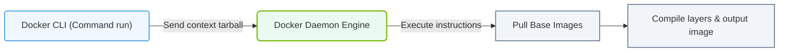

# 23.3c Building images: docker build, layer caching, and .dockerignore optimization

<div class="lesson-completion" data-lesson-id="23_3c_docker_build_process"></div>
<div class="lesson-tags">
  <span class="lesson-tag">📦 Nvidia Software Stack</span>
  <span class="lesson-tag">📖 Containerization Fundamentals</span>
</div>


When you work with AI infrastructure, you'll frequently build Docker images that package machine learning frameworks, GPU drivers, and model dependencies. The **docker build** command is your primary tool for creating these images. However, without understanding how Docker caches layers and how to exclude unnecessary files, your builds can become slow and your images bloated. This section explains these concepts in simple terms.

---

## ⚙️ What Happens During `docker build`?

The **docker build** command reads a **Dockerfile** — a recipe that tells Docker how to assemble your image. Each instruction in the Dockerfile (like installing Python packages or copying code) creates a new **layer**. Think of layers like stacked transparent sheets: each sheet adds something on top of the previous one.

- **Base layer**: Usually an operating system (e.g., Ubuntu) or a pre-built image (e.g., NVIDIA CUDA base image).
- **Intermediate layers**: Each command (RUN, COPY, ADD) creates a new layer.
- **Final layer**: The last instruction (often CMD or ENTRYPOINT) defines what runs when the container starts.

When you run **docker build**, Docker executes each instruction sequentially, creating a new layer for each step. If a step fails, you can fix it and rebuild — but Docker will reuse layers from previous successful steps (this is caching).

---

## 🕵️ Layer Caching — Why Your Second Build Is Faster

Docker caches each layer after a successful build. On subsequent builds, Docker checks if the instruction and its context (files, commands) have changed. If nothing changed, Docker reuses the cached layer instead of re-executing the instruction.

**Key caching rules:**
- **Instruction match**: The exact command text must match (e.g., RUN apt-get update).
- **File content match**: For COPY and ADD, Docker compares file checksums. If any file changed, the cache is invalidated from that layer onward.
- **Parent layer match**: If a parent layer is invalidated, all child layers must be rebuilt.

**Why this matters for AI infrastructure:**
- Installing large packages (like PyTorch or TensorFlow) takes time. If you place that instruction early in your Dockerfile and it doesn't change, Docker reuses the cached layer — saving minutes per build.
- Changing a single line of Python code invalidates the cache for that COPY layer and all subsequent layers. This is why you should copy code **after** installing dependencies.

---

## 🛠️ Optimizing Your Dockerfile for Cache Efficiency

To maximize cache reuse, structure your Dockerfile from **least frequently changing** to **most frequently changing**:

1. **Base image** — rarely changes (e.g., nvidia/cuda:12.2-runtime-ubuntu22.04)
2. **System dependencies** — change occasionally (e.g., apt-get install packages)
3. **Python dependencies** — change when requirements.txt updates
4. **Application code** — changes most frequently

**Example Dockerfile structure (for reference):**

```dockerfile
FROM nvidia/cuda:12.2-runtime-ubuntu22.04

RUN apt-get update && apt-get install -y python3 python3-pip

COPY requirements.txt /app/requirements.txt
RUN pip install -r /app/requirements.txt

COPY . /app

CMD ["python3", "/app/main.py"]
```

**Why this order works:**
- If you only change **main.py**, Docker reuses cached layers for the base image, system packages, and Python dependencies. Only the final COPY layer is rebuilt.
- If you add a new Python package to **requirements.txt**, Docker rebuilds from the COPY requirements.txt layer onward — but still reuses the system packages layer.

---


### 📊 Visual Representation: Docker Build Context and Daemon Engine
This flowchart outlines how the Docker CLI sends the local build context directory to the background Docker Daemon to execute image compilation.




## 📦 The `.dockerignore` File — Stop Sending Junk to the Build Context

When you run **docker build**, Docker sends the entire directory (called the **build context**) to the Docker daemon. This includes hidden files, virtual environments, and large datasets — all of which slow down the build and bloat the image.

The **.dockerignore** file tells Docker to exclude specific files or directories from the build context. It works like a **.gitignore** file.

**Common files to exclude in AI projects:**

- **__pycache__/** — Python bytecode cache
- **.git/** — Git repository history
- **.env** — Environment variables (secrets)
- **venv/** or **.venv/** — Python virtual environments
- **data/** — Large datasets (should be mounted at runtime)
- ***.pyc** — Compiled Python files
- **.dockerignore** — The file itself (optional)
- **Dockerfile** — The Dockerfile itself (optional)

**Example .dockerignore file (for reference):**

```dockerignore
.git/
__pycache__/
*.pyc
.env
venv/
data/
*.log
```

**Benefits of using .dockerignore:**
- **Faster builds**: Smaller build context means less data to transfer to the Docker daemon.
- **Smaller images**: Excluded files don't end up in the final image.
- **Security**: Secrets and sensitive files stay out of the image.

---

## 📊 Comparison: With vs. Without Optimization

| Aspect | Without Optimization | With Optimization |
|--------|---------------------|-------------------|
| **Build time (first build)** | 5-10 minutes (full rebuild) | 5-10 minutes (same) |
| **Build time (code change)** | 5-10 minutes (full rebuild) | 30 seconds (cached layers) |
| **Image size** | 3.5 GB (includes venv, .git) | 2.2 GB (only essentials) |
| **Build context size** | 500 MB (includes data/) | 50 KB (code only) |
| **Cache invalidation** | Every file change breaks cache | Only changed layers rebuild |

---

## 🎯 Practical Tips for New Engineers

- **Always create a .dockerignore file** — it's as important as your Dockerfile.
- **Place COPY commands strategically** — copy requirements.txt before copying the rest of your code.
- **Combine RUN commands** — use `&&` to chain commands in a single RUN instruction (reduces layer count).
- **Use specific base images** — prefer `nvidia/cuda:12.2-runtime-ubuntu22.04` over `ubuntu:latest` to avoid unnecessary layers.
- **Test cache behavior** — run **docker build** twice. The second build should show "Using cache" for most layers.

**Remember:** Every layer you cache is time saved on your next build. Every file you exclude with .dockerignore is space saved in your image. These optimizations become critical when you're iterating on AI models and rebuilding containers dozens of times per day.