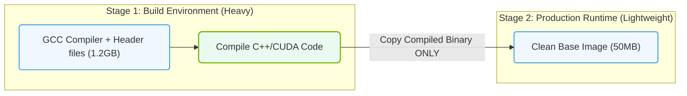

# 23.3i Multi-stage builds: separating build and runtime environments to minimize image size

  📦 Nvidia Software Stack
  📖 Containerization Fundamentals

---

## 🌱 Context Introduction

When building container images for AI workloads, you often need compilers, development libraries, and build tools that are only required during the image creation process. If you keep these tools in the final image, your container becomes unnecessarily large — sometimes hundreds of megabytes or even gigabytes larger than needed.

Multi-stage builds solve this by allowing you to use **multiple FROM statements** in a single Dockerfile. Each FROM begins a new stage, and you can selectively copy artifacts (like compiled binaries or Python wheels) from earlier stages into the final, minimal image. This keeps your runtime environment lean, secure, and fast to deploy.

---

## 🧱 The Problem: Bloated Container Images

- **Build-time dependencies** (e.g., GCC, CMake, CUDA toolkit headers, pip cache) are only needed to compile or install software.
- **Runtime dependencies** (e.g., Python interpreter, CUDA runtime libraries, inference engine) are what the application actually needs to run.
- Keeping build tools in the final image increases:
  - **Image size** — slower downloads and higher storage costs.
  - **Attack surface** — more packages that could contain vulnerabilities.
  - **Deployment time** — larger images take longer to pull on GPU nodes.

---

## 🛠️ How Multi-stage Builds Work

- A single Dockerfile contains multiple **FROM** instructions, each starting a new stage.
- Each stage can use a different base image (e.g., one with full CUDA toolkit, another with only CUDA runtime).
- You copy only the necessary files from earlier stages into the final stage using **COPY --from=**.
- The final image contains only the runtime environment and your application artifacts.

---

## 🧩 Example Workflow for an AI Inference Container

**Stage 1 — Build Stage:**
- Starts from a full development image (e.g., nvidia/cuda:12.1-devel).
- Installs build dependencies, compiles custom CUDA kernels, or builds Python wheels.
- All intermediate files and caches remain in this stage.

**Stage 2 — Runtime Stage:**
- Starts from a minimal runtime image (e.g., nvidia/cuda:12.1-runtime).
- Copies only the compiled artifacts (e.g., .so files, Python packages) from Stage 1.
- Installs only runtime Python dependencies (no pip cache, no compilers).
- Sets the final entrypoint and command.

---

### 📊 Visual Representation: Multi-Stage Build Pipeline Size Reduction
This diagram shows how multi-stage builds compile code in a heavy development stage and copy only the final binary to a clean, lightweight runtime stage.

## 📊 Comparison: Single-stage vs. Multi-stage Builds

| Aspect | Single-stage Build | Multi-stage Build |
|--------|-------------------|-------------------|
| **Image size** | Large (includes compilers, headers, caches) | Small (only runtime essentials) |
| **Build time** | Faster (one pass) | Slightly slower (multiple stages, but cached) |
| **Security surface** | Larger (unnecessary tools remain) | Smaller (only what is needed) |
| **Deployment speed** | Slower (bigger image to pull) | Faster (smaller image to pull) |
| **Complexity** | Simple Dockerfile | Slightly more complex, but clearer intent |
| **Best for** | Prototyping, local testing | Production, CI/CD, edge deployment |

---

## 🕵️ Key Benefits for AI Infrastructure

- **Reduced GPU node provisioning time** — smaller images pull faster on clusters.
- **Lower storage costs** — fewer gigabytes consumed in container registries.
- **Improved security compliance** — fewer packages to scan and patch.
- **Cleaner separation of concerns** — build logic is isolated from runtime logic.

---

## ⚙️ Practical Tips for Engineers

- **Use named stages** — give each stage a descriptive name (e.g., **builder**, **runtime**) for clarity.
- **Copy only what is needed** — avoid copying entire directories; be specific (e.g., copy only compiled binaries or installed Python site-packages).
- **Leverage caching** — place frequently changing steps (like code copy) later in the build stage to maximize layer cache reuse.
- **Combine with .dockerignore** — exclude unnecessary files (e.g., .git, __pycache__) from all stages.
- **Test both stages** — ensure the build stage produces correct artifacts and the runtime stage runs them without errors.

---

## 🧪 Common Pitfalls to Avoid

- **Copying too much** — copying entire **/usr/local** or **/opt** from the build stage defeats the purpose.
- **Missing runtime dependencies** — some libraries (e.g., libcuda.so) must be present in the runtime image; verify with **ldd**.
- **Forgetting to clean up** — even in multi-stage builds, remove temporary files within the build stage to keep intermediate layers smaller.
- **Using different base OS versions** — copying binaries compiled on Ubuntu to a runtime image based on Alpine may cause library conflicts.

---

## ✅ Summary

Multi-stage builds are a fundamental technique for creating efficient, secure, and production-ready container images for AI workloads. By separating the build environment from the runtime environment, you minimize image size, reduce attack surface, and accelerate deployment — all while keeping your Dockerfile readable and maintainable. For any AI infrastructure involving GPU-accelerated containers, this pattern is considered best practice.