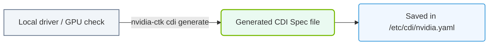

# 24.3b Generating CDI specs: nvidia-cdi-hook generate

<div class="lesson-completion" data-lesson-id="24_3b_generating_cdi_specs"></div>
<div class="lesson-tags">
  <span class="lesson-tag">📦 Nvidia Software Stack</span>
  <span class="lesson-tag">📖 GPU-Accelerated Containers</span>
</div>


---

## 🔍 Context Introduction

When you run a GPU-accelerated container, the container runtime needs to know exactly which GPU devices, driver libraries, and configuration files to inject into the container. This is where **CDI (Container Device Interface)** specifications come in. A CDI spec is a JSON or YAML file that describes how to make a specific device (like an NVIDIA GPU) available inside a container.

The **nvidia-cdi-hook generate** command is the tool that automatically creates these CDI specification files for you. Instead of manually writing complex device mappings, you run this command once, and it produces a ready-to-use CDI spec that your container runtime can reference.

---

## ⚙️ What Does "Generating CDI Specs" Mean?

- A **CDI spec** is a structured document that lists:
  - Which **device nodes** (e.g., /dev/nvidia0) to mount
  - Which **libraries** (e.g., libcuda.so) to inject
  - Which **environment variables** to set (e.g., NVIDIA_VISIBLE_DEVICES)
  - Which **container hooks** to run (e.g., for driver initialization)

- **nvidia-cdi-hook generate** scans your system's NVIDIA driver installation and creates a complete CDI specification automatically.

- The generated spec is typically saved to a standard location like **/etc/cdi/nvidia.yaml** so that container runtimes (like Docker with CDI support or containerd) can find and use it.

---

## 🛠️ How the Generation Process Works

The tool performs these steps when you run the generate command:

- **Step 1:** Detects all NVIDIA GPUs currently present on the system.
- **Step 2:** Identifies the installed NVIDIA driver version and paths to driver libraries.
- **Step 3:** Maps each GPU to a unique device name (e.g., **nvidia.com/gpu=0**).
- **Step 4:** Creates a CDI specification file containing all necessary device nodes, mounts, and hooks.
- **Step 5:** Saves the spec to the CDI configuration directory so container runtimes can discover it.

---

## 📊 Key Components of a Generated CDI Spec

| Component | Description | Example in Spec |
|-----------|-------------|-----------------|
| **Device Name** | Unique identifier for each GPU | **nvidia.com/gpu=0** |
| **Device Nodes** | Physical GPU device files to mount | **/dev/nvidia0**, **/dev/nvidiactl** |
| **Mounts** | Driver libraries and binaries to inject | **/usr/lib/x86_64-linux-gnu/libcuda.so** |
| **Hooks** | Scripts to run before container starts | **nvidia-cdi-hook** for driver setup |
| **Environment Variables** | Variables set inside the container | **NVIDIA_VISIBLE_DEVICES=all** |

---


### 📊 Visual Representation: CDI Spec Generation pipeline
This flowchart shows how the nvidia-ctk command queries local driver hardware to output a structured CDI spec file.




## 🕵️ When Should You Generate CDI Specs?

You need to generate CDI specs in these scenarios:

- **First-time setup:** After installing the NVIDIA Container Toolkit on a new machine.
- **Driver upgrade:** After updating the NVIDIA driver to a new version.
- **Hardware change:** After adding or removing physical GPUs from the system.
- **Configuration reset:** If the CDI spec file gets corrupted or accidentally deleted.

---

## 📝 Example Workflow (No Code Blocks)

Here is how the generation process looks in practice:

For reference:
```
nvidia-ctk cdi generate --output=/etc/cdi/nvidia.yaml
```

📤 Output: **Generated CDI spec for 2 NVIDIA GPUs (nvidia.com/gpu=0, nvidia.com/gpu=1)**

After generation, you can verify the spec was created by checking the output directory. A typical generated file contains entries for each GPU, including device nodes like **/dev/nvidia0** and library mounts like **/usr/lib/x86_64-linux-gnu/libcuda.so.1**.

---

## ✅ Best Practices for Engineers

- **Regenerate after every driver update** — old specs may reference incorrect library paths.
- **Store specs in a version-controlled location** if you manage multiple machines.
- **Validate generated specs** by running a test container with the **--device** flag set to **nvidia.com/gpu=0**.
- **Use the same CDI spec across a cluster** to ensure consistent GPU access behavior.

---

## 🧠 Key Takeaway

**nvidia-cdi-hook generate** is your automated assistant for creating CDI specifications. It eliminates manual configuration errors and ensures that every GPU-accelerated container gets exactly the right devices, libraries, and environment settings it needs to run NVIDIA workloads. For new engineers, think of it as the "plug-and-play" step that bridges your physical GPU hardware with your containerized applications.