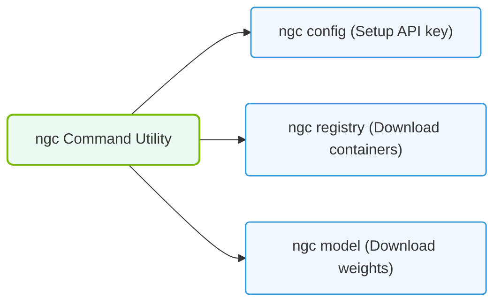

# 25.1e NGC CLI: programmatic access to download models and resources

<div class="lesson-completion" data-lesson-id="25_1e_ngc_cli"></div>
<div class="lesson-tags">
  <span class="lesson-tag">📦 Nvidia Software Stack</span>
  <span class="lesson-tag">📖 NVIDIA NGC, AI Enterprise, and NIMs</span>
</div>


Welcome, new engineer! This section introduces you to the **NGC CLI** — a command-line tool that gives you programmatic access to download models, containers, and resources from the NVIDIA GPU Cloud (NGC) Catalog. Think of it as a direct pipeline from NVIDIA's software hub to your machine, without needing to click through a web interface.

---

## 🧭 Context: Why Use the NGC CLI?

The NGC Catalog hosts thousands of optimized AI models, containers, Helm charts, and datasets. While you can browse and download these via a web browser, the **NGC CLI** automates this process — essential for scripting, CI/CD pipelines, and reproducible workflows. Instead of manually clicking "Download," you can fetch exactly what you need with a single command, integrate it into your training scripts, or deploy it to production clusters.

---

## ⚙️ What is the NGC CLI?

The NGC CLI is a lightweight, cross-platform command-line tool that authenticates you to the NGC Catalog and enables:

- **Downloading models** (e.g., pre-trained LLMs, vision models)
- **Pulling containers** (e.g., TensorFlow, PyTorch with NVIDIA optimizations)
- **Managing datasets** and resources
- **Automating workflows** via scripts

It replaces manual web downloads with a repeatable, scriptable interface.

---

## 🛠️ Core Capabilities

- **🔐 Authentication**: Log in once, then access private and public resources.
- **📦 Model Downloads**: Fetch model files (e.g., `.pth`, `.onnx`, `.safetensors`) directly to your local machine.
- **🐳 Container Management**: Pull Docker images from NGC's registry (e.g., `nvcr.io/nvidia/tensorflow:latest`).
- **📂 Resource Discovery**: Search and list available models, containers, and datasets without opening a browser.
- **🔄 Automation**: Integrate into shell scripts, Makefiles, or CI/CD pipelines (e.g., Jenkins, GitLab CI).

---

## 🧩 Comparison: Web UI vs. NGC CLI

| Feature | Web UI (Browser) | NGC CLI (Programmatic) |
|---------|------------------|------------------------|
| **Ease of use** | Click-and-download | Requires terminal knowledge |
| **Automation** | Manual only | Scriptable, repeatable |
| **Speed** | Slower for bulk downloads | Faster for multiple resources |
| **Integration** | Standalone | Works with pipelines, Docker, Kubernetes |
| **Access control** | Manual login each session | Token-based, persistent |

---


### 📊 Visual Representation: NGC CLI Command Modules
This diagram outlines the subcommand groups of the NGC CLI used to download resources programmatically.




## 🕵️ How It Works (Conceptual Flow)

1. **Install** the NGC CLI on your system (Linux, macOS, or Windows).
2. **Authenticate** using an API key from your NGC account (stored locally).
3. **Search** for a resource (e.g., a model named `llama-3.1-8b`).
4. **Download** the resource to a specified directory.
5. **Use** the downloaded files in your AI workflow (training, inference, etc.).

No code blocks needed here — just a logical sequence of steps.

---

## 📥 Example Workflow (For Reference)

Below is a typical sequence of commands you would run in your terminal. Each line is a separate action.

```bash
# For reference only
ngc config set
ngc registry model list nvidia/llama-3.1-8b
ngc registry model download-version nvidia/llama-3.1-8b:latest --dest ./models
```

📤 **Output**: After the last command, you would see a confirmation message like:  
`Downloaded nvidia/llama-3.1-8b:latest to ./models/llama-3.1-8b`

---

## 🧠 Key Takeaways for New Engineers

- The **NGC CLI** is your programmatic key to NVIDIA's software ecosystem — use it to avoid manual downloads.
- It supports **models, containers, datasets**, and more — all from the command line.
- Authentication is token-based, making it secure for automated pipelines.
- Always check the **latest version** of a resource using the `list` command before downloading.
- For production, store your API key as an environment variable (e.g., `NGC_API_KEY`) rather than typing it each time.

---

## 📚 Next Steps

- Explore the NGC Catalog website to see what resources are available.
- Practice listing models with the CLI before downloading.
- Integrate a model download into a simple shell script to automate your setup.

You now have the foundation to programmatically access NVIDIA's accelerated software hub — happy building! 🚀