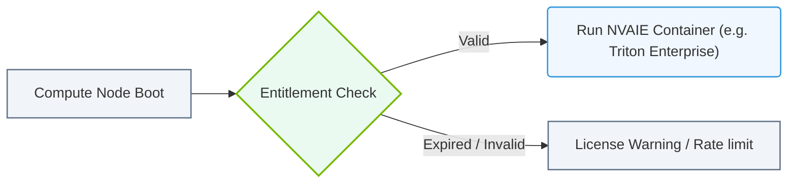

# 25.2b NVAIE licensing: per-GPU subscriptions and vGPU license server configuration

  📦 Nvidia Software Stack
  📖 NVIDIA NGC, AI Enterprise, and NIMs

---

## 🧭 Context Introduction

When you deploy NVIDIA AI Enterprise (NVAIE) in production, you are not just installing software — you are activating a licensed product. NVAIE provides enterprise-grade support, security patches, and access to NVIDIA's optimized AI tools. However, to use these tools legally and reliably, you must understand how licensing works.

This topic covers two key licensing models:
- **Per-GPU subscriptions** — licensing tied to individual GPUs.
- **vGPU license server configuration** — a centralized server that manages virtual GPU (vGPU) licenses across your infrastructure.

Think of licensing as the "key" that unlocks the full capabilities of your NVIDIA hardware and software stack. Without proper licensing, your AI workloads may stop running after a grace period.

---

## ⚙️ Per-GPU Subscriptions — Licensing by the Physical GPU

### 🔍 What Is a Per-GPU Subscription?

A **per-GPU subscription** means you purchase a license for each physical GPU in your system. This is the simplest licensing model for NVAIE.

### 📌 Key Characteristics

- **One license per physical GPU** — If you have 4 GPUs in a server, you need 4 licenses.
- **Subscription-based** — You pay annually or monthly (not a one-time purchase).
- **Tied to the GPU serial number** — The license is locked to that specific GPU hardware.
- **Portable within your organization** — You can move a license to a replacement GPU (with NVIDIA's approval).

### 🛠️ When to Use Per-GPU Subscriptions

- You have dedicated AI servers with fixed GPU configurations.
- You do not use virtualization (no vGPU).
- You want the simplest licensing model with minimal configuration.

### 📊 Comparison: Per-GPU vs. vGPU Licensing

| Feature | Per-GPU Subscription | vGPU Licensing |
|---------|----------------------|----------------|
| **License unit** | One physical GPU | One virtual GPU (vGPU) |
| **Configuration** | No server needed | Requires a license server |
| **Flexibility** | Fixed to hardware | Can be shared across VMs |
| **Best for** | Bare-metal AI workloads | Virtualized environments (VDI, multi-tenant) |
| **Management** | Manual tracking | Centralized via license server |

---

## 🖥️ vGPU License Server Configuration — Centralized License Management

### 🔍 What Is a vGPU License Server?

A **vGPU license server** is a dedicated machine (physical or virtual) that hosts and distributes vGPU licenses to your virtual machines. When a VM requests a vGPU, the NVIDIA driver contacts this server to check out a license.

### 📌 Why You Need It

- **Centralized control** — Manage all vGPU licenses from one place.
- **License pooling** — Licenses are not tied to specific GPUs; they are shared across your cluster.
- **Grace period** — If the license server goes offline, VMs continue running for a limited time (usually 7–14 days).
- **Audit trail** — See which VMs are using which licenses.

### 🛠️ Configuration Steps (High-Level)

1. **Prepare the license server machine** — It can be a Linux or Windows server with network access to all GPU hosts.
2. **Install the NVIDIA License System** — Download and install the NVIDIA License Server software from the NVIDIA Enterprise portal.
3. **Activate the license server** — Use your NVAIE entitlement to generate a license file or activate via the portal.
4. **Configure firewall rules** — Ensure port **7070** (default) is open between GPU hosts and the license server.
5. **Point GPU hosts to the license server** — On each GPU host, set the license server address in the NVIDIA driver configuration file.
6. **Verify connectivity** — Use the NVIDIA management tool to confirm the host can reach the license server.

### 📊 vGPU License Server Components

| Component | Purpose |
|-----------|---------|
| **License Server** | Central machine that holds and distributes licenses |
| **License File** | A `.bin` or `.lic` file containing your entitlement |
| **Client (GPU Host)** | The physical server running NVIDIA GPUs and VMs |
| **vGPU Manager** | Software on the host that manages vGPU allocation |
| **NVIDIA Management Tool** | CLI or GUI tool to check license status |

---

### 📊 Visual Representation: NVAIE License Verification Flow
This flowchart shows how servers query local licenses or connect to Cloud License Servers to check entitlement.

## 🕵️ Common Licensing Scenarios and Troubleshooting

### ✅ Scenario 1: New GPU Installation

- Install the GPU and NVIDIA drivers.
- If using per-GPU subscription: Activate the license via the NVIDIA portal using the GPU serial number.
- If using vGPU: Configure the host to point to your license server.

### ❌ Scenario 2: License Expired

- **Per-GPU**: The GPU will stop running AI workloads after a grace period (usually 30 days).
- **vGPU**: VMs will lose vGPU acceleration after the grace period expires.
- **Fix**: Renew your NVAIE subscription and re-activate the license.

### 🔄 Scenario 3: License Server Unreachable

- VMs continue running for the grace period (7–14 days).
- After that, vGPU acceleration stops.
- **Fix**: Restore network connectivity to the license server or configure a backup license server.

### 📝 Checking License Status

To verify your license status on a GPU host, use the NVIDIA management tool. The output will show:
- **Licensed** — License is active and valid.
- **Unlicensed** — No license found (grace period may be active).
- **Expired** — License has passed its expiration date.

---

## 🧰 Best Practices for New Engineers

- **Always activate licenses before production use** — Do not rely on grace periods.
- **Document your GPU serial numbers** — You will need them for per-GPU activation.
- **Set up a backup license server** — For vGPU environments, configure a secondary server for redundancy.
- **Monitor license usage** — Use NVIDIA's monitoring tools to track how many licenses are in use.
- **Keep your license server updated** — NVIDIA releases updates that fix bugs and improve security.
- **Test license failover** — Simulate a license server outage to ensure your VMs behave as expected.

---

## ✅ Summary

| Licensing Model | Key Action | Configuration Complexity |
|-----------------|------------|--------------------------|
| Per-GPU Subscription | Activate each GPU individually | Low |
| vGPU Licensing | Set up a license server and point hosts to it | Medium |

Both models serve the same purpose — ensuring you are legally entitled to use NVIDIA AI Enterprise. The choice depends on your infrastructure:
- **Bare-metal AI servers** → Per-GPU subscription.
- **Virtualized environments with vGPU** → License server.

As a new engineer, start by understanding which model your organization uses, then follow the activation steps carefully. Licensing is not optional — it is the foundation of a stable, compliant AI infrastructure.