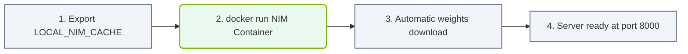

# 25.3c Deploying a NIM locally: docker run + --gpus + API key

  📦 Nvidia Software Stack
  📖 NVIDIA NGC, AI Enterprise, and NIMs

---

## 🧭 Context Introduction

NVIDIA NIM (NVIDIA Inference Microservice) is a pre-built, optimized container that packages an AI model along with all the necessary runtime dependencies, including TensorRT, Triton Inference Server, and CUDA. Deploying a NIM locally means you run this container on your own machine (or server) using Docker, leveraging your NVIDIA GPU for accelerated inference.

For a new engineer, think of NIM as a "turnkey AI model" — you pull a container, provide your API key for authentication, and start making inference requests immediately. No need to manually install frameworks, manage dependencies, or optimize the model for your GPU.

---

## ⚙️ Prerequisites Before You Start

Before deploying a NIM locally, ensure you have the following in place:

- **NVIDIA GPU with appropriate drivers** — A supported GPU (e.g., A100, H100, L40S, or even RTX 4090) with NVIDIA drivers installed.
- **Docker installed** — Docker Engine (version 19.03 or later) with NVIDIA Container Toolkit configured.
- **NVIDIA AI Enterprise API Key** — Obtained from the NVIDIA NGC portal. This key authenticates your access to the NIM container registry.
- **NVIDIA Container Toolkit** — Installed and configured to allow Docker containers to access the host GPU.

---

## 🛠️ Step-by-Step Deployment Process

### 🔐 Step 1: Authenticate with NVIDIA NGC

To pull a NIM container, you must first log in to the NVIDIA NGC container registry using your API key.

- Run the Docker login command with your API key as the password.
- Your username is typically **$oauthtoken** (a literal string), and the password is your API key.
- Successful authentication returns a confirmation message indicating you are logged in.

---

### 🖼️ Step 2: Pull the NIM Container Image

Once authenticated, you can pull the specific NIM container for your desired model.

- Use the Docker pull command with the full image path from NGC (e.g., **nvcr.io/nvidia/nim/llama-3.1-8b-instruct:latest**).
- The download size is typically several gigabytes, so ensure sufficient disk space and a stable internet connection.
- The pull progress shows layer downloads and extraction.

---

### 🚀 Step 3: Run the NIM Container with GPU Access

This is the core deployment step. You use the **docker run** command with specific flags to enable GPU acceleration and pass your API key.

- Use the **--gpus all** flag to grant the container access to all available GPUs on the host.
- Set the environment variable **NVIDIA_API_KEY** to your actual API key value.
- Expose a port (e.g., **-p 8000:8000**) to access the inference endpoint from your host machine.
- The container starts and initializes the model, loading it into GPU memory.

---

### ✅ Step 4: Verify the Deployment

After the container is running, verify that the inference service is operational.

- Check the container logs for a message indicating the server is ready (e.g., "Server is listening on port 8000").
- Use a simple curl command to test the health endpoint (e.g., **curl http://localhost:8000/v1/health/ready**).
- A successful response returns a JSON object with status **"ok"** or **"ready"**.

---

### 📊 Visual Representation: NIM Model Deployment flow
This flowchart maps out a NIM deployment: setting local cache paths, running Docker commands, and validating the server endpoint.

## 📊 Key Components Explained

| Component | Purpose | Example Value |
|-----------|---------|---------------|
| **docker run** | Starts a new container from an image | Base command |
| **--gpus all** | Grants GPU access to the container | Enables CUDA within container |
| **NVIDIA_API_KEY** | Environment variable for authentication | **nvapi-xxxxxxxxxxxx** |
| **-p 8000:8000** | Port mapping from container to host | Access service at localhost:8000 |
| **Image name** | Full path to the NIM container on NGC | **nvcr.io/nvidia/nim/llama-3.1-8b-instruct:latest** |

---

## 🕵️ Common Pitfalls and Troubleshooting

- **"Failed to initialize GPU" error** — Your NVIDIA Container Toolkit is not installed or configured. Verify with **nvidia-smi** inside a test container.
- **"Unauthorized: authentication required" error** — Your API key is invalid or expired. Generate a new key from the NGC portal.
- **"Port already in use" error** — Another service is using port 8000. Change the host port mapping (e.g., **-p 8001:8000**).
- **Container exits immediately** — Insufficient GPU memory for the model. Check available VRAM with **nvidia-smi** and choose a smaller model variant.
- **Slow inference response** — The model is loading for the first time. Subsequent requests will be faster once the model is cached in GPU memory.

---

## 🔄 Comparison: Local NIM vs. Cloud NIM

| Aspect | Local NIM Deployment | Cloud NIM (NGC API) |
|--------|----------------------|----------------------|
| **Latency** | Very low (local GPU) | Higher (network round-trip) |
| **Data privacy** | Full control (data stays local) | Data sent to NVIDIA cloud |
| **Cost model** | GPU hardware cost only | Pay-per-token or subscription |
| **Scalability** | Limited to local GPU resources | Elastic, auto-scaling |
| **Setup complexity** | Requires Docker + GPU setup | Simple API key only |

---

## 📝 Final Notes for New Engineers

- Always verify your GPU driver version and CUDA compatibility before pulling a NIM container. Check the NIM documentation for supported driver versions.
- The API key is sensitive — never hardcode it in scripts or share it publicly. Use environment variables or Docker secrets in production.
- Start with a smaller model (e.g., 7B or 8B parameters) to test your setup before moving to larger models.
- Monitor GPU utilization with **nvidia-smi** while the container is running to ensure the GPU is being used effectively.
- For production deployments, consider adding resource limits (e.g., **--memory=32g**) to prevent the container from consuming all host resources.