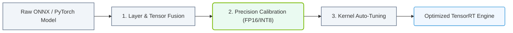

# 25.4a TensorRT: graph optimization, layer fusion, and precision calibration

  📦 Nvidia Software Stack
  📖 NVIDIA NGC, AI Enterprise, and NIMs

---

## 🧠 Context Introduction

When you train a deep learning model, it often runs slowly during inference (making predictions) because the model is built for flexibility during training, not speed during deployment. **TensorRT** is NVIDIA's solution to this problem. It takes your trained model and applies three key optimizations — **graph optimization**, **layer fusion**, and **precision calibration** — to make it run faster and more efficiently on NVIDIA GPUs.

Think of it like this: training is like learning to cook a complex recipe step-by-step. TensorRT is like a professional chef who preps all ingredients, combines steps, and uses the best tools to serve the final dish in seconds.

---

## ⚙️ Graph Optimization — Streamlining the Computation Map

**What it does:** TensorRT analyzes the entire neural network structure (the "graph") and removes unnecessary operations, reorders steps, and merges redundant calculations.

**Why it matters:** During training, frameworks like PyTorch or TensorFlow add extra operations for gradient calculations and debugging. TensorRT strips these away for inference.

**Key techniques:**
- **Dead code elimination** — Removes operations that don't affect the final output
- **Constant folding** — Pre-computes values that never change (like fixed weights)
- **Kernel auto-tuning** — Tests different ways to run the same operation and picks the fastest

**Simple analogy:** Imagine a GPS route with unnecessary detours. Graph optimization finds the shortest, fastest path from input to output.

---

## 🔗 Layer Fusion — Combining Operations for Speed

**What it does:** Layer fusion merges multiple consecutive neural network layers into a single, more efficient operation. Instead of moving data between GPU memory and processing units multiple times, fusion keeps data local and processes it in one pass.

**Common fusion patterns:**
- **Conv + BatchNorm + ReLU** → Fused into one kernel
- **Add + ReLU** → Combined into a single operation
- **Matrix multiply + bias** → Merged into one step

**Why it matters:** Each separate layer requires reading from and writing to GPU memory. Fusion reduces these memory transfers by 50-80%, which is often the biggest bottleneck.

**Simple analogy:** Instead of washing, drying, and folding laundry in three separate trips to different rooms, you do all three in one spot without moving the clothes.

---

## 🎯 Precision Calibration — Trading Accuracy for Speed

**What it does:** Precision calibration reduces the numerical precision of model weights and activations. Most models are trained in **FP32** (32-bit floating point). TensorRT can convert them to **FP16** (16-bit) or **INT8** (8-bit integer) with minimal accuracy loss.

**How it works:**
1. TensorRT runs a small set of representative data through the model
2. It measures the distribution of values at each layer
3. It selects optimal scaling factors to minimize information loss
4. It converts weights and activations to lower precision

**Precision comparison table:**

| Precision | Memory Reduction | Speed Gain | Accuracy Impact | Best For |
|-----------|-----------------|------------|-----------------|----------|
| **FP32** | Baseline | Baseline | Baseline | Safety-critical applications |
| **FP16** | ~50% smaller | ~2x faster | Negligible loss | Most production models |
| **INT8** | ~75% smaller | ~3-4x faster | Slight loss (1-2%) | High-throughput, latency-sensitive apps |

**Simple analogy:** FP32 is like measuring ingredients with a laboratory scale. INT8 is like using measuring cups — slightly less precise, but much faster and still good enough for the recipe.

---

### 📊 Visual Representation: TensorRT Compiler Optimization Steps
This flowchart maps TensorRT compilation: layer fusion, precision calibration, and kernel selection.

## 🛠️ How These Three Work Together

TensorRT applies these optimizations in a specific order:

1. **Graph optimization** first — cleans up the model structure
2. **Layer fusion** next — combines remaining operations
3. **Precision calibration** last — converts to lower precision

The result is a single **TensorRT engine** file that can be loaded and run directly on the GPU.

---

## 📊 Real-World Impact Example

Consider a ResNet-50 image classification model:

| Metric | Original PyTorch Model | After TensorRT Optimization |
|--------|----------------------|---------------------------|
| **Latency** | 15 ms per image | 3 ms per image |
| **Throughput** | 66 images/second | 333 images/second |
| **Memory usage** | 200 MB | 50 MB |
| **Accuracy** | 76.1% Top-1 | 75.8% Top-1 |

The optimized model runs **5x faster** with only **0.3% accuracy loss**.

---

## 🕵️ When to Use TensorRT

TensorRT is ideal when:
- You need **real-time inference** (e.g., video processing, autonomous vehicles)
- You're deploying to **edge devices** with limited memory
- You have **high-throughput requirements** (e.g., serving thousands of users)
- Your model is **already trained and ready for production**

TensorRT is less useful when:
- You're still experimenting with model architectures
- Your model changes frequently
- You need exact numerical reproducibility (FP32 only)

---

## 🚀 Key Takeaway for New Engineers

**TensorRT is not a training tool — it's a deployment optimizer.** You don't change how you train your model. Instead, you take your finished, trained model and run it through TensorRT to create a faster, smaller version for production.

The three optimizations — graph optimization, layer fusion, and precision calibration — work together like a well-tuned engine: removing unnecessary parts, combining components for efficiency, and using the right fuel grade for maximum performance.

---

*Next topic: 25.4b TensorRT-LLM — Optimizing Large Language Models for Inference*