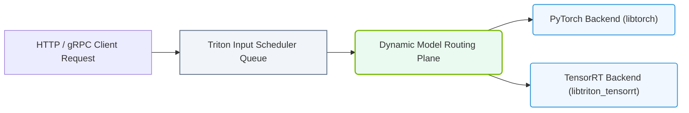

# 25.5a Triton architecture: model repository, backends, and the C++ inference core

<div class="lesson-completion" data-lesson-id="25_5a_triton_architecture"></div>
<div class="lesson-tags">
  <span class="lesson-tag">📦 Nvidia Software Stack</span>
  <span class="lesson-tag">📖 NVIDIA NGC, AI Enterprise, and NIMs</span>
</div>


## 🧭 Context Introduction

When you deploy a machine learning model to production, you need more than just a trained model file. You need a system that can receive requests, load the model efficiently, manage memory, and return predictions quickly — all while handling multiple users at once. This is where **NVIDIA Triton Inference Server** comes in.

Triton is a high-performance inference server designed to run models from various frameworks (like PyTorch, TensorFlow, ONNX, and more) in production. Think of it as a specialized web server for AI models. To understand how Triton works, you need to understand three core components: the **model repository** (where models live), **backends** (how models are executed), and the **C++ inference core** (the engine that makes everything fast).

---

## 📦 The Model Repository — Where Models Live

The model repository is simply a directory or storage location that Triton watches for model files. When you place a model here, Triton automatically discovers it and makes it available for inference.

### Key Concepts:
- **Model Repository Path**: You tell Triton where to look for models at startup (e.g., a folder on your server or a cloud storage bucket).
- **Model Versioning**: Each model can have multiple versions stored in subdirectories named by version number (e.g., `1`, `2`, `3`). Triton can serve specific versions or automatically use the latest.
- **Configuration File**: Each model folder contains a `config.pbtxt` file that describes the model's input/output shapes, data types, and other settings. If you don't provide one, Triton tries to auto-generate it.

### Example Folder Structure (for reference):
```
model_repository/
├── sentiment_model/
│   ├── 1/
│   │   └── model.onnx
│   └── config.pbtxt
└── image_classifier/
    ├── 1/
    │   └── model.pt
    └── 2/
        └── model.pt
```

**📤 Output**: When Triton starts, it scans this folder and loads each model version. You can then send inference requests to `http://server:8000/v2/models/sentiment_model/infer`.

---

## ⚙️ Backends — The Execution Engines

A **backend** is the component that knows how to run a specific type of model. Triton uses different backends for different frameworks. Think of a backend as a translator — it takes your model file and runs it using the appropriate framework's runtime.

### Common Backends:
| Backend Name | Framework | File Type |
|--------------|-----------|-----------|
| **PyTorch** | PyTorch | `.pt`, `.pth` |
| **TensorFlow** | TensorFlow | `saved_model.pb` |
| **ONNX Runtime** | ONNX | `.onnx` |
| **TensorRT** | NVIDIA TensorRT | `.plan`, `.engine` |
| **Python** | Custom Python code | `.py` scripts |

### How Backends Work:
- Each backend is a shared library (`.so` file on Linux) that Triton loads at startup.
- When a request comes in, Triton routes it to the correct backend based on the model's configuration.
- The backend handles memory allocation, GPU acceleration (if available), and returns the result.

**Important Note**: You don't need to install every backend — only the ones matching your model frameworks. Triton ships with pre-built backends, or you can build custom ones.

---


### 📊 Visual Representation: Triton Inference Server Request Pipeline
This diagram displays the Triton pipeline, showing how requests are dynamically scheduled and routed to matching model backend engines.




## 🛠️ The C++ Inference Core — The Heart of Triton

The **C++ inference core** is the low-level engine that orchestrates everything. It's written in C++ for maximum performance and minimal latency. This core handles:

### Core Responsibilities:
- **Request Scheduling**: Decides which model instance handles each request, balancing load across GPUs and CPU threads.
- **Batching**: Automatically groups multiple requests together for efficient GPU utilization (called "dynamic batching").
- **Memory Management**: Allocates and reuses GPU memory to avoid fragmentation.
- **Concurrency**: Handles thousands of simultaneous inference requests using a thread pool.

### How It Works (Simplified):
1. A client sends an HTTP or gRPC request to Triton.
2. The C++ core receives the request and places it in a queue.
3. The scheduler decides which model backend should process it.
4. The backend runs the model on GPU or CPU.
5. The result is returned to the client through the core.

### Performance Features:
- **Zero-Copy Inference**: Data moves directly between network buffers and GPU memory without unnecessary copying.
- **Model Pipelining**: Multiple models can be chained together (e.g., pre-processing → inference → post-processing) without intermediate storage.
- **GPU Sharing**: Multiple models can share the same GPU, with the core managing memory and compute time.

---

## 🔗 How They Work Together

Here's a simple flow showing how these three components interact:

1. **Startup**: Triton reads the model repository, loads configuration files, and initializes the appropriate backends.
2. **Request Arrives**: A client sends an inference request (e.g., "classify this image").
3. **Core Processing**: The C++ core receives the request, checks which model and version to use, and applies any batching.
4. **Backend Execution**: The core hands the data to the correct backend (e.g., TensorRT backend), which runs the model on GPU.
5. **Response**: The backend returns the result to the core, which sends it back to the client.

---

## 🧪 Practical Example for New Engineers

Imagine you have a PyTorch model that classifies customer reviews as positive or negative. Here's what you'd do:

1. **Export your model** to a `.pt` file.
2. **Create a model repository** folder with a version subdirectory (e.g., `1/`).
3. **Add a config.pbtxt** file describing the input (text) and output (sentiment score).
4. **Start Triton** pointing to your model repository.
5. **Send a test request** using a simple HTTP client.

The C++ core will load your model using the PyTorch backend, and you'll get predictions back in milliseconds.

---

## ✅ Key Takeaways for New Engineers

- **Model Repository** = Where you store your trained models with version control.
- **Backends** = Framework-specific runners that execute your model (PyTorch, TensorFlow, etc.).
- **C++ Inference Core** = The high-performance engine that manages requests, batching, and GPU memory.
- **Together**, they form a production-ready system that can serve millions of predictions per second.

Start by experimenting with a single model in a local repository, then gradually add more models and explore features like dynamic batching and model pipelines.