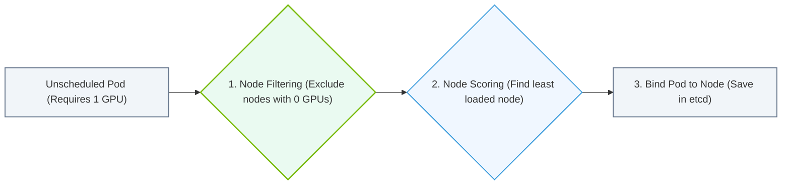

# 26.2c Scheduler (kube-scheduler): matching Pods to Nodes based on resources and constraints

  📦 Cluster Orchestration
  📖 Kubernetes Fundamentals

## 🧭 Context Introduction

Imagine you have a fleet of worker nodes in your Kubernetes cluster, each with different amounts of CPU, memory, and GPU resources. When you create a new Pod (a group of containers), the system needs to decide **which node** should run that Pod. This decision is critical — especially when dealing with expensive GPU resources.

The **kube-scheduler** is the component responsible for this decision-making process. It watches for newly created Pods that have not yet been assigned to a node, and then selects the best node for each Pod based on the Pod's resource requirements and any special constraints you define.

---

## ⚙️ What Does the Scheduler Do?

The kube-scheduler performs two main steps for every unscheduled Pod:

- **Filtering (Predicates):** The scheduler first filters out nodes that cannot run the Pod. For example, if a Pod requests a GPU, nodes without GPUs are removed from consideration.
- **Scoring (Priorities):** After filtering, the scheduler scores the remaining nodes based on how well they fit the Pod's needs. The node with the highest score is selected.

Key responsibilities include:

- Matching Pods to nodes based on **resource requests** (CPU, memory, GPU)
- Enforcing **constraints** like node affinity, taints, and tolerations
- Distributing workloads evenly across the cluster
- Respecting **Pod priority** and preemption rules

---

## 📊 Resource Matching: How the Scheduler Decides

When a Pod is created, it can specify how many resources it needs. The scheduler uses these numbers to find a node with enough capacity.

| Pod Resource Specification | What It Means | How Scheduler Uses It |
|---------------------------|---------------|----------------------|
| **requests.cpu** | Minimum CPU the Pod needs | Scheduler ensures node has at least this much CPU available |
| **requests.memory** | Minimum memory the Pod needs | Scheduler ensures node has at least this much memory available |
| **limits.cpu** | Maximum CPU the Pod can use | Used for scheduling decisions when combined with requests |
| **limits.memory** | Maximum memory the Pod can use | Helps prevent overcommitment on nodes |
| **nvidia.com/gpu** | Number of GPUs required | Scheduler only considers nodes with available GPU capacity |

For example, if a Pod requests **2 CPUs**, **4 GB of memory**, and **1 GPU**, the scheduler will only consider nodes that have at least those resources available *after* accounting for all other running Pods.

---

## 🛠️ Constraints: Beyond Basic Resources

Sometimes you need more control over where Pods land. The scheduler supports several constraint mechanisms:

### Node Selector (Simple Label Matching)
- You can label nodes (e.g., **gpu-type=tesla** or **region=us-east**)
- Pods can specify a **nodeSelector** to only run on nodes with matching labels
- Example: A Pod with **nodeSelector: { gpu-type: "a100" }** will only be scheduled on nodes labeled with **gpu-type=a100**

### Node Affinity (Advanced Label Matching)
- Provides more expressive rules than nodeSelector
- Supports **required** rules (hard constraints) and **preferred** rules (soft preferences)
- Example: **requiredDuringSchedulingIgnoredDuringExecution** with a rule that the node must have **topology.kubernetes.io/zone in us-west-2a**

### Taints and Tolerations
- **Taints** are applied to nodes to repel Pods that don't explicitly tolerate them
- **Tolerations** are applied to Pods to allow them to be scheduled on tainted nodes
- This is commonly used to reserve GPU nodes for specific workloads

### Pod Affinity and Anti-Affinity
- **Pod Affinity:** Schedule Pods near other Pods (e.g., for low-latency communication)
- **Pod Anti-Affinity:** Spread Pods across different nodes (e.g., for high availability)

---

### 📊 Visual Representation: kube-scheduler Filtering and Scoring Pipeline
This flowchart maps scheduling: filtering nodes that lack requested GPU resources, then scoring the remainder to assign a pod.

## 🕵️ The Scheduling Process Step-by-Step

Here is how the scheduler works in practice:

1. **A new Pod is created** and added to the API server
2. **The scheduler watches** the API server for unscheduled Pods (those with **spec.nodeName** empty)
3. **Filtering phase:** The scheduler evaluates each node against the Pod's requirements:
   - Does the node have enough CPU, memory, and GPU?
   - Does the node satisfy nodeSelector and node affinity rules?
   - Does the Pod tolerate the node's taints?
4. **Scoring phase:** Remaining nodes are scored based on:
   - How much spare capacity remains after placing the Pod
   - How well the Pod's preferred constraints are met
   - How balanced the overall cluster load will be
5. **Binding:** The scheduler writes the chosen node name into the Pod's **spec.nodeName** field
6. **kubelet on that node** picks up the Pod and starts running its containers

---

## 🎯 GPU-Specific Scheduling Considerations

For AI workloads, GPU scheduling is especially important:

- **GPU Requests:** Pods must explicitly request GPUs using **nvidia.com/gpu** in their resource limits
- **GPU Sharing:** By default, one GPU can only be used by one Pod at a time (no oversubscription)
- **GPU Types:** You can label nodes by GPU model (e.g., **A100**, **H100**, **V100**) and use nodeSelector or node affinity to match workloads to the right hardware
- **MIG (Multi-Instance GPU):** For NVIDIA A100 and H100 GPUs, you can partition a single GPU into multiple instances, and the scheduler treats each MIG device as a separate resource

---

## 🔍 Common Scheduling Scenarios

| Scenario | How the Scheduler Handles It |
|----------|------------------------------|
| **Pod requests 4 GPUs, but no node has 4 free GPUs** | Pod remains in **Pending** state until a node becomes available |
| **Two Pods both request the same GPU** | Only one Pod gets scheduled; the other waits |
| **Pod has nodeSelector for a specific GPU type** | Scheduler only considers nodes with that label |
| **Node has a taint "dedicated=gpu:NoSchedule"** | Only Pods with a matching toleration can be scheduled there |
| **Pod has preferred node affinity for a zone** | Scheduler tries to place it there, but will use other zones if needed |

---

## ✅ Key Takeaways for New Engineers

- The **kube-scheduler** is the brain that decides where Pods run
- It uses **filtering** (remove bad nodes) then **scoring** (pick the best node)
- **Resource requests** (CPU, memory, GPU) are the minimum guarantees the scheduler respects
- **Constraints** like nodeSelector, affinity rules, and taints give you fine-grained control
- GPU scheduling requires explicit resource requests and careful labeling of nodes
- If a Pod stays in **Pending** state, the scheduler likely cannot find a suitable node — check resource availability and constraints

Understanding how the scheduler works helps you design better Pod specifications and cluster configurations, ensuring your AI workloads land on the right hardware every time.