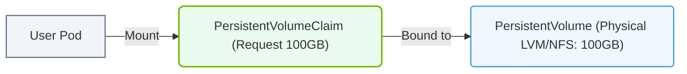

# 26.3g PersistentVolumes (PV) and PersistentVolumeClaims (PVC): durable storage in K8s

<div class="lesson-completion" data-lesson-id="26_3g_persistent_volumes_and_claims"></div>
<div class="lesson-tags">
  <span class="lesson-tag">📦 Cluster Orchestration</span>
  <span class="lesson-tag">📖 Kubernetes Fundamentals</span>
</div>


## 🧠 Context Introduction

When you run AI workloads in Kubernetes, your containers often need to save data that survives beyond the life of a pod — things like trained model weights, large datasets, or checkpoint files. By default, containers have ephemeral storage: when a pod restarts or is deleted, all data inside it disappears. This is a big problem for AI training jobs that might run for hours or days.

**PersistentVolumes (PV)** and **PersistentVolumeClaims (PVC)** are Kubernetes objects that solve this problem by providing durable, long-lived storage that exists independently of any pod. Think of a PV as a storage resource (like a network drive or cloud disk) that an administrator provisions, and a PVC as a request from a user (or your AI workload) to use a piece of that storage.

---

## ⚙️ What Are PersistentVolumes (PV)?

A **PersistentVolume** is a piece of storage in the cluster that has been provisioned by an administrator or dynamically created by a storage system. It is a cluster resource, just like a node is a cluster resource.

Key characteristics:
- PVs exist independently of any pod — they live on even if all pods are deleted.
- They can be backed by various storage types: NFS, cloud disks (AWS EBS, GCE PD), local SSD, or even network-attached storage.
- PVs have a **capacity** (e.g., 100Gi) and an **access mode** (how many pods can read/write to it at once).
- A PV is not directly usable by a pod — it must be **bound** to a PVC first.

---

## 🛠️ What Are PersistentVolumeClaims (PVC)?

A **PersistentVolumeClaim** is a request for storage by a user (or your AI workload). It specifies:
- How much storage is needed (e.g., 50Gi).
- What access mode is required (e.g., ReadWriteOnce — only one pod can write).
- Optionally, a **storage class** to request a specific type of storage (e.g., fast SSD vs. standard HDD).

When you create a PVC, Kubernetes looks for a PV that matches the claim's requirements. If a matching PV exists, the PVC is **bound** to that PV. If no PV matches, the PVC remains **pending** until a suitable PV becomes available (or until a dynamic provisioner creates one).

---

## 🔗 How PV and PVC Work Together

The relationship is simple:

1. **Provisioning**: A PV exists (either pre-created by an admin or dynamically created by a storage class).
2. **Claiming**: A user creates a PVC that describes what storage they need.
3. **Binding**: Kubernetes finds a PV that satisfies the PVC's requirements and binds them together. This binding is exclusive — a PV can only be bound to one PVC at a time.
4. **Using**: Your pod references the PVC by name in its volume configuration. The pod then uses the storage from the bound PV.

---

## 📊 Comparison: PV vs. PVC

| Aspect | PersistentVolume (PV) | PersistentVolumeClaim (PVC) |
|--------|------------------------|-----------------------------|
| **Who creates it?** | Administrator or dynamic provisioner | User or workload (e.g., AI engineer) |
| **What is it?** | A storage resource in the cluster | A request for storage |
| **Lifespan** | Independent of pods; persists until deleted | Independent of pods; persists until deleted |
| **Example** | A 100Gi NFS share ready for use | "I need 50Gi of fast SSD storage" |
| **Binding** | Can only be bound to one PVC at a time | Bound to exactly one PV when matched |
| **Reclaim policy** | What happens to PV after PVC is deleted (Retain, Delete, Recycle) | Not applicable |

---


### 📊 Visual Representation: PersistentVolume (PV) and PVC allocation
This diagram displays how user PVCs request storage resources, which are dynamically bound to matching cluster PersistentVolumes.




## 🕵️ Common Access Modes

Access modes define how many pods can access the storage and in what way:

- **ReadWriteOnce (RWO)**: Only one pod can read and write to the volume at a time. Good for single-instance AI training jobs.
- **ReadOnlyMany (ROX)**: Many pods can read the volume, but none can write. Good for sharing a model registry or dataset.
- **ReadWriteMany (RWX)**: Many pods can read and write simultaneously. Good for distributed training or shared workspaces.

---

## 🧪 Example Workflow for AI Engineers

Here is a typical workflow when you need durable storage for an AI training job:

1. **Check existing PVs**: You see what storage is already available in the cluster.
2. **Create a PVC**: You define a PVC requesting 100Gi of storage with ReadWriteOnce access mode.
3. **Wait for binding**: Kubernetes binds your PVC to an existing PV that matches (or a dynamic provisioner creates one).
4. **Deploy your pod**: In your pod specification, you reference the PVC by name. Your training script saves model checkpoints to the mounted path.
5. **Pod restarts**: Even if the pod crashes or is deleted, the data on the PV remains. You can launch a new pod with the same PVC and resume training from the last checkpoint.

---

## 🧩 Storage Classes (Optional but Important)

A **StorageClass** is a Kubernetes object that defines how storage is provisioned dynamically. Instead of an admin manually creating PVs, you can create a PVC with a specific storage class name, and Kubernetes automatically creates a PV for you using the provisioner defined in that class.

For AI workloads, you might have:
- **fast-ssd**: Uses a cloud provider's high-performance SSD provisioner.
- **standard-hdd**: Uses a slower, cheaper provisioner for large datasets.

---

## ✅ Key Takeaways for New Engineers

- **PVs are the actual storage resources**; PVCs are the requests to use them.
- **Storage survives pod restarts** — critical for AI training checkpoints and model persistence.
- **Binding is exclusive** — one PV can only serve one PVC at a time.
- **Access modes matter** — choose ReadWriteOnce for single-pod training, ReadWriteMany for distributed workloads.
- **StorageClasses enable automation** — you don't always need an admin to pre-create PVs.

---

## 📖 Example: PVC Definition (For Reference)

```yaml
apiVersion: v1
kind: PersistentVolumeClaim
metadata:
  name: ai-training-data
spec:
  accessModes:
    - ReadWriteOnce
  resources:
    requests:
      storage: 100Gi
  storageClassName: fast-ssd
```

**📤 Output:** When applied, this PVC will either bind to an existing PV or trigger dynamic provisioning of a 100Gi fast SSD volume.

---

## 🚀 Next Steps

As you work with AI workloads, you will frequently use PVCs to:
- Store training datasets that multiple jobs need to access.
- Save model checkpoints during long-running training.
- Persist logs and metrics for debugging.
- Share model artifacts between training and inference pipelines.

Understanding PV and PVC is foundational to building reliable, stateful AI applications on Kubernetes.