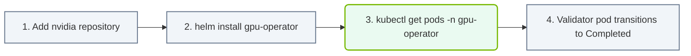

# 27.1c Installing the GPU Operator via Helm: values.yaml configuration options

<div class="lesson-completion" data-lesson-id="27_1c_gpu_operator_installation"></div>
<div class="lesson-tags">
  <span class="lesson-tag">📦 Cluster Orchestration</span>
  <span class="lesson-tag">📖 Kubernetes for AI</span>
</div>


When installing the NVIDIA GPU Operator using Helm, the **values.yaml** file is your central configuration point. Think of it as a settings dashboard where you define how the GPU Operator should behave in your Kubernetes cluster. For new engineers, understanding these options helps you tailor the installation to your specific hardware, drivers, and workload requirements without needing to modify complex YAML manifests manually.

---

## 🧭 Context: Why values.yaml Matters

The GPU Operator automates the deployment and management of NVIDIA GPU drivers, container runtime, device plugins, monitoring, and more. The **values.yaml** file allows you to:

- Enable or disable specific components (e.g., driver installation, monitoring, time-slicing)
- Set version numbers for drivers and toolkits
- Configure node selectors to target specific GPU-enabled nodes
- Define resource limits and tolerations

Without proper configuration, the Operator might not work correctly with your cluster's GPU hardware or software stack.

---

## ⚙️ Core Configuration Sections in values.yaml

The values.yaml file is organized into logical sections. Here are the most important ones for a new engineer:

### 🔧 Global Settings

These apply across all components:

- **global.operatorDefaultRuntime** — Sets the default container runtime (e.g., **crio**, **containerd**, **docker**)
- **global.useHostMOFED** — Whether to use the host's Mellanox OFED drivers (set to **true** or **false**)
- **global.openshift** — Set to **true** if deploying on OpenShift clusters

### 🖥️ Driver Configuration

Controls NVIDIA driver deployment:

- **driver.enabled** — Set to **true** to let the Operator install drivers, or **false** if drivers are pre-installed
- **driver.version** — Specifies the exact driver version (e.g., **535.154.05**)
- **driver.repoConfig** — URL or ConfigMap for the driver repository
- **driver.imageTag** — Container image tag for the driver installer

### 🧪 Toolkit Configuration

Manages the NVIDIA Container Toolkit:

- **toolkit.enabled** — Enables the container runtime hook (typically **true**)
- **toolkit.version** — Version of the toolkit to install
- **toolkit.env** — Environment variables for the toolkit (e.g., **CONTAINERD_CONFIG** for custom containerd paths)

### 📊 Device Plugin Configuration

Handles GPU device discovery and allocation:

- **devicePlugin.enabled** — Enables the NVIDIA device plugin (must be **true** for GPU workloads)
- **devicePlugin.version** — Version of the device plugin
- **devicePlugin.env** — Additional environment variables (e.g., **PASS_DEVICE_SPECS** for MIG support)

### 🕵️ Monitoring and Metrics

Enables GPU monitoring:

- **dcgmExporter.enabled** — Enables the DCGM exporter for Prometheus metrics
- **dcgmExporter.version** — Version of the DCGM exporter
- **dcgmExporter.serviceMonitor.enabled** — Set to **true** if using Prometheus Operator

### 🛠️ MIG (Multi-Instance GPU) Configuration

For partitioning A100/H100 GPUs:

- **migManager.enabled** — Enables MIG management
- **migManager.defaultMigProfile** — Default MIG profile (e.g., **all-1g.10gb**)
- **mig.strategy** — Strategy for MIG device naming (**single** or **mixed**)

---

## 📊 Comparison Table: Common Configuration Scenarios

| Scenario | driver.enabled | toolkit.enabled | devicePlugin.enabled | dcgmExporter.enabled | Key Notes |
|---|---|---|---|---|---|
| **Fresh cluster, no drivers** | **true** | **true** | **true** | **true** | Operator installs everything |
| **Pre-installed drivers** | **false** | **true** | **true** | **true** | Only runtime and plugins |
| **Minimal monitoring** | **true** | **true** | **true** | **false** | No Prometheus metrics |
| **MIG partitioning** | **true** | **true** | **true** | **true** | Add migManager.enabled: **true** |
| **Air-gapped cluster** | **true** | **true** | **true** | **true** | Override image registry paths |

---


### 📊 Visual Representation: GPU Operator Helm Chart deploy flow
This flowchart maps out Operator installation: deploying Helm charts and monitoring pod boots.




## 🗂️ How to Customize values.yaml

When installing the GPU Operator, you pass your custom values.yaml to Helm. The typical workflow is:

1. **Download the default values.yaml** from the GPU Operator Helm chart repository
2. **Make a copy** and name it something like **my-gpu-operator-values.yaml**
3. **Edit only the sections you need** — leave the rest as defaults
4. **Install using Helm** with your custom file

For reference, a minimal custom values.yaml for a cluster with pre-installed drivers might look like:

```
driver:
  enabled: false

toolkit:
  enabled: true

devicePlugin:
  enabled: true

dcgmExporter:
  enabled: true
```

📤 Output: The Operator will skip driver installation but deploy the container toolkit, device plugin, and monitoring.

---

## 🧩 Advanced Options to Know

### Node Selectors and Tolerations

Control which nodes receive GPU components:

- **driver.nodeSelector** — Labels for nodes where drivers should be installed (e.g., **nvidia.com/gpu.present: "true"**)
- **toolkit.tolerations** — Tolerations for nodes with taints (e.g., **nvidia.com/gpu: "true"**)

### Custom Image Registry

For air-gapped or private registries:

- **global.imageRegistry** — Override the default NVIDIA NGC registry
- **global.imagePullSecrets** — Secret name for registry authentication

### Resource Limits

Prevent components from consuming too many cluster resources:

- **driver.resources** — CPU/memory limits for the driver installer pod
- **dcgmExporter.resources** — Limits for the metrics exporter

---

## ✅ Quick Checklist for New Engineers

Before deploying with a custom values.yaml, verify these points:

- [ ] **driver.enabled** matches your cluster's driver state (pre-installed or not)
- [ ] **toolkit.enabled** is set to **true** for container runtime support
- [ ] **devicePlugin.enabled** is set to **true** for GPU workload scheduling
- [ ] **global.operatorDefaultRuntime** matches your container runtime (check with **crictl info**)
- [ ] Node selectors and tolerations match your GPU node labels
- [ ] Image registry paths are correct for your environment (especially in air-gapped setups)

---

## 📚 Summary

The **values.yaml** file is your primary tool for customizing the GPU Operator installation. By understanding the key sections — driver, toolkit, device plugin, monitoring, and MIG — you can deploy the Operator correctly for your specific cluster environment. Start with the default values, make small changes, and test incrementally. As you gain experience, you'll learn which options matter most for your GPU workloads.

Remember: the GPU Operator is designed to be modular. If you don't need a component (like DCGM exporter), simply set it to **false** in your values.yaml. This keeps your cluster lean and focused on what matters for your AI infrastructure.